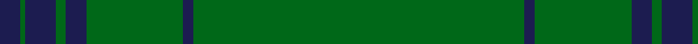

In pattern [BGBGBGGGGBGGG](/patterns/bgbgbggggbggg/).

This was sourced from tartans-authority.  It is a [13 stripes tartan](/stripes/stripes13/).

Original link http://www.tartansauthority.com/tartan-ferret/display/10202/

## Thread count
DB/8 G2 DBa12 G4 DBa8 Ga2 G32 Ga2 G2 DBa4 G2 Ga2 G/122

## Palette
Each colour and its ΔE from the base-6 reference it is a variant of.

| Colour | Shade | Base | ΔE (OKLab) |
|---|---|---|---|
| DB | <code style="background-color:#1C1C50;">#1C1C50</code> `#1C1C50` | B <code style="background-color:#2A418A;">#2A418A</code> | 0.14 |
| DBa | <code style="background-color:#1C1C50;">#1C1C50</code> `#1C1C50` | B <code style="background-color:#2A418A;">#2A418A</code> | 0.14 |
| G | <code style="background-color:#006818;">#006818</code> `#006818` | G <code style="background-color:#006100;">#006100</code> | 0.02 |
| Ga | <code style="background-color:#006818;">#006818</code> `#006818` | G <code style="background-color:#006100;">#006100</code> | 0.02 |

## Nearest tartans

The nearest existing variants by ΔTartan distance.

1. [Braveheart Htg (Fashion)](/setts/s10/g3b2g40b1g2b1g9r4g3r2~b202060-g006818-r880000~x4/) — ΔT 1.55
1. [Stewart from Cairnie](/setts/s8/g83k6g3k9r2k5g2y2~g005020-k101010-rdc0000-ye8c000~x2/) — ΔT 1.64
1. [Unidentified #12](/setts/s11/b2k1g36k1r2k1r2k1g36k1y2~b3c82af-g005020-k101010-rdc0000-ye8c000~x2/) — ΔT 1.96
1. [U.S. Seabees (Military)](/setts/s13/g72y2g10r9g2ga9g2b9g2ba9g9y2g72~b2c2c80-ba1474b4-g006818-ga603800-r880000-yd09800~x2/) — ΔT 1.98
1. [MacFie](/setts/s7/y1r12g162r1g2r12ya1~g11450d-raa0000-yaaaa00-yaaaaaaa~x2/) — ΔT 2.10
1. [Crane of Cluny (Personal)](/setts/s8/g82k6g3k9r2k5g2y2~g006818-k101010-rc8002c-ye8c000~x2/) — ΔT 2.17
1. [Owen of Wales](/setts/s18/g18b2g2b3g3r1g2ba1g3ba1g2r1g3b3g2b2g18ba2~b002048-ba003c64-g006818-rc80000~x2/) — ΔT 2.26
1. [Owen Welsh Name Tartan Tartan Number: 5750. Earliest known date: 2002 The tartan for this Welsh surname and its variations, Bowen, Ifan, is actually woven in Wales at the Cambrian Woollen Mill, weaving on the same site since 1830. This tartan differs from many traditional patterns in that the warp and weft differ, giving the finished worsted wool cloth more of a predominant stripe, vertically noticeable in the finished Kilt, or Cilt in Wales. See products available Copyright © Blair Urquhart, Comrie, 2015](/setts/s10/g3b1g2r1g3ba3g2ba2g18b2~b003c64-ba002048-g006818-rc80000~x2/) — ΔT 2.28
1. [Unidentified Plaid #2](/setts/s10/g32ga2g2ga2g2ga12g22w1g1w3~g005020-ga503c14-we0e0e0~x2/) — ΔT 2.29
1. [Unidentified Plaid 11](/setts/s10/g32r2g2r2g2r12g22w1g1w3~g008000-r806050-we0e0e0~x2/) — ΔT 2.33

## Neighbour map

Every grey dot is one of 15726 variants placed by the first two principal components of the ΔTartan feature space (44% of its variance). Red is this tartan; blue dots are its nearest — click one to open its page.

<svg viewBox="0 0 640 380" role="img" style="max-width:100%;height:auto;border:1px solid #e0e0e0;border-radius:4px;display:block" xmlns="http://www.w3.org/2000/svg"><image href="/nn/cloud.v1.png" width="640" height="380"/><a href="/setts/s10/g3b2g40b1g2b1g9r4g3r2~b202060-g006818-r880000~x4/"><circle cx="626.0" cy="167.2" r="4" fill="#3465a4"><title>Braveheart Htg (Fashion)</title></circle></a><a href="/setts/s8/g83k6g3k9r2k5g2y2~g005020-k101010-rdc0000-ye8c000~x2/"><circle cx="621.2" cy="144.5" r="4" fill="#3465a4"><title>Stewart from Cairnie</title></circle></a><a href="/setts/s11/b2k1g36k1r2k1r2k1g36k1y2~b3c82af-g005020-k101010-rdc0000-ye8c000~x2/"><circle cx="624.7" cy="122.0" r="4" fill="#3465a4"><title>Unidentified #12</title></circle></a><a href="/setts/s13/g72y2g10r9g2ga9g2b9g2ba9g9y2g72~b2c2c80-ba1474b4-g006818-ga603800-r880000-yd09800~x2/"><circle cx="589.7" cy="118.5" r="4" fill="#3465a4"><title>U.S. Seabees (Military)</title></circle></a><a href="/setts/s7/y1r12g162r1g2r12ya1~g11450d-raa0000-yaaaa00-yaaaaaaa~x2/"><circle cx="626.0" cy="146.3" r="4" fill="#3465a4"><title>MacFie</title></circle></a><a href="/setts/s8/g82k6g3k9r2k5g2y2~g006818-k101010-rc8002c-ye8c000~x2/"><circle cx="587.9" cy="132.1" r="4" fill="#3465a4"><title>Crane of Cluny (Personal)</title></circle></a><a href="/setts/s18/g18b2g2b3g3r1g2ba1g3ba1g2r1g3b3g2b2g18ba2~b002048-ba003c64-g006818-rc80000~x2/"><circle cx="531.7" cy="160.8" r="4" fill="#3465a4"><title>Owen of Wales</title></circle></a><a href="/setts/s10/g3b1g2r1g3ba3g2ba2g18b2~b003c64-ba002048-g006818-rc80000~x2/"><circle cx="535.0" cy="187.4" r="4" fill="#3465a4"><title>Owen Welsh Name Tartan Tartan Number: 5750. Earliest known date: 2002 The tartan for this Welsh surname and its variations, Bowen, Ifan, is actually woven in Wales at the Cambrian Woollen Mill, weaving on the same site since 1830. This tartan differs from many traditional patterns in that the warp and weft differ, giving the finished worsted wool cloth more of a predominant stripe, vertically noticeable in the finished Kilt, or Cilt in Wales. See products available Copyright © Blair Urquhart, Comrie, 2015</title></circle></a><a href="/setts/s10/g32ga2g2ga2g2ga12g22w1g1w3~g005020-ga503c14-we0e0e0~x2/"><circle cx="580.8" cy="186.9" r="4" fill="#3465a4"><title>Unidentified Plaid #2</title></circle></a><a href="/setts/s10/g32r2g2r2g2r12g22w1g1w3~g008000-r806050-we0e0e0~x2/"><circle cx="566.7" cy="176.6" r="4" fill="#3465a4"><title>Unidentified Plaid 11</title></circle></a><circle cx="626.0" cy="121.6" r="5" fill="#c00000"/></svg>

ID: /setts/s13/g61g1g1b2g1g1g16g1b4g2b6g1b4~b1c1c50-g006818~x2/
