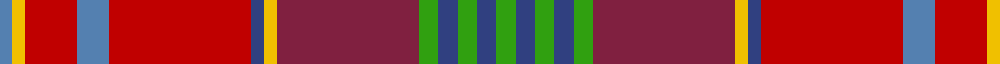

In pattern [BYRBRBYRGBGBG](/patterns/byrbrbyrgbgbg/).

This was sourced from weddslist.  It is a [13 stripes tartan](/stripes/stripes13/).

Original link http://www.weddslist.com/cgi-bin/tartans/pg.pl?source=sts

## Thread count
Ba/4 Y4 R16 Ba10 R44 B4 Y4 DR44 G6 B6 G6 B6 G/6

## Palette
Each colour and its ΔE from the base-6 reference it is a variant of.

| Colour | Shade | Base | ΔE (OKLab) |
|---|---|---|---|
| B | <code style="background-color:#304080;">#304080</code> `#304080` | B <code style="background-color:#2A418A;">#2A418A</code> | 0.02 |
| Ba | <code style="background-color:#5480B0;">#5480B0</code> `#5480B0` | B <code style="background-color:#2A418A;">#2A418A</code> | 0.19 |
| DR | <code style="background-color:#802040;">#802040</code> `#802040` | R <code style="background-color:#CC0000;">#CC0000</code> | 0.17 |
| G | <code style="background-color:#30A010;">#30A010</code> `#30A010` | G <code style="background-color:#006100;">#006100</code> | 0.20 |
| R | <code style="background-color:#C00000;">#C00000</code> `#C00000` | R <code style="background-color:#CC0000;">#CC0000</code> | 0.03 |
| Y | <code style="background-color:#F0C000;">#F0C000</code> `#F0C000` | Y <code style="background-color:#F2BF00;">#F2BF00</code> | 0.00 |

## Nearest tartans

The nearest existing variants by ΔTartan distance.

1. [Strathtay (District?)](/setts/s13/y12g4y4g10r40ra4r4ra50rb4ra4rb8ya20r4-g406054-r901c38-rae86000-rb880000-ya0a0a0-yac4bc68/) — ΔT 0.99
1. [Murray of Abercairney (Personal)](/setts/s9/b6g2k2r24ra2ga18ra2g2b6-b3c82af-g808080-ga005020-k101010-rdc0000-rac82828/) — ΔT 1.11
1. [Rathmore](/setts/s12/r80w8r16b8r8b8y8b32wa16ra8wa16y8-b5c5c5c-r880000-rac80000-wa8ace8-wac0c0c0-yd09800/) — ΔT 1.12
1. [Asman Family](/setts/s10/b8y6b34g12w4ba12w4r48ba6r8-b304080-ba401000-g407050-rc00000-we0e0e0-yf0c000/) — ΔT 1.23
1. [Harmon (Personal)](/setts/s18/k4r12y4r4y4r38b4g4b4r4ra8k4ra22g4ra4g4ra12y4-b2c2c80-g006818-k10101a-rc80000-ra880000-ye8c000/) — ΔT 1.25
1. [Ryutokukan High School (Corporate)](/setts/s12/r6b40ra2b8ra4b4ra8b4ra10g4rb40w6-b5c5c5c-g289c18-r888888-rac80000-rb880000-wfcfcfc/) — ΔT 1.26
1. [Gordon of Abergeldie](/setts/s10/r126w8k8b36y8g100y8b36k8w8-b780078-g005830-k101010-rc80000-wfcfcfc-yd8b000/) — ΔT 1.32
1. [Berwick -upon-Tweed (asymmetric)](/setts/s14/r32ra10g4ra8g4ra10ga76k10g4k8g4k10r16b8-b0596fa-g005020-ga808080-k101010-rdc0000-rabe7832/) — ΔT 1.32
1. [Pitcairn Heritage (Name)](/setts/s13/g6b8g6b8g6r56y4b4ra56b12ra18y4b4-b1870a4-g009468-ra00000-rac80050-yf09400/) — ΔT 1.33
1. [Moray of Abercairney Clan Tartan Tartan Number: 51. Earliest known date: 1735 The sett is derived from the portrait of James, 14th Laird, painted about 1735. Historians have made different interpretations of the tartan. The tartan is similar to other Perthshire setts but not to the Clan Murray tartan. See products available Copyright © Blair Urquhart, Comrie, 2015](/setts/s9/b12ba4k4r48ra4g36r4ba4b12-b2c2c80-ba2888c4-g006818-k101010-rc80000-rad05054/) — ΔT 1.36

## Neighbour map

Every grey dot is one of 15726 variants placed by the first two principal components of the ΔTartan feature space (44% of its variance). Red is this tartan; blue dots are its nearest — click one to open its page.

<svg viewBox="0 0 640 380" role="img" style="max-width:100%;height:auto;border:1px solid #e0e0e0;border-radius:4px;display:block" xmlns="http://www.w3.org/2000/svg"><image href="/nn/cloud.v1.png" width="640" height="380"/><a href="/setts/s13/y12g4y4g10r40ra4r4ra50rb4ra4rb8ya20r4-g406054-r901c38-rae86000-rb880000-ya0a0a0-yac4bc68/"><circle cx="182.9" cy="109.2" r="4" fill="#3465a4"><title>Strathtay (District?)</title></circle></a><a href="/setts/s9/b6g2k2r24ra2ga18ra2g2b6-b3c82af-g808080-ga005020-k101010-rdc0000-rac82828/"><circle cx="183.8" cy="129.8" r="4" fill="#3465a4"><title>Murray of Abercairney (Personal)</title></circle></a><a href="/setts/s12/r80w8r16b8r8b8y8b32wa16ra8wa16y8-b5c5c5c-r880000-rac80000-wa8ace8-wac0c0c0-yd09800/"><circle cx="228.2" cy="121.2" r="4" fill="#3465a4"><title>Rathmore</title></circle></a><a href="/setts/s10/b8y6b34g12w4ba12w4r48ba6r8-b304080-ba401000-g407050-rc00000-we0e0e0-yf0c000/"><circle cx="173.2" cy="125.6" r="4" fill="#3465a4"><title>Asman Family</title></circle></a><a href="/setts/s18/k4r12y4r4y4r38b4g4b4r4ra8k4ra22g4ra4g4ra12y4-b2c2c80-g006818-k10101a-rc80000-ra880000-ye8c000/"><circle cx="192.8" cy="107.3" r="4" fill="#3465a4"><title>Harmon (Personal)</title></circle></a><a href="/setts/s12/r6b40ra2b8ra4b4ra8b4ra10g4rb40w6-b5c5c5c-g289c18-r888888-rac80000-rb880000-wfcfcfc/"><circle cx="250.3" cy="107.8" r="4" fill="#3465a4"><title>Ryutokukan High School (Corporate)</title></circle></a><a href="/setts/s10/r126w8k8b36y8g100y8b36k8w8-b780078-g005830-k101010-rc80000-wfcfcfc-yd8b000/"><circle cx="179.6" cy="100.0" r="4" fill="#3465a4"><title>Gordon of Abergeldie</title></circle></a><a href="/setts/s14/r32ra10g4ra8g4ra10ga76k10g4k8g4k10r16b8-b0596fa-g005020-ga808080-k101010-rdc0000-rabe7832/"><circle cx="184.7" cy="81.6" r="4" fill="#3465a4"><title>Berwick -upon-Tweed (asymmetric)</title></circle></a><a href="/setts/s13/g6b8g6b8g6r56y4b4ra56b12ra18y4b4-b1870a4-g009468-ra00000-rac80050-yf09400/"><circle cx="250.1" cy="122.9" r="4" fill="#3465a4"><title>Pitcairn Heritage (Name)</title></circle></a><a href="/setts/s9/b12ba4k4r48ra4g36r4ba4b12-b2c2c80-ba2888c4-g006818-k101010-rc80000-rad05054/"><circle cx="198.0" cy="131.1" r="4" fill="#3465a4"><title>Moray of Abercairney Clan Tartan Tartan Number: 51. Earliest known date: 1735 The sett is derived from the portrait of James, 14th Laird, painted about 1735. Historians have made different interpretations of the tartan. The tartan is similar to other Perthshire setts but not to the Clan Murray tartan. See products available Copyright © Blair Urquhart, Comrie, 2015</title></circle></a><circle cx="182.7" cy="114.6" r="5" fill="#c00000"/></svg>

ID: /setts/s13/g6b6g6b6g6r44y4b4ra44ba10ra16y4ba4-b304080-ba5480b0-g30a010-r802040-rac00000-yf0c000/
