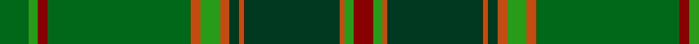

In pattern [GGRGRGRGRGRGR](/stripes/ggrgrgrgrgrgr/).

This was sourced from house-of-tartan.  It is a [13 stripe tartan](/stripes/stripes13/).

Original link http://www.house-of-tartan.scotland.net/house/TartanViewjs.asp?colr=Def&tnam=4065

## Thread count
G/12 Ga4 DR4 G60 DO4 Ga8 DO4 DG4 DO2 DG40 DO2 Ga4 DR/8

## Palette
Each colour and its ΔE from the base-6 reference it is a variant of.

| Colour | Shade | Base | ΔE (OKLab) |
|---|---|---|---|
| DG | <code style="background-color:#003820;">#003820</code> `#003820` | G <code style="background-color:#006100;">#006100</code> | 0.15 |
| DO | <code style="background-color:#C44C10;">#C44C10</code> `#C44C10` | R <code style="background-color:#CC0000;">#CC0000</code> | 0.08 |
| DR | <code style="background-color:#880000;">#880000</code> `#880000` | R <code style="background-color:#CC0000;">#CC0000</code> | 0.15 |
| G | <code style="background-color:#006818;">#006818</code> `#006818` | G <code style="background-color:#006100;">#006100</code> | 0.02 |
| Ga | <code style="background-color:#289C18;">#289C18</code> `#289C18` | G <code style="background-color:#006100;">#006100</code> | 0.19 |

## Nearest tartans

The nearest existing variants by ΔTartan distance.

1. [All Ireland Green (Fashion)](/setts/s13/g6g2r2g30y2g4y2dg2y1dg20y1g2r4~x2/) — ΔT 0.41
1. [All Ireland Green](/setts/s13/g6g2r2g30lb2g4lb2dg2lb1dg20lb1g2r4~x2/) — ΔT 1.08
1. [Fitzgibbon (Name)](/setts/s9/dg2lo6g24r2y2dg1y6dg10g2~x2/) — ΔT 1.19
1. [Urquhart (White Line)](/setts/s12/g4w2g24k3g3k3g8k24g48k3g3r2~x2/) — ΔT 1.20
1. [Westmeath (District)](/setts/s14/g11r6dt6do2g3do2dt6r6g36lo2do3lo2dt5r5~x2/) — ΔT 1.30
1. [Manitoba Province](/setts/s14/r12g1dg3g20t1g1t3g1t1g20dg3g1r12lo3~x4/) — ΔT 1.53
1. [Sheffield, City of](/setts/s14/t5g5k4o31g3o3g62o3g3o31k4g5t5r3~x2/) — ΔT 1.67
1. [Ensign, of Ontario](/setts/s15/g21k1r4k1o21g3o3g3o21g3ly4g21o3g3o3~x2/) — ΔT 1.69
1. [Hannigan of Dirleton](/setts/s8/p4g4dy2w3g27dy30ly1r3~x2/) — ΔT 1.70
1. [Walker, Gauvin (Personal)](/setts/s12/ly1y3dt2g5dp4g1dt14y1dt4g25y2ly1~x2/) — ΔT 1.71

## Neighbour map

Every grey dot is one of 14299 variants placed by the first two principal components of the ΔTartan feature space (44% of its variance). Red is this tartan; blue dots are its nearest — click one to open its page.

<svg viewBox="0 0 640 380" role="img" style="max-width:100%;height:auto;border:1px solid #e0e0e0;border-radius:4px;display:block" xmlns="http://www.w3.org/2000/svg"><image href="/nn/cloud.v1.png" width="640" height="380"/><a href="/setts/s13/g6g2r2g30y2g4y2dg2y1dg20y1g2r4~x2/"><circle cx="334.8" cy="132.4" r="4" fill="#3465a4"><title>All Ireland Green (Fashion)</title></circle></a><a href="/setts/s13/g6g2r2g30lb2g4lb2dg2lb1dg20lb1g2r4~x2/"><circle cx="296.8" cy="111.3" r="4" fill="#3465a4"><title>All Ireland Green</title></circle></a><a href="/setts/s9/dg2lo6g24r2y2dg1y6dg10g2~x2/"><circle cx="329.0" cy="171.5" r="4" fill="#3465a4"><title>Fitzgibbon (Name)</title></circle></a><a href="/setts/s12/g4w2g24k3g3k3g8k24g48k3g3r2~x2/"><circle cx="272.9" cy="135.3" r="4" fill="#3465a4"><title>Urquhart (White Line)</title></circle></a><a href="/setts/s14/g11r6dt6do2g3do2dt6r6g36lo2do3lo2dt5r5~x2/"><circle cx="331.4" cy="145.3" r="4" fill="#3465a4"><title>Westmeath (District)</title></circle></a><a href="/setts/s14/r12g1dg3g20t1g1t3g1t1g20dg3g1r12lo3~x4/"><circle cx="350.3" cy="144.8" r="4" fill="#3465a4"><title>Manitoba Province</title></circle></a><a href="/setts/s14/t5g5k4o31g3o3g62o3g3o31k4g5t5r3~x2/"><circle cx="274.3" cy="109.6" r="4" fill="#3465a4"><title>Sheffield, City of</title></circle></a><a href="/setts/s15/g21k1r4k1o21g3o3g3o21g3ly4g21o3g3o3~x2/"><circle cx="332.5" cy="147.0" r="4" fill="#3465a4"><title>Ensign, of Ontario</title></circle></a><a href="/setts/s8/p4g4dy2w3g27dy30ly1r3~x2/"><circle cx="306.1" cy="129.9" r="4" fill="#3465a4"><title>Hannigan of Dirleton</title></circle></a><a href="/setts/s12/ly1y3dt2g5dp4g1dt14y1dt4g25y2ly1~x2/"><circle cx="342.6" cy="138.5" r="4" fill="#3465a4"><title>Walker, Gauvin (Personal)</title></circle></a><circle cx="328.1" cy="126.4" r="5" fill="#c00000"/></svg>

ID: /setts/s13/g6g2r2g30o2g4o2dg2o1dg20o1g2r4~x2/
