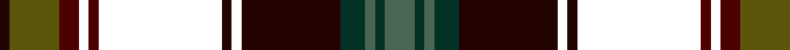

In pattern [GGGGKKKKBKBGK](/patterns/ggggkkkkbkbgk/).

This was sourced from house-of-tartan.  It is a [13 stripes tartan](/stripes/stripes13/).

Original link http://www.house-of-tartan.scotland.net/house/TartanViewjs.asp?colr=Def&tnam=10115

## Thread count
K/4 T20 DR8 SR4 DR4 SR50 K4 SR4 K40 DG10 N4 DG4 N/12

## Palette
Each colour and its ΔE from the base-6 reference it is a variant of.

| Colour | Shade | Base | ΔE (OKLab) |
|---|---|---|---|
| DG | <code style="background-color:#033126;">#033126</code> `#033126` | G <code style="background-color:#006100;">#006100</code> | 0.18 |
| DR | <code style="background-color:#4C0000;">#4C0000</code> `#4C0000` | B <code style="background-color:#2A418A;">#2A418A</code> | 0.25 |
| K | <code style="background-color:#220300;">#220300</code> `#220300` | K <code style="background-color:#000000;">#000000</code> | 0.18 |
| N | <code style="background-color:#4A6753;">#4A6753</code> `#4A6753` | G <code style="background-color:#006100;">#006100</code> | 0.12 |
| T | <code style="background-color:#5C560B;">#5C560B</code> `#5C560B` | G <code style="background-color:#006100;">#006100</code> | 0.09 |

## Nearest tartans

The nearest existing variants by ΔTartan distance.

1. [Bonnie Brae](/setts/s11/r6b3g3ra26b20ga26rb3ga4rb3ga4rb6~b000050-g908000-ga003000-r900030-ra800000-rb906030/) — ΔT 1.47
1. [Gotts (Personal)](/setts/s14/w2r19k2r2k3r2k8b8g2b3g2b2g19y2x2~b000064-g005020-k101010-r781c38-we0e0e0-yc89600/) — ΔT 1.53
1. [Loch Freuchie District Tartan Tartan Number: 10725. Earliest known date: 25 October 2012 A tartan for the area around Loch Freuchie near Crieff. The tartan is based on the Murray of Atholl and Breadalbane setts, with differences, to relate the tartan to the particular Loch Freuchie area. Mr MacArthur-Fox has created a tartan for anyone to wear without fear of offending another person or group. See products available Copyright © Blair Urquhart, Comrie, 2015](/setts/s10/b3g3r2g20k25ka2ba13k2ba3r3x2~b4a708b-ba2c4e75-g124d36-k101010-ka000000-rff0000/) — ΔT 1.54
1. [MacNicol Hunting](/setts/s17/b10k1g1k1g1k1b10r3k10r3g10k1y1k1ya1k1g10x2~b000052-g11450d-k000000-raa0000-yaaaa00-yaaaaaaa/) — ΔT 1.55
1. [MacNicol Hunting](/setts/s17/b10k1g1k1g1k1b10r3k10r3g10k1y1k1ya1k1g10~b000052-g11450d-k000000-raa0000-yaaaa00-yaaaaaaa/) — ΔT 1.55
1. [Oban (District?)](/setts/s13/k2r1b9r2k7b2r6g6r2k12w1ba1k1x4~b1c0070-ba5c5c5c-g006818-k101010-r880000-wc0c0c0/) — ΔT 1.55
1. [Quebec, Plaid du (District)](/setts/s13/k25g5k2y2ka2r2k2g20r20ka2w2ka2r2x2~g003820-k00002c-ka101010-rb40000-we0e0e0-yc4a000/) — ΔT 1.56
1. [Renton (Personal)](/setts/s18/r8k2r8ka4ra3ka4k8ka2k8ka4b21ba8ka2k3ka2ba8b24ka3x2~b244458-ba405c74-k000000-ka101010-r886044-raa00028/) — ΔT 1.63
1. [Paget (Personal)](/setts/s14/r3g4ga2g10k18g2b18g3b18g2k18g18w1r3x2~b440044-g006818-ga5c6428-k101010-rc80000-wfcfcfc/) — ΔT 1.63
1. [Loch Freuchie](/setts/s10/b3g3r2g20k25y2ba13k2ba3r3x2~b4a708b-ba2c4e75-g124d36-k101010-rff0000-yf0da0f/) — ΔT 1.65

## Neighbour map

Every grey dot is one of 15726 variants placed by the first two principal components of the ΔTartan feature space (44% of its variance). Red is this tartan; blue dots are its nearest — click one to open its page.

<svg viewBox="0 0 640 380" role="img" style="max-width:100%;height:auto;border:1px solid #e0e0e0;border-radius:4px;display:block" xmlns="http://www.w3.org/2000/svg"><image href="/nn/cloud.v1.png" width="640" height="380"/><a href="/setts/s11/r6b3g3ra26b20ga26rb3ga4rb3ga4rb6~b000050-g908000-ga003000-r900030-ra800000-rb906030/"><circle cx="151.8" cy="158.8" r="4" fill="#3465a4"><title>Bonnie Brae</title></circle></a><a href="/setts/s14/w2r19k2r2k3r2k8b8g2b3g2b2g19y2x2~b000064-g005020-k101010-r781c38-we0e0e0-yc89600/"><circle cx="138.9" cy="133.1" r="4" fill="#3465a4"><title>Gotts (Personal)</title></circle></a><a href="/setts/s10/b3g3r2g20k25ka2ba13k2ba3r3x2~b4a708b-ba2c4e75-g124d36-k101010-ka000000-rff0000/"><circle cx="190.9" cy="148.5" r="4" fill="#3465a4"><title>Loch Freuchie District Tartan Tartan Number: 10725. Earliest known date: 25 October 2012 A tartan for the area around Loch Freuchie near Crieff. The tartan is based on the Murray of Atholl and Breadalbane setts, with differences, to relate the tartan to the particular Loch Freuchie area. Mr MacArthur-Fox has created a tartan for anyone to wear without fear of offending another person or group. See products available Copyright © Blair Urquhart, Comrie, 2015</title></circle></a><a href="/setts/s17/b10k1g1k1g1k1b10r3k10r3g10k1y1k1ya1k1g10x2~b000052-g11450d-k000000-raa0000-yaaaa00-yaaaaaaa/"><circle cx="134.5" cy="129.0" r="4" fill="#3465a4"><title>MacNicol Hunting</title></circle></a><a href="/setts/s17/b10k1g1k1g1k1b10r3k10r3g10k1y1k1ya1k1g10~b000052-g11450d-k000000-raa0000-yaaaa00-yaaaaaaa/"><circle cx="134.5" cy="129.0" r="4" fill="#3465a4"><title>MacNicol Hunting</title></circle></a><a href="/setts/s13/k2r1b9r2k7b2r6g6r2k12w1ba1k1x4~b1c0070-ba5c5c5c-g006818-k101010-r880000-wc0c0c0/"><circle cx="195.4" cy="149.6" r="4" fill="#3465a4"><title>Oban (District?)</title></circle></a><a href="/setts/s13/k25g5k2y2ka2r2k2g20r20ka2w2ka2r2x2~g003820-k00002c-ka101010-rb40000-we0e0e0-yc4a000/"><circle cx="158.1" cy="110.2" r="4" fill="#3465a4"><title>Quebec, Plaid du (District)</title></circle></a><a href="/setts/s18/r8k2r8ka4ra3ka4k8ka2k8ka4b21ba8ka2k3ka2ba8b24ka3x2~b244458-ba405c74-k000000-ka101010-r886044-raa00028/"><circle cx="145.9" cy="131.8" r="4" fill="#3465a4"><title>Renton (Personal)</title></circle></a><a href="/setts/s14/r3g4ga2g10k18g2b18g3b18g2k18g18w1r3x2~b440044-g006818-ga5c6428-k101010-rc80000-wfcfcfc/"><circle cx="169.9" cy="130.8" r="4" fill="#3465a4"><title>Paget (Personal)</title></circle></a><a href="/setts/s10/b3g3r2g20k25y2ba13k2ba3r3x2~b4a708b-ba2c4e75-g124d36-k101010-rff0000-yf0da0f/"><circle cx="177.3" cy="141.9" r="4" fill="#3465a4"><title>Loch Freuchie</title></circle></a><circle cx="174.2" cy="133.9" r="5" fill="#c00000"/></svg>

ID: /setts/s13/g6ga2g2ga5k20ka2k2ka25b2ka2b4gb10k2x2~b4c0000-g4a6753-ga033126-gb5c560b-k220300-ka000000/
