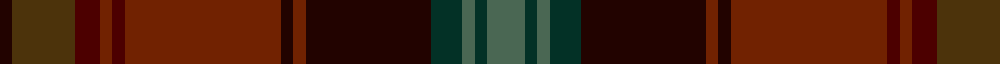

In pattern [GGGGKRKRBRBGK](/patterns/ggggkrkrbrbgk/).

This was sourced from register-of-tartans.  It is a [13 stripes tartan](/stripes/stripes13/).

Original link https://www.tartanregister.gov.uk/tartanDetails.aspx?ref=10115

## Thread count
K/4 T20 DR8 Ta4 DR4 Ta50 K4 Ta4 K40 DG10 N4 DG4 N/12

## Palette
Each colour and its ΔE from the base-6 reference it is a variant of.

| Colour | Shade | Base | ΔE (OKLab) |
|---|---|---|---|
| DG | <code style="background-color:#033126;">#033126</code> `#033126` | G <code style="background-color:#006100;">#006100</code> | 0.18 |
| DR | <code style="background-color:#4C0000;">#4C0000</code> `#4C0000` | B <code style="background-color:#2A418A;">#2A418A</code> | 0.25 |
| K | <code style="background-color:#220300;">#220300</code> `#220300` | K <code style="background-color:#000000;">#000000</code> | 0.18 |
| N | <code style="background-color:#4A6753;">#4A6753</code> `#4A6753` | G <code style="background-color:#006100;">#006100</code> | 0.12 |
| T | <code style="background-color:#4C330B;">#4C330B</code> `#4C330B` | G <code style="background-color:#006100;">#006100</code> | 0.16 |
| Ta | <code style="background-color:#712201;">#712201</code> `#712201` | R <code style="background-color:#CC0000;">#CC0000</code> | 0.19 |

## Nearest tartans

The nearest existing variants by ΔTartan distance.

1. [Strathmore](/setts/s16/g3r15ga2r2ga2r2ga18b2ga2b2ga2b27k2b2k6y2~b3c2118-g4c5419-ga344625-k101010-r87041c-yff8a00~x2/) — ΔT 0.79
1. [Strathmore District Tartan Tartan Number: 10118. Earliest known date: 20/11/2009 The name 'Strathmore' means the big valley and its fertile lands have made this area lying between the Grampians to the North and the Sidlaws to the South one the wealthiest farming areas in Scotland. The tartan is thus influenced by the brown and black of the rich soil, the green of the pastures, the red for the abundance of soft fruit grown and the gold to represent its prosperity. See products available Copyright © Blair Urquhart, Comrie, 2015](/setts/s16/g3r15ga2r2g2r2g18b2g2b2g2b27k2b2k6ka2~b402010-g303c0c-ga344625-k101010-ka000000-r8c1c20~x2/) — ΔT 1.18
1. [Allen - 2012 (Personal)](/setts/s14/b16r2b3r4b2ba12g18w2g18ba12b12y2r2y2~b441800-ba5c5c5c-g604000-r880000-w98c8e8-ybc8c00~x2/) — ΔT 1.33
1. [Scottish Register of Tartans' Tartan](/setts/s15/r12y4r7g2r2g28ga2g28k2g2k23r3gb6r3k5~g3f2103-ga633c14-gb755000-k140e04-r7f012d-yb5a189/) — ΔT 1.38
1. [Langerman (Anchorage)](/setts/s16/b1g2b1g3ga6b1g6b2r5ra13ba23r1ba1r1ba2r1~b000080-ba441800-g416041-ga344a35-ra00000-ra880000~x2/) — ΔT 1.38
1. [Faulkner (Personal)](/setts/s11/b8k2r26y1r6k3g10ya1k3b22ya1~b584458-g003820-k101010-r681014-yf09400-ya94a494~x2/) — ΔT 1.62
1. [Kelvin Family (Personal)](/setts/s12/b9k2b4k2ba6r3g2b2ba11g23bb1k8~b2c4084-ba680028-bb5f749c-g503c14-k101010-rb07430~x2/) — ΔT 1.71
1. [Redgate (Connecticut) Hunting #2](/setts/s15/b5k2ba6w1ba6k2b7k16g7k2bb4g2bb4k2g4~b402a21-ba3f4b60-bb5d0f04-g334e3d-k120a01-wddd5af~x2/) — ΔT 1.76
1. [Homecoming (Fashion)](/setts/s15/r2g2r2g11r2g2r2b4k15b3k3b3k3b14ra2~b2c3c40-g44481c-k101010-r70142c-ra888888~x2/) — ΔT 1.78
1. [Methven](/setts/s11/r2g3ga18r2ga2r21gb6g2gb2g24y2~g003820-ga503c14-gb5c6428-rb03000-yc88c00~x2/) — ΔT 1.79

## Neighbour map

Every grey dot is one of 15726 variants placed by the first two principal components of the ΔTartan feature space (44% of its variance). Red is this tartan; blue dots are its nearest — click one to open its page.

<svg viewBox="0 0 640 380" role="img" style="max-width:100%;height:auto;border:1px solid #e0e0e0;border-radius:4px;display:block" xmlns="http://www.w3.org/2000/svg"><image href="/nn/cloud.v1.png" width="640" height="380"/><a href="/setts/s16/g3r15ga2r2ga2r2ga18b2ga2b2ga2b27k2b2k6y2~b3c2118-g4c5419-ga344625-k101010-r87041c-yff8a00~x2/"><circle cx="276.4" cy="137.5" r="4" fill="#3465a4"><title>Strathmore</title></circle></a><a href="/setts/s16/g3r15ga2r2g2r2g18b2g2b2g2b27k2b2k6ka2~b402010-g303c0c-ga344625-k101010-ka000000-r8c1c20~x2/"><circle cx="299.5" cy="147.9" r="4" fill="#3465a4"><title>Strathmore District Tartan Tartan Number: 10118. Earliest known date: 20/11/2009 The name 'Strathmore' means the big valley and its fertile lands have made this area lying between the Grampians to the North and the Sidlaws to the South one the wealthiest farming areas in Scotland. The tartan is thus influenced by the brown and black of the rich soil, the green of the pastures, the red for the abundance of soft fruit grown and the gold to represent its prosperity. See products available Copyright © Blair Urquhart, Comrie, 2015</title></circle></a><a href="/setts/s14/b16r2b3r4b2ba12g18w2g18ba12b12y2r2y2~b441800-ba5c5c5c-g604000-r880000-w98c8e8-ybc8c00~x2/"><circle cx="215.7" cy="179.9" r="4" fill="#3465a4"><title>Allen - 2012 (Personal)</title></circle></a><a href="/setts/s15/r12y4r7g2r2g28ga2g28k2g2k23r3gb6r3k5~g3f2103-ga633c14-gb755000-k140e04-r7f012d-yb5a189/"><circle cx="307.3" cy="147.0" r="4" fill="#3465a4"><title>Scottish Register of Tartans' Tartan</title></circle></a><a href="/setts/s16/b1g2b1g3ga6b1g6b2r5ra13ba23r1ba1r1ba2r1~b000080-ba441800-g416041-ga344a35-ra00000-ra880000~x2/"><circle cx="272.5" cy="103.1" r="4" fill="#3465a4"><title>Langerman (Anchorage)</title></circle></a><a href="/setts/s11/b8k2r26y1r6k3g10ya1k3b22ya1~b584458-g003820-k101010-r681014-yf09400-ya94a494~x2/"><circle cx="309.6" cy="136.0" r="4" fill="#3465a4"><title>Faulkner (Personal)</title></circle></a><a href="/setts/s12/b9k2b4k2ba6r3g2b2ba11g23bb1k8~b2c4084-ba680028-bb5f749c-g503c14-k101010-rb07430~x2/"><circle cx="241.1" cy="136.9" r="4" fill="#3465a4"><title>Kelvin Family (Personal)</title></circle></a><a href="/setts/s15/b5k2ba6w1ba6k2b7k16g7k2bb4g2bb4k2g4~b402a21-ba3f4b60-bb5d0f04-g334e3d-k120a01-wddd5af~x2/"><circle cx="198.0" cy="162.5" r="4" fill="#3465a4"><title>Redgate (Connecticut) Hunting #2</title></circle></a><a href="/setts/s15/r2g2r2g11r2g2r2b4k15b3k3b3k3b14ra2~b2c3c40-g44481c-k101010-r70142c-ra888888~x2/"><circle cx="241.6" cy="202.2" r="4" fill="#3465a4"><title>Homecoming (Fashion)</title></circle></a><a href="/setts/s11/r2g3ga18r2ga2r21gb6g2gb2g24y2~g003820-ga503c14-gb5c6428-rb03000-yc88c00~x2/"><circle cx="250.3" cy="168.6" r="4" fill="#3465a4"><title>Methven</title></circle></a><circle cx="252.8" cy="155.5" r="5" fill="#c00000"/></svg>

ID: /setts/s13/g6ga2g2ga5k20r2k2r25b2r2b4gb10k2~b4c0000-g4a6753-ga033126-gb4c330b-k220300-r712201~x2/
