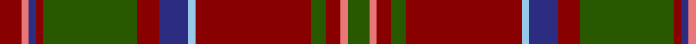

In pattern [GRRGRWBRGRBRR](/patterns/grrgrwbrgrbrr/).

This was sourced from register-of-tartans.  It is a [13 stripes tartan](/stripes/stripes13/).

Original link https://www.tartanregister.gov.uk/tartanDetails.aspx?ref=909

## Thread count
DR/6 LR2 DB2 DR2 G26 DR6 DB8 LB2 DR32 G4 DR4 LR2 G/6

## Palette
Each colour and its ΔE from the base-6 reference it is a variant of.

| Colour | Shade | Base | ΔE (OKLab) |
|---|---|---|---|
| DB | <code style="background-color:#2C2C80;">#2C2C80</code> `#2C2C80` | B <code style="background-color:#2C4084;">#2C4084</code> | 0.05 |
| DR | <code style="background-color:#880000;">#880000</code> `#880000` | R <code style="background-color:#C80000;">#C80000</code> | 0.14 |
| G | <code style="background-color:#285800;">#285800</code> `#285800` | G <code style="background-color:#006400;">#006400</code> | 0.04 |
| LB | <code style="background-color:#98C8E8;">#98C8E8</code> `#98C8E8` | W <code style="background-color:#F4F4F0;">#F4F4F0</code> | 0.17 |
| LR | <code style="background-color:#E87878;">#E87878</code> `#E87878` | R <code style="background-color:#C80000;">#C80000</code> | 0.19 |

## Nearest tartans

The nearest existing variants by ΔTartan distance.

1. [Michael from Appin (Personal)](/setts/s12/b8r48g4r6g38y4r4b16r4g4w4r4-b2c2c80-g285800-r880000-we0e0e0-ye8c000/) — ΔT 0.89
1. [Glen Nevis #2 (Personal)](/setts/s12/g56y4g4y4g8k12g12k12b12ba4b36y4-b4c3428-ba441800-g8c7038-k101010-ydc943c/) — ΔT 0.92
1. [Ainslie #2](/setts/s15/r24k8r8k16r8k8r24g72r8y4r8k8r40w4r8-g006818-k101010-r880000-wfcfcfc-yd09800/) — ΔT 0.94
1. [MacClure Clan/Family Tartan Tartan Number: 3330. Earliest known date: pre 2002 Designed by Phil Smith for all MacClures. (note by Phil Smith Sept 2004) and originally woven by D C Dalgliesh. MacClures and MacLures are a sept of MacLeod. See products available Copyright © Blair Urquhart, Comrie, 2015](/setts/s12/k8y4r8g24r8b16r8k8r60g8r8k4-b1c0070-g006818-k101010-r800000-yb8b8b8/) — ΔT 0.95
1. [Glen Coe (District)](/setts/s13/r10ra4k6r8g86r12k14b4r94g4r6ra4g8-b5c8ca8-g006818-k101010-r880000-rae87878/) — ΔT 1.04
1. [Glendronach Corporate Tartan Tartan Number: 2293. Earliest known date: 1989 A copyright design created for the Glendronach Company. See products available Copyright © Blair Urquhart, Comrie, 2015](/setts/s12/g42r4w2y6r4g10r42y2y2y2r2g16-g604000-ra00048-we0e0e0-ye8c000/) — ΔT 1.10
1. [MacClure](/setts/s12/k8w4r8g24r8b16r8k8r60g8r8k4-b1c0070-g003820-k101010-r880000-wc0c0c0/) — ΔT 1.11
1. [Leando Hunting (Personal)](/setts/s13/b76ba8r4bb12w4bb4w4bb4ba24b12bb4ba12w4-b5c5c5c-ba441800-bb480800-ra00048-we0e0e0/) — ΔT 1.15
1. [MacDonald of Glenaladale](/setts/s12/r14ra4b4r4g64r12b24r82g4r10ra4g10-b304080-g008000-r900030-rad03030/) — ΔT 1.17
1. [Balnagowan (Harrods)](/setts/s14/y6g6r2y4r2g40k10g8k10g6r4g6ra14g4-g604000-k101010-rc80000-rab84c00-ye8c000/) — ΔT 1.20

## Neighbour map

Every grey dot is one of 15726 variants placed by the first two principal components of the ΔTartan feature space (44% of its variance). Red is this tartan; blue dots are its nearest — click one to open its page.

<svg viewBox="0 0 640 380" role="img" style="max-width:100%;height:auto;border:1px solid #e0e0e0;border-radius:4px;display:block" xmlns="http://www.w3.org/2000/svg"><image href="/nn/cloud.v1.png" width="640" height="380"/><a href="/setts/s12/b8r48g4r6g38y4r4b16r4g4w4r4-b2c2c80-g285800-r880000-we0e0e0-ye8c000/"><circle cx="267.3" cy="138.6" r="4" fill="#3465a4"><title>Michael from Appin (Personal)</title></circle></a><a href="/setts/s12/g56y4g4y4g8k12g12k12b12ba4b36y4-b4c3428-ba441800-g8c7038-k101010-ydc943c/"><circle cx="272.0" cy="142.8" r="4" fill="#3465a4"><title>Glen Nevis #2 (Personal)</title></circle></a><a href="/setts/s15/r24k8r8k16r8k8r24g72r8y4r8k8r40w4r8-g006818-k101010-r880000-wfcfcfc-yd09800/"><circle cx="300.1" cy="124.0" r="4" fill="#3465a4"><title>Ainslie #2</title></circle></a><a href="/setts/s12/k8y4r8g24r8b16r8k8r60g8r8k4-b1c0070-g006818-k101010-r800000-yb8b8b8/"><circle cx="325.3" cy="142.0" r="4" fill="#3465a4"><title>MacClure Clan/Family Tartan Tartan Number: 3330. Earliest known date: pre 2002 Designed by Phil Smith for all MacClures. (note by Phil Smith Sept 2004) and originally woven by D C Dalgliesh. MacClures and MacLures are a sept of MacLeod. See products available Copyright © Blair Urquhart, Comrie, 2015</title></circle></a><a href="/setts/s13/r10ra4k6r8g86r12k14b4r94g4r6ra4g8-b5c8ca8-g006818-k101010-r880000-rae87878/"><circle cx="351.9" cy="103.4" r="4" fill="#3465a4"><title>Glen Coe (District)</title></circle></a><a href="/setts/s12/g42r4w2y6r4g10r42y2y2y2r2g16-g604000-ra00048-we0e0e0-ye8c000/"><circle cx="351.6" cy="114.4" r="4" fill="#3465a4"><title>Glendronach Corporate Tartan Tartan Number: 2293. Earliest known date: 1989 A copyright design created for the Glendronach Company. See products available Copyright © Blair Urquhart, Comrie, 2015</title></circle></a><a href="/setts/s12/k8w4r8g24r8b16r8k8r60g8r8k4-b1c0070-g003820-k101010-r880000-wc0c0c0/"><circle cx="337.5" cy="146.6" r="4" fill="#3465a4"><title>MacClure</title></circle></a><a href="/setts/s13/b76ba8r4bb12w4bb4w4bb4ba24b12bb4ba12w4-b5c5c5c-ba441800-bb480800-ra00048-we0e0e0/"><circle cx="316.5" cy="111.0" r="4" fill="#3465a4"><title>Leando Hunting (Personal)</title></circle></a><a href="/setts/s12/r14ra4b4r4g64r12b24r82g4r10ra4g10-b304080-g008000-r900030-rad03030/"><circle cx="348.6" cy="132.2" r="4" fill="#3465a4"><title>MacDonald of Glenaladale</title></circle></a><a href="/setts/s14/y6g6r2y4r2g40k10g8k10g6r4g6ra14g4-g604000-k101010-rc80000-rab84c00-ye8c000/"><circle cx="323.9" cy="122.3" r="4" fill="#3465a4"><title>Balnagowan (Harrods)</title></circle></a><circle cx="317.6" cy="134.2" r="5" fill="#c00000"/></svg>

ID: /setts/s13/g6r2ra4g4ra32w2b8ra6g26ra2b2r2ra6-b2c2c80-g285800-re87878-ra880000-w98c8e8/
