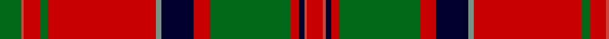

In pattern [GRRGRGKRGRKRR](/patterns/grrgrgkrgrkrr/).

This was sourced from register-of-tartans.  It is a [13 stripes tartan](/stripes/stripes13/).

Original link https://www.tartanregister.gov.uk/tartanDetails.aspx?ref=2361

## Attestations

This cloth appears in 2 source records; the oldest owns this page.

- 01/01/1800 — MacDonald of Glencoe #3 (register-of-tartans, [record](https://www.tartanregister.gov.uk/tartanDetails.aspx?ref=2361))
- c1950 — MacDonald of Glencoe - 1950 (Clan) (tartans-authority, [record](http://www.tartansauthority.com/tartan-ferret/display/1012/))

## Thread count
G/16 R2 Ra12 G6 Ra80 LG4 DB24 Ra12 G60 Ra6 DB4 R2 Ra/12

## Palette
Each colour and its ΔE from the base-6 reference it is a variant of.

| Colour | Shade | Base | ΔE (OKLab) |
|---|---|---|---|
| DB | <code style="background-color:#00002C;">#00002C</code> `#00002C` | K <code style="background-color:#000000;">#000000</code> | 0.16 |
| G | <code style="background-color:#006818;">#006818</code> `#006818` | G <code style="background-color:#006100;">#006100</code> | 0.02 |
| LG | <code style="background-color:#789484;">#789484</code> `#789484` | G <code style="background-color:#006100;">#006100</code> | 0.24 |
| R | <code style="background-color:#CC4438;">#CC4438</code> `#CC4438` | R <code style="background-color:#CC0000;">#CC0000</code> | 0.06 |
| Ra | <code style="background-color:#C80000;">#C80000</code> `#C80000` | R <code style="background-color:#CC0000;">#CC0000</code> | 0.01 |

## Nearest tartans

The nearest existing variants by ΔTartan distance.

1. [Hay](/setts/s14/r6g4y2g36r2g2r2g12r48g4r2k1r2w6~g004c00-k000000-rc80000-wd0d0d0-yffc800/) — ΔT 0.87
1. [Perth, (Duke of.. )](/setts/s14/b30r14b2r14g20w1g2w1g20r44b4r10ba1r4x2~b304080-ba5480b0-g008000-rc00000-we0e0e0/) — ΔT 0.88
1. [Perth (Duke of.. ) Portrait Tartan Tartan Number: 460. Earliest known date: 1739 From a painting by Dominique Dupra which hangs in the National Portrait Gallery in Edinburgh. The white stripe could be yellow. See products available Copyright © Blair Urquhart, Comrie, 2015](/setts/s14/b30r14b2r14g20w1g2w1g20r44b4r10ba1r4x2~b2c2c80-ba5c8ca8-g006818-rc80000-we0e0e0/) — ΔT 0.94
1. [Hay Clan Tartan Tartan Number: 1555. Earliest known date: 1842 The design comes from the Vestiarium Scoticum (1842). The authors, the Sobieski Stuart brothers, enjoyed a popular following among the Scottish gentry in the early Victorian era, and in the spirit of the times, added mystery, romance and some spurious historical documentation to the subject of tartan. Of the better known tartans, the book offers some minor variation, but in other cases it provides the only recorded version of many tartans in use today. See products available Copyright © Blair Urquhart, Comrie, 2015](/setts/s14/r9g6y4g54r4g4r4g18r72g6r4k2r4w9~g006818-k101010-rc80000-we0e0e0-ye8c000/) — ΔT 0.96
1. [Munro (Clan)](/setts/s17/r36y2b1r3g41r3b1y2r3b12r3y2b1r36g3ra3g4x2~b2c2c80-g006818-rc80000-racc4438-ye8c000/) — ΔT 0.99
1. [Dalziel (Logan) Family Tartan Tartan Number: 969. Earliest known date: 1831 Dalziel or Dalzell tartan is similar to the Munro. The basic form of the design was used for a 'George IV' tartan produced in honour of the King's visit in 1822. The Barony of Dalzell in Lanarkshire is the origin of the name. In Old Scots it means 'I dare' and this is also the motto on the family coat of arms. A cadet branch of the family built the House of the Binns in West Lothian which is now owned by the National Trust for Scotland. See products available Copyright © Blair Urquhart, Comrie, 2015](/setts/s17/r24w1b2r4g32r4b2w1r4b6r4w1b2r32g2ra3g6x2~b2c2c80-g006818-rc80000-raa00048-we0e0e0/) — ΔT 1.04
1. [MacDonald, of Glencoe](/setts/s13/r5y1b2r2g30r5b10ba1r42g2r4y1g4x2~b304080-ba5480b0-g008000-r900030-yf0c000/) — ΔT 1.05
1. [Chisholm](/setts/s10/r6w1r24b6g2k1g2k1g12r1x2~b304080-g008000-k000000-rc00000-we0e0e0/) — ΔT 1.05
1. [Dalziel](/setts/s17/r24w1b2r4g32r4b2w1r4b6r4w1b2r32g2ra3g6x2~b304080-g008000-rc00000-ra900030-we0e0e0/) — ΔT 1.05
1. [Seton](/setts/s10/g6w1g12r4b4r2k4r32g1r2x2~b304080-g008000-k000000-rc00000-we0e0e0/) — ΔT 1.07

## Neighbour map

Every grey dot is one of 15726 variants placed by the first two principal components of the ΔTartan feature space (44% of its variance). Red is this tartan; blue dots are its nearest — click one to open its page.

<svg viewBox="0 0 640 380" role="img" style="max-width:100%;height:auto;border:1px solid #e0e0e0;border-radius:4px;display:block" xmlns="http://www.w3.org/2000/svg"><image href="/nn/cloud.v1.png" width="640" height="380"/><a href="/setts/s14/r6g4y2g36r2g2r2g12r48g4r2k1r2w6~g004c00-k000000-rc80000-wd0d0d0-yffc800/"><circle cx="354.9" cy="58.4" r="4" fill="#3465a4"><title>Hay</title></circle></a><a href="/setts/s14/b30r14b2r14g20w1g2w1g20r44b4r10ba1r4x2~b304080-ba5480b0-g008000-rc00000-we0e0e0/"><circle cx="328.5" cy="87.7" r="4" fill="#3465a4"><title>Perth, (Duke of.. )</title></circle></a><a href="/setts/s14/b30r14b2r14g20w1g2w1g20r44b4r10ba1r4x2~b2c2c80-ba5c8ca8-g006818-rc80000-we0e0e0/"><circle cx="326.3" cy="86.1" r="4" fill="#3465a4"><title>Perth (Duke of.. ) Portrait Tartan Tartan Number: 460. Earliest known date: 1739 From a painting by Dominique Dupra which hangs in the National Portrait Gallery in Edinburgh. The white stripe could be yellow. See products available Copyright © Blair Urquhart, Comrie, 2015</title></circle></a><a href="/setts/s14/r9g6y4g54r4g4r4g18r72g6r4k2r4w9~g006818-k101010-rc80000-we0e0e0-ye8c000/"><circle cx="344.8" cy="71.8" r="4" fill="#3465a4"><title>Hay Clan Tartan Tartan Number: 1555. Earliest known date: 1842 The design comes from the Vestiarium Scoticum (1842). The authors, the Sobieski Stuart brothers, enjoyed a popular following among the Scottish gentry in the early Victorian era, and in the spirit of the times, added mystery, romance and some spurious historical documentation to the subject of tartan. Of the better known tartans, the book offers some minor variation, but in other cases it provides the only recorded version of many tartans in use today. See products available Copyright © Blair Urquhart, Comrie, 2015</title></circle></a><a href="/setts/s17/r36y2b1r3g41r3b1y2r3b12r3y2b1r36g3ra3g4x2~b2c2c80-g006818-rc80000-racc4438-ye8c000/"><circle cx="361.7" cy="57.3" r="4" fill="#3465a4"><title>Munro (Clan)</title></circle></a><a href="/setts/s17/r24w1b2r4g32r4b2w1r4b6r4w1b2r32g2ra3g6x2~b2c2c80-g006818-rc80000-raa00048-we0e0e0/"><circle cx="358.7" cy="72.8" r="4" fill="#3465a4"><title>Dalziel (Logan) Family Tartan Tartan Number: 969. Earliest known date: 1831 Dalziel or Dalzell tartan is similar to the Munro. The basic form of the design was used for a 'George IV' tartan produced in honour of the King's visit in 1822. The Barony of Dalzell in Lanarkshire is the origin of the name. In Old Scots it means 'I dare' and this is also the motto on the family coat of arms. A cadet branch of the family built the House of the Binns in West Lothian which is now owned by the National Trust for Scotland. See products available Copyright © Blair Urquhart, Comrie, 2015</title></circle></a><a href="/setts/s13/r5y1b2r2g30r5b10ba1r42g2r4y1g4x2~b304080-ba5480b0-g008000-r900030-yf0c000/"><circle cx="371.0" cy="77.0" r="4" fill="#3465a4"><title>MacDonald, of Glencoe</title></circle></a><a href="/setts/s10/r6w1r24b6g2k1g2k1g12r1x2~b304080-g008000-k000000-rc00000-we0e0e0/"><circle cx="335.1" cy="106.3" r="4" fill="#3465a4"><title>Chisholm</title></circle></a><a href="/setts/s17/r24w1b2r4g32r4b2w1r4b6r4w1b2r32g2ra3g6x2~b304080-g008000-rc00000-ra900030-we0e0e0/"><circle cx="357.3" cy="73.1" r="4" fill="#3465a4"><title>Dalziel</title></circle></a><a href="/setts/s10/g6w1g12r4b4r2k4r32g1r2x2~b304080-g008000-k000000-rc00000-we0e0e0/"><circle cx="368.4" cy="91.8" r="4" fill="#3465a4"><title>Seton</title></circle></a><circle cx="329.5" cy="78.5" r="5" fill="#c00000"/></svg>

ID: /setts/s13/g8r1ra6g3ra40ga2k12ra6g30ra3k2r1ra6x2~g006818-ga789484-k00002c-rcc4438-rac80000/
