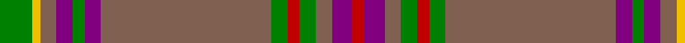

In pattern [GYRBGBRGRGRBR](/patterns/gyrbgbrgrgrbr/).

This was sourced from weddslist.  It is a [13 stripes tartan](/stripes/stripes13/).

Original link http://www.weddslist.com/cgi-bin/tartans/pg.pl?source=sts

## Thread count
G/8 Y2 LT4 P4 G3 P4 LT42 G4 R3 G4 LT4 P5 R/3

## Palette
Each colour and its ΔE from the base-6 reference it is a variant of.

| Colour | Shade | Base | ΔE (OKLab) |
|---|---|---|---|
| G | <code style="background-color:#008000;">#008000</code> `#008000` | G <code style="background-color:#006100;">#006100</code> | 0.10 |
| LT | <code style="background-color:#806050;">#806050</code> `#806050` | R <code style="background-color:#CC0000;">#CC0000</code> | 0.17 |
| P | <code style="background-color:#800080;">#800080</code> `#800080` | B <code style="background-color:#2A418A;">#2A418A</code> | 0.17 |
| R | <code style="background-color:#C00000;">#C00000</code> `#C00000` | R <code style="background-color:#CC0000;">#CC0000</code> | 0.03 |
| Y | <code style="background-color:#F0C000;">#F0C000</code> `#F0C000` | Y <code style="background-color:#F2BF00;">#F2BF00</code> | 0.00 |

## Nearest tartans

The nearest existing variants by ΔTartan distance.

1. [Sarna (District)](/setts/s13/g8y2ga4b4g3b4ga42g4r3g4ga4b5r3~b780078-g006818-ga604000-rc80000-ye8c000/) — ΔT 0.85
1. [Toyokawa Check](/setts/s11/b36ba10y2ba5g2ba5y10b5y2b10w2~b5c5c5c-ba680028-g408060-we0e0e0-ya08858~x2/) — ΔT 1.03
1. [Diana, hunting Plaid](/setts/s12/r46b3r7g2ra2g2w2g11b6ba2b3ra2~b8080d0-ba000050-g008000-r806050-rac00000-we0e0e0~x2/) — ΔT 1.15
1. [Hickory](/setts/s10/b4g30ba2g2ba14w2ba2w1ba6ga3~b141e46-ba4c3428-g786557-ga767e52-wf0e0c8~x2/) — ΔT 1.16
1. [Westmeath Irish County Tartan Tartan Number: 2278. Earliest known date: 1996 One of a series of Irish District tartans designed by Polly Wittering of the House of Edgar, with colours reminiscent of the Country with soft warm colours dominating. See products available Copyright © Blair Urquhart, Comrie, 2015](/setts/s14/g11r6b6ga2g3ga2b6r6g36y2ga3y2b5r5~b004874-g3c6838-ga28200c-r8c0020-ycc9c10~x2/) — ΔT 1.27
1. [Chisholm hunting](/setts/s10/r6w1r24b6g2b1g2b1g12ra1~b304080-g008000-r806050-rac00000-we0e0e0~x2/) — ΔT 1.28
1. [Brewer](/setts/s19/g3r2b1r19g1r1g1r8g1b8r1g8r1g1r1g28y1g2ra2~b1870a4-g00643c-r880000-rab468ac-ye8c000~x2/) — ΔT 1.32
1. [Unidentified #25](/setts/s12/b4g2b2w2g9y27r4y27g9w2b2g2~b1474b4-g604000-rc80000-we0e0e0-ya08858~x3/) — ΔT 1.34
1. [McAlifyfe (Personal)](/setts/s11/g3k3r6g6ra12g3k2g30y2g3k3~g696b3a-k101010-rb966ae-raa01d69-ycb8000~x2/) — ΔT 1.39
1. [Diana Hunting Plaid Tartan Tartan Number: 1318. Earliest known date: 1981 Based on MacNab. See products available Copyright © Blair Urquhart, Comrie, 2015](/setts/s12/g46b3g7ga2r2ga2w2ga11b6ba2b3r2~b2888c4-ba202060-g604000-ga006818-rc80000-we0e0e0~x2/) — ΔT 1.40

## Neighbour map

Every grey dot is one of 15726 variants placed by the first two principal components of the ΔTartan feature space (44% of its variance). Red is this tartan; blue dots are its nearest — click one to open its page.

<svg viewBox="0 0 640 380" role="img" style="max-width:100%;height:auto;border:1px solid #e0e0e0;border-radius:4px;display:block" xmlns="http://www.w3.org/2000/svg"><image href="/nn/cloud.v1.png" width="640" height="380"/><a href="/setts/s13/g8y2ga4b4g3b4ga42g4r3g4ga4b5r3~b780078-g006818-ga604000-rc80000-ye8c000/"><circle cx="387.6" cy="122.0" r="4" fill="#3465a4"><title>Sarna (District)</title></circle></a><a href="/setts/s11/b36ba10y2ba5g2ba5y10b5y2b10w2~b5c5c5c-ba680028-g408060-we0e0e0-ya08858~x2/"><circle cx="383.9" cy="150.5" r="4" fill="#3465a4"><title>Toyokawa Check</title></circle></a><a href="/setts/s12/r46b3r7g2ra2g2w2g11b6ba2b3ra2~b8080d0-ba000050-g008000-r806050-rac00000-we0e0e0~x2/"><circle cx="398.9" cy="95.5" r="4" fill="#3465a4"><title>Diana, hunting Plaid</title></circle></a><a href="/setts/s10/b4g30ba2g2ba14w2ba2w1ba6ga3~b141e46-ba4c3428-g786557-ga767e52-wf0e0c8~x2/"><circle cx="364.2" cy="126.1" r="4" fill="#3465a4"><title>Hickory</title></circle></a><a href="/setts/s14/g11r6b6ga2g3ga2b6r6g36y2ga3y2b5r5~b004874-g3c6838-ga28200c-r8c0020-ycc9c10~x2/"><circle cx="339.4" cy="137.3" r="4" fill="#3465a4"><title>Westmeath Irish County Tartan Tartan Number: 2278. Earliest known date: 1996 One of a series of Irish District tartans designed by Polly Wittering of the House of Edgar, with colours reminiscent of the Country with soft warm colours dominating. See products available Copyright © Blair Urquhart, Comrie, 2015</title></circle></a><a href="/setts/s10/r6w1r24b6g2b1g2b1g12ra1~b304080-g008000-r806050-rac00000-we0e0e0~x2/"><circle cx="381.6" cy="143.0" r="4" fill="#3465a4"><title>Chisholm hunting</title></circle></a><a href="/setts/s19/g3r2b1r19g1r1g1r8g1b8r1g8r1g1r1g28y1g2ra2~b1870a4-g00643c-r880000-rab468ac-ye8c000~x2/"><circle cx="362.4" cy="91.5" r="4" fill="#3465a4"><title>Brewer</title></circle></a><a href="/setts/s12/b4g2b2w2g9y27r4y27g9w2b2g2~b1474b4-g604000-rc80000-we0e0e0-ya08858~x3/"><circle cx="357.9" cy="143.5" r="4" fill="#3465a4"><title>Unidentified #25</title></circle></a><a href="/setts/s11/g3k3r6g6ra12g3k2g30y2g3k3~g696b3a-k101010-rb966ae-raa01d69-ycb8000~x2/"><circle cx="373.1" cy="143.8" r="4" fill="#3465a4"><title>McAlifyfe (Personal)</title></circle></a><a href="/setts/s12/g46b3g7ga2r2ga2w2ga11b6ba2b3r2~b2888c4-ba202060-g604000-ga006818-rc80000-we0e0e0~x2/"><circle cx="391.8" cy="97.7" r="4" fill="#3465a4"><title>Diana Hunting Plaid Tartan Tartan Number: 1318. Earliest known date: 1981 Based on MacNab. See products available Copyright © Blair Urquhart, Comrie, 2015</title></circle></a><circle cx="379.1" cy="115.0" r="5" fill="#c00000"/></svg>

ID: /setts/s13/g8y2r4b4g3b4r42g4ra3g4r4b5ra3~b800080-g008000-r806050-rac00000-yf0c000/
