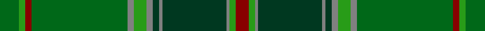

This page is one **sett** — a single exact thread-count. It belongs to the [tartan](/tartans/gi6g2r2gi30y2g4y2dg2y1dg20y1g2r4/)
(the same proportion at any scale), whose colour order is pattern [GGRGGGGGGGGGR](/stripes/ggrgggggggggr/).

Sourced from tartans-authority.  It is a [13 stripe tartan](/stripes/stripes13/).

Original link http://www.tartansauthority.com/tartan-ferret/display/4065/

## Register references

External register numbers recorded for this tartan.

- Scottish Tartans Authority (ITI): 4065

## Thread count
Ga/12 G4 DR4 Ga60 N4 G8 N4 DG4 N2 DG40 N2 G4 DR/8

## Palette

Palette: <strong>Tartan Register</strong>
<table><thead><tr><th>Colour</th><th>Threads</th><th>Shade</th><th>Base</th><th>OKLCh</th></tr></thead><tbody><tr><td>Ga/</td><td style="text-align:right;font-variant-numeric:tabular-nums">12</td><td><code style="background-color:#006818;">#006818</code> <small style="color:#888">#006818</small></td><td>G <code style="background-color:#006100;">#006100</code></td><td><small style="color:#888">oklch(45.0% 0.142 145.0)</small></td></tr><tr><td>G</td><td style="text-align:right;font-variant-numeric:tabular-nums">4</td><td><code style="background-color:#289C18;">#289C18</code> <small style="color:#888">#289C18</small></td><td>G <code style="background-color:#006100;">#006100</code></td><td><small style="color:#888">oklch(60.6% 0.191 141.6)</small></td></tr><tr><td>DR</td><td style="text-align:right;font-variant-numeric:tabular-nums">4</td><td><code style="background-color:#880000;">#880000</code> <small style="color:#888">#880000</small></td><td>R <code style="background-color:#CC0000;">#CC0000</code></td><td><small style="color:#888">oklch(39.4% 0.162 29.2)</small></td></tr><tr><td>Ga</td><td style="text-align:right;font-variant-numeric:tabular-nums">60</td><td><code style="background-color:#006818;">#006818</code> <small style="color:#888">#006818</small></td><td>G <code style="background-color:#006100;">#006100</code></td><td><small style="color:#888">oklch(45.0% 0.142 145.0)</small></td></tr><tr><td>N</td><td style="text-align:right;font-variant-numeric:tabular-nums">4</td><td><code style="background-color:#808080;">#808080</code> <small style="color:#888">#808080</small></td><td>G <code style="background-color:#006100;">#006100</code></td><td><small style="color:#888">oklch(60.0% 0.000 89.9)</small></td></tr><tr><td>G</td><td style="text-align:right;font-variant-numeric:tabular-nums">8</td><td><code style="background-color:#289C18;">#289C18</code> <small style="color:#888">#289C18</small></td><td>G <code style="background-color:#006100;">#006100</code></td><td><small style="color:#888">oklch(60.6% 0.191 141.6)</small></td></tr><tr><td>N</td><td style="text-align:right;font-variant-numeric:tabular-nums">4</td><td><code style="background-color:#808080;">#808080</code> <small style="color:#888">#808080</small></td><td>G <code style="background-color:#006100;">#006100</code></td><td><small style="color:#888">oklch(60.0% 0.000 89.9)</small></td></tr><tr><td>DG</td><td style="text-align:right;font-variant-numeric:tabular-nums">4</td><td><code style="background-color:#003820;">#003820</code> <small style="color:#888">#003820</small></td><td>G <code style="background-color:#006100;">#006100</code></td><td><small style="color:#888">oklch(30.0% 0.070 158.3)</small></td></tr><tr><td>N</td><td style="text-align:right;font-variant-numeric:tabular-nums">2</td><td><code style="background-color:#808080;">#808080</code> <small style="color:#888">#808080</small></td><td>G <code style="background-color:#006100;">#006100</code></td><td><small style="color:#888">oklch(60.0% 0.000 89.9)</small></td></tr><tr><td>DG</td><td style="text-align:right;font-variant-numeric:tabular-nums">40</td><td><code style="background-color:#003820;">#003820</code> <small style="color:#888">#003820</small></td><td>G <code style="background-color:#006100;">#006100</code></td><td><small style="color:#888">oklch(30.0% 0.070 158.3)</small></td></tr><tr><td>N</td><td style="text-align:right;font-variant-numeric:tabular-nums">2</td><td><code style="background-color:#808080;">#808080</code> <small style="color:#888">#808080</small></td><td>G <code style="background-color:#006100;">#006100</code></td><td><small style="color:#888">oklch(60.0% 0.000 89.9)</small></td></tr><tr><td>G</td><td style="text-align:right;font-variant-numeric:tabular-nums">4</td><td><code style="background-color:#289C18;">#289C18</code> <small style="color:#888">#289C18</small></td><td>G <code style="background-color:#006100;">#006100</code></td><td><small style="color:#888">oklch(60.6% 0.191 141.6)</small></td></tr><tr><td>DR/</td><td style="text-align:right;font-variant-numeric:tabular-nums">8</td><td><code style="background-color:#880000;">#880000</code> <small style="color:#888">#880000</small></td><td>R <code style="background-color:#CC0000;">#CC0000</code></td><td><small style="color:#888">oklch(39.4% 0.162 29.2)</small></td></tr></tbody></table>

## Nearest tartans

The nearest existing variants by ΔTartan distance, with this tartan at the top so the swatches line up against it.

ΔTartan

Tartan

Sett

—

<a href="/ttd/edit/#slug=gi6g2r2gi30y2g4y2dg2y1dg20y1g2r4~x2">All Ireland Green (Fashion)</a> <a class="nn-out" href="/setts/s13/gi6g2r2gi30y2g4y2dg2y1dg20y1g2r4~x2/" title="open its dictionary page">↗</a>

0.41

<a href="/ttd/edit/#slug=gi6g2r2gi30o2g4o2dg2o1dg20o1g2r4~x2">All Irish Green Irish District Tartan Tartan Number: 4065. Earliest known date: 1997 Part of a collection produced by Lochcarron in 1997 to acknowledge the early historical and cultural links between the Scots and Irish. See products available Copyright © Blair Urquhart, Comrie, 2015</a> <a class="nn-out" href="/setts/s13/gi6g2r2gi30o2g4o2dg2o1dg20o1g2r4~x2/" title="open its dictionary page">↗</a>

1.11

<a href="/ttd/edit/#slug=dg2lo6g24r2y2dg1y6dg10g2~x2">Fitzgibbon (Name)</a> <a class="nn-out" href="/setts/s9/dg2lo6g24r2y2dg1y6dg10g2~x2/" title="open its dictionary page">↗</a>

1.33

<a href="/ttd/edit/#slug=gi6g2r2gi30lb2g4lb2dg2lb1dg20lb1g2r4~x2">All Ireland Green</a> <a class="nn-out" href="/setts/s13/gi6g2r2gi30lb2g4lb2dg2lb1dg20lb1g2r4~x2/" title="open its dictionary page">↗</a>

1.38

<a href="/ttd/edit/#slug=g4w2g24k3g3k3g8k24gi48k3gi3r2~x2">Urquhart (White Line)</a> <a class="nn-out" href="/setts/s12/g4w2g24k3g3k3g8k24gi48k3gi3r2~x2/" title="open its dictionary page">↗</a>

1.45

<a href="/ttd/edit/#slug=g11r6dt6do2g3do2dt6r6g36lo2do3lo2dt5r5~x2">Westmeath (District)</a> <a class="nn-out" href="/setts/s14/g11r6dt6do2g3do2dt6r6g36lo2do3lo2dt5r5~x2/" title="open its dictionary page">↗</a>

1.63

<a href="/ttd/edit/#slug=gi44k1gi3ly3gi3w1g21w1g3w3g3w1g21~x2">Currie (Clan)</a> <a class="nn-out" href="/setts/s13/gi44k1gi3ly3gi3w1g21w1g3w3g3w1g21~x2/" title="open its dictionary page">↗</a>

1.69

<a href="/ttd/edit/#slug=r12g1dg3g20t1g1t3g1t1g20dg3g1r12lo3~x4">Manitoba Province</a> <a class="nn-out" href="/setts/s14/r12g1dg3g20t1g1t3g1t1g20dg3g1r12lo3~x4/" title="open its dictionary page">↗</a>

1.74

<a href="/ttd/edit/#slug=t5g5k4o31gi3o3gi62o3gi3o31k4g5t5r3~x2">Sheffield, City of</a> <a class="nn-out" href="/setts/s14/t5g5k4o31gi3o3gi62o3gi3o31k4g5t5r3~x2/" title="open its dictionary page">↗</a>

1.74

<a href="/ttd/edit/#slug=g4dg40g4k8db4k8g5k2lo4k2dg1g2dg2k1o1~x2">Eastern Shore Police (Corporate)</a> <a class="nn-out" href="/setts/s15/g4dg40g4k8db4k8g5k2lo4k2dg1g2dg2k1o1~x2/" title="open its dictionary page">↗</a>

1.75

<a href="/ttd/edit/#slug=dp4g4y2w3g27y30ly1r3~x2">Hannigan of Dirleton (Personal)</a> <a class="nn-out" href="/setts/s8/dp4g4y2w3g27y30ly1r3~x2/" title="open its dictionary page">↗</a>

## Neighbour map

Every grey dot is one of 14359 variants placed by the first two principal components of the ΔTartan feature space (44% of its variance). Red is this tartan; blue dots are its nearest — click one to open its page.

<svg viewBox="0 0 640 380" role="img" style="max-width:100%;height:auto;border:1px solid #e0e0e0;border-radius:4px;display:block" xmlns="http://www.w3.org/2000/svg"><image href="/nn/cloud.v1.png" width="640" height="380"/><a href="/setts/s13/gi6g2r2gi30o2g4o2dg2o1dg20o1g2r4~x2/"><circle cx="327.9" cy="126.3" r="4" fill="#3465a4"><title>All Irish Green Irish District Tartan Tartan Number: 4065. Earliest known date: 1997 Part of a collection produced by Lochcarron in 1997 to acknowledge the early historical and cultural links between the Scots and Irish. See products available Copyright © Blair Urquhart, Comrie, 2015</title></circle></a><a href="/setts/s9/dg2lo6g24r2y2dg1y6dg10g2~x2/"><circle cx="328.9" cy="171.5" r="4" fill="#3465a4"><title>Fitzgibbon (Name)</title></circle></a><a href="/setts/s13/gi6g2r2gi30lb2g4lb2dg2lb1dg20lb1g2r4~x2/"><circle cx="296.5" cy="111.3" r="4" fill="#3465a4"><title>All Ireland Green</title></circle></a><a href="/setts/s12/g4w2g24k3g3k3g8k24gi48k3gi3r2~x2/"><circle cx="272.8" cy="135.5" r="4" fill="#3465a4"><title>Urquhart (White Line)</title></circle></a><a href="/setts/s14/g11r6dt6do2g3do2dt6r6g36lo2do3lo2dt5r5~x2/"><circle cx="331.1" cy="145.4" r="4" fill="#3465a4"><title>Westmeath (District)</title></circle></a><a href="/setts/s13/gi44k1gi3ly3gi3w1g21w1g3w3g3w1g21~x2/"><circle cx="376.7" cy="111.9" r="4" fill="#3465a4"><title>Currie (Clan)</title></circle></a><a href="/setts/s14/r12g1dg3g20t1g1t3g1t1g20dg3g1r12lo3~x4/"><circle cx="349.8" cy="144.9" r="4" fill="#3465a4"><title>Manitoba Province</title></circle></a><a href="/setts/s14/t5g5k4o31gi3o3gi62o3gi3o31k4g5t5r3~x2/"><circle cx="273.9" cy="109.5" r="4" fill="#3465a4"><title>Sheffield, City of</title></circle></a><a href="/setts/s15/g4dg40g4k8db4k8g5k2lo4k2dg1g2dg2k1o1~x2/"><circle cx="347.6" cy="94.6" r="4" fill="#3465a4"><title>Eastern Shore Police (Corporate)</title></circle></a><a href="/setts/s8/dp4g4y2w3g27y30ly1r3~x2/"><circle cx="332.8" cy="146.3" r="4" fill="#3465a4"><title>Hannigan of Dirleton (Personal)</title></circle></a><circle cx="334.7" cy="132.2" r="5" fill="#c00000"/></svg>

ID: /setts/s13/gi6g2r2gi30y2g4y2dg2y1dg20y1g2r4~x2/
