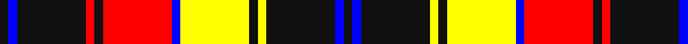

**Bands:** [KBKRKRBYKYKBK](/stripes/kbkrkrbykykbk/) · **Stripes:** [K B K R K R B LY K LY K B K](/stripes/stripes13/) K B K R K R B LY K LY K B K

This was sourced from register-of-tartans.  It is a [13 band tartan](/bands/bands13/).

Original link https://www.tartanregister.gov.uk/tartanDetails.aspx?ref=5790

## Register references

External register numbers recorded for this tartan.

- Scottish Register of Tartans: [5790](https://www.tartanregister.gov.uk/tartanDetails.aspx?ref=5790)
- Scottish Tartans Authority (ITI): 7838
- Scottish Tartans World Register: 3115

## Thread count
K/6 B6 K48 R6 K6 R48 B6 Y48 K6 Y6 K48 B6 K/6

## Palette
Each colour and its ΔE from the base-6 reference it is a variant of.

| Colour | Shade | Base | ΔE (OKLab) |
|---|---|---|---|
| B | <code style="background-color:#0000FF;">#0000FF</code> `#0000FF` | B <code style="background-color:#2A418A;">#2A418A</code> | 0.20 |
| K | <code style="background-color:#101010;">#101010</code> `#101010` | K <code style="background-color:#000000;">#000000</code> | 0.17 |
| R | <code style="background-color:#FF0000;">#FF0000</code> `#FF0000` | R <code style="background-color:#CC0000;">#CC0000</code> | 0.11 |
| Y | <code style="background-color:#FFFF00;">#FFFF00</code> `#FFFF00` | Y <code style="background-color:#F2BF00;">#F2BF00</code> | 0.16 |

## Nearest tartans

The nearest existing variants by ΔTartan distance.

1. [Robieson QAHS (Fashion)](/setts/s13/k1db1k8ly1k1ly8db1r8k1r1k8db1k1~x6/) — ΔT 0.70
1. [Braemar, Camel](/setts/s10/o1w2k5o3k1o4k1o10k1o1~x4/) — ΔT 0.89
1. [Campbell 'Camel'](/setts/s10/do1lr2k5do3k1o4k1o10k1o1~x4/) — ΔT 1.04
1. [Liberty Square](/setts/s12/w12lb2k5lb2k10lb2k15lb2k20lb2y25lb2~x2/) — ΔT 1.16
1. [Abergavenny](/setts/s17/lb36k41lb4lb6k8o24lb12lb4o4k6lb4lb4k48o4lb8k22lb18/) — ΔT 1.19
1. [Braemar, or Blair Atholl](/setts/s10/o1w2k5o3k1o5k1o11k1o1~x4/) — ΔT 1.24
1. [Dogrobes](/setts/s9/lb3r2lb9dt15w2dt15r9w2r3~x2/) — ΔT 1.29
1. [Auld Lang Syne, Grey (Fashion)](/setts/s12/k4w2k9k3r3w3r3w23k10w2k6w2~x2/) — ΔT 1.30
1. [Tyrone County Crest (Fashion)](/setts/s12/r4k2ly13lo3k22r2k2w13k7r3k7w4~x2/) — ΔT 1.31
1. [Buchanan Old Dress](/setts/s9/k40w25k10ly8k3ly8k10r25w4~x2/) — ΔT 1.34

## Neighbour map

Every grey dot is one of 14313 variants placed by the first two principal components of the ΔTartan feature space (44% of its variance). Red is this tartan; blue dots are its nearest — click one to open its page.

<svg viewBox="0 0 640 380" role="img" style="max-width:100%;height:auto;border:1px solid #e0e0e0;border-radius:4px;display:block" xmlns="http://www.w3.org/2000/svg"><image href="/nn/cloud.v1.png" width="640" height="380"/><a href="/setts/s13/k1db1k8ly1k1ly8db1r8k1r1k8db1k1~x6/"><circle cx="215.3" cy="150.9" r="4" fill="#3465a4"><title>Robieson QAHS (Fashion)</title></circle></a><a href="/setts/s10/o1w2k5o3k1o4k1o10k1o1~x4/"><circle cx="235.8" cy="159.4" r="4" fill="#3465a4"><title>Braemar, Camel</title></circle></a><a href="/setts/s10/do1lr2k5do3k1o4k1o10k1o1~x4/"><circle cx="241.7" cy="162.1" r="4" fill="#3465a4"><title>Campbell 'Camel'</title></circle></a><a href="/setts/s12/w12lb2k5lb2k10lb2k15lb2k20lb2y25lb2~x2/"><circle cx="222.7" cy="145.5" r="4" fill="#3465a4"><title>Liberty Square</title></circle></a><a href="/setts/s17/lb36k41lb4lb6k8o24lb12lb4o4k6lb4lb4k48o4lb8k22lb18/"><circle cx="216.7" cy="128.8" r="4" fill="#3465a4"><title>Abergavenny</title></circle></a><a href="/setts/s10/o1w2k5o3k1o5k1o11k1o1~x4/"><circle cx="270.5" cy="159.6" r="4" fill="#3465a4"><title>Braemar, or Blair Atholl</title></circle></a><a href="/setts/s9/lb3r2lb9dt15w2dt15r9w2r3~x2/"><circle cx="205.3" cy="183.3" r="4" fill="#3465a4"><title>Dogrobes</title></circle></a><a href="/setts/s12/k4w2k9k3r3w3r3w23k10w2k6w2~x2/"><circle cx="212.1" cy="137.2" r="4" fill="#3465a4"><title>Auld Lang Syne, Grey (Fashion)</title></circle></a><a href="/setts/s12/r4k2ly13lo3k22r2k2w13k7r3k7w4~x2/"><circle cx="181.4" cy="138.8" r="4" fill="#3465a4"><title>Tyrone County Crest (Fashion)</title></circle></a><a href="/setts/s9/k40w25k10ly8k3ly8k10r25w4~x2/"><circle cx="200.2" cy="157.2" r="4" fill="#3465a4"><title>Buchanan Old Dress</title></circle></a><circle cx="199.3" cy="142.1" r="5" fill="#c00000"/></svg>

ID: /setts/s13/k1b1k8ly1k1ly8b1r8k1r1k8b1k1~x6/
