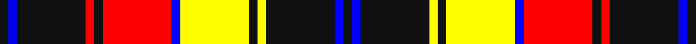

In pattern [KBKRKRBYKYKBK](/stripes/kbkrkrbykykbk/).

This was sourced from register-of-tartans.  It is a [13 stripe tartan](/stripes/stripes13/).

Original link https://www.tartanregister.gov.uk/tartanDetails.aspx?ref=5790

## Register references

External register numbers recorded for this tartan.

- Scottish Register of Tartans: [5790](https://www.tartanregister.gov.uk/tartanDetails.aspx?ref=5790)
- Scottish Tartans Authority (ITI): 7838
- Scottish Tartans World Register: 3115

## Thread count
K/6 B6 K48 R6 K6 R48 B6 Y48 K6 Y6 K48 B6 K/6

## Palette
Each colour and the base-6 reference it is a variant of.

| Colour | Shade | Base |
|---|---|---|
| B | <code style="background-color:#0000FF;">#0000FF</code> `oklch(45.2% 0.313 264.1)` <small>#0000FF</small> | B <code style="background-color:#2A418A;">#2A418A</code> |
| K | <code style="background-color:#101010;">#101010</code> `oklch(17.3% 0.000 89.9)` <small>#101010</small> | K <code style="background-color:#000000;">#000000</code> |
| R | <code style="background-color:#FF0000;">#FF0000</code> `oklch(62.8% 0.258 29.2)` <small>#FF0000</small> | R <code style="background-color:#CC0000;">#CC0000</code> |
| Y | <code style="background-color:#FFFF00;">#FFFF00</code> `oklch(96.8% 0.211 109.8)` <small>#FFFF00</small> | Y <code style="background-color:#F2BF00;">#F2BF00</code> |

## Nearest tartans

The nearest existing variants by ΔTartan distance, with this tartan at the top so the swatches line up against it.

ΔTartan

Tartan

Sett

—

<a href="/ttd/edit/#slug=k1b1k8r1k1r8b1ly8k1ly1k8b1k1~x6">Robieson QAHS</a> <a class="nn-out" href="/setts/s13/k1b1k8r1k1r8b1ly8k1ly1k8b1k1~x6/" title="open its dictionary page">↗</a>

0.70

<a href="/ttd/edit/#slug=k1db1k8r1k1r8db1ly8k1ly1k8db1k1~x6">Robieson QAHS (Fashion)</a> <a class="nn-out" href="/setts/s13/k1db1k8r1k1r8db1ly8k1ly1k8db1k1~x6/" title="open its dictionary page">↗</a>

0.89

<a href="/ttd/edit/#slug=o1w2k5o3k1o4k1o10k1o1~x4">Braemar, Camel</a> <a class="nn-out" href="/setts/s10/o1w2k5o3k1o4k1o10k1o1~x4/" title="open its dictionary page">↗</a>

1.04

<a href="/ttd/edit/#slug=do1lr2k5do3k1o4k1o10k1o1~x4">Campbell 'Camel'</a> <a class="nn-out" href="/setts/s10/do1lr2k5do3k1o4k1o10k1o1~x4/" title="open its dictionary page">↗</a>

1.16

<a href="/ttd/edit/#slug=w12lb2k5lb2k10lb2k15lb2k20lb2y25lb2~x2">Liberty Square</a> <a class="nn-out" href="/setts/s12/w12lb2k5lb2k10lb2k15lb2k20lb2y25lb2~x2/" title="open its dictionary page">↗</a>

1.19

<a href="/ttd/edit/#slug=lb36k41lb4lb6k8o24lb12lb4o4k6lb4lb4k48o4lb8k22lb18">Abergavenny</a> <a class="nn-out" href="/setts/s17/lb36k41lb4lb6k8o24lb12lb4o4k6lb4lb4k48o4lb8k22lb18/" title="open its dictionary page">↗</a>

1.24

<a href="/ttd/edit/#slug=o1w2k5o3k1o5k1o11k1o1~x4">Braemar, or Blair Atholl</a> <a class="nn-out" href="/setts/s10/o1w2k5o3k1o5k1o11k1o1~x4/" title="open its dictionary page">↗</a>

1.29

<a href="/ttd/edit/#slug=r3w2r9dt15w2dt15lb9r2lb3~x2">Dogrobes</a> <a class="nn-out" href="/setts/s9/r3w2r9dt15w2dt15lb9r2lb3~x2/" title="open its dictionary page">↗</a>

1.30

<a href="/ttd/edit/#slug=k4w2k9k3r3w3r3w23k10w2k6w2~x2">Auld Lang Syne, Grey (Fashion)</a> <a class="nn-out" href="/setts/s12/k4w2k9k3r3w3r3w23k10w2k6w2~x2/" title="open its dictionary page">↗</a>

1.31

<a href="/ttd/edit/#slug=r4k2ly13lo3k22r2k2w13k7r3k7w4~x2">Tyrone County Crest (Fashion)</a> <a class="nn-out" href="/setts/s12/r4k2ly13lo3k22r2k2w13k7r3k7w4~x2/" title="open its dictionary page">↗</a>

1.34

<a href="/ttd/edit/#slug=k40w25k10ly8k3ly8k10r25w4~x2">Buchanan Old Dress</a> <a class="nn-out" href="/setts/s9/k40w25k10ly8k3ly8k10r25w4~x2/" title="open its dictionary page">↗</a>

## Neighbour map

Every grey dot is one of 14299 variants placed by the first two principal components of the ΔTartan feature space (44% of its variance). Red is this tartan; blue dots are its nearest — click one to open its page.

<svg viewBox="0 0 640 380" role="img" style="max-width:100%;height:auto;border:1px solid #e0e0e0;border-radius:4px;display:block" xmlns="http://www.w3.org/2000/svg"><image href="/nn/cloud.v1.png" width="640" height="380"/><a href="/setts/s13/k1db1k8r1k1r8db1ly8k1ly1k8db1k1~x6/"><circle cx="215.2" cy="150.8" r="4" fill="#3465a4"><title>Robieson QAHS (Fashion)</title></circle></a><a href="/setts/s10/o1w2k5o3k1o4k1o10k1o1~x4/"><circle cx="235.7" cy="159.2" r="4" fill="#3465a4"><title>Braemar, Camel</title></circle></a><a href="/setts/s10/do1lr2k5do3k1o4k1o10k1o1~x4/"><circle cx="241.6" cy="162.0" r="4" fill="#3465a4"><title>Campbell 'Camel'</title></circle></a><a href="/setts/s12/w12lb2k5lb2k10lb2k15lb2k20lb2y25lb2~x2/"><circle cx="222.6" cy="145.3" r="4" fill="#3465a4"><title>Liberty Square</title></circle></a><a href="/setts/s17/lb36k41lb4lb6k8o24lb12lb4o4k6lb4lb4k48o4lb8k22lb18/"><circle cx="216.5" cy="128.6" r="4" fill="#3465a4"><title>Abergavenny</title></circle></a><a href="/setts/s10/o1w2k5o3k1o5k1o11k1o1~x4/"><circle cx="270.3" cy="159.4" r="4" fill="#3465a4"><title>Braemar, or Blair Atholl</title></circle></a><a href="/setts/s9/r3w2r9dt15w2dt15lb9r2lb3~x2/"><circle cx="205.2" cy="183.1" r="4" fill="#3465a4"><title>Dogrobes</title></circle></a><a href="/setts/s12/k4w2k9k3r3w3r3w23k10w2k6w2~x2/"><circle cx="211.9" cy="137.1" r="4" fill="#3465a4"><title>Auld Lang Syne, Grey (Fashion)</title></circle></a><a href="/setts/s12/r4k2ly13lo3k22r2k2w13k7r3k7w4~x2/"><circle cx="181.3" cy="138.7" r="4" fill="#3465a4"><title>Tyrone County Crest (Fashion)</title></circle></a><a href="/setts/s9/k40w25k10ly8k3ly8k10r25w4~x2/"><circle cx="200.0" cy="157.1" r="4" fill="#3465a4"><title>Buchanan Old Dress</title></circle></a><circle cx="199.1" cy="142.0" r="5" fill="#c00000"/></svg>

ID: /setts/s13/k1b1k8r1k1r8b1ly8k1ly1k8b1k1~x6/
