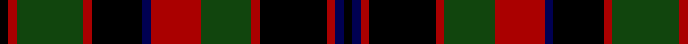

This page is one **sett** — a single exact thread-count. It belongs to the [tartan](/tartans/k1db1r1k8r1dg6r6db1k6r1dg8r1k1/)
(the same proportion at any scale), whose colour order is pattern [KBRKRGRBKRGRK](/stripes/kbrkrgrbkrgrk/).

Sourced from weddslist.  It is a [13 stripe tartan](/stripes/stripes13/).

Original link http://www.weddslist.com/cgi-bin/tartans/pg.pl?source=x

## Thread count
K/1 DR1 DG8 DR1 K6 DB1 DR6 DG6 DR1 K8 DR1 DB1 K/1

## Palette

Palette: <strong>Ingles Buchan</strong> <small style="color:#888">(1 of 4 colours)</small>
<table><thead><tr><th>Colour</th><th>Threads</th><th>Shade</th><th>Base</th><th>OKLCh</th></tr></thead><tbody><tr><td>K/</td><td style="text-align:right;font-variant-numeric:tabular-nums">1</td><td><code style="background-color:#000000;">#000000</code> <small style="color:#888">#000000</small></td><td>K <code style="background-color:#000000;">#000000</code></td><td><small style="color:#888">oklch(0.0% 0.000 0.0)</small></td></tr><tr><td>DR</td><td style="text-align:right;font-variant-numeric:tabular-nums">1</td><td><code style="background-color:#AA0000;">#AA0000</code> <small style="color:#888">#AA0000</small></td><td>R <code style="background-color:#CC0000;">#CC0000</code></td><td><small style="color:#888">oklch(46.3% 0.190 29.2)</small></td></tr><tr><td>DG</td><td style="text-align:right;font-variant-numeric:tabular-nums">8</td><td><code style="background-color:#11450D;">#11450D</code> <small style="color:#888">#11450D</small></td><td>G <code style="background-color:#006100;">#006100</code></td><td><small style="color:#888">oklch(34.4% 0.101 142.1)</small></td></tr><tr><td>DR</td><td style="text-align:right;font-variant-numeric:tabular-nums">1</td><td><code style="background-color:#AA0000;">#AA0000</code> <small style="color:#888">#AA0000</small></td><td>R <code style="background-color:#CC0000;">#CC0000</code></td><td><small style="color:#888">oklch(46.3% 0.190 29.2)</small></td></tr><tr><td>K</td><td style="text-align:right;font-variant-numeric:tabular-nums">6</td><td><code style="background-color:#000000;">#000000</code> <small style="color:#888">#000000</small></td><td>K <code style="background-color:#000000;">#000000</code></td><td><small style="color:#888">oklch(0.0% 0.000 0.0)</small></td></tr><tr><td>DB</td><td style="text-align:right;font-variant-numeric:tabular-nums">1</td><td><code style="background-color:#000052;">#000052</code> <small style="color:#888">#000052</small></td><td>B <code style="background-color:#2A418A;">#2A418A</code></td><td><small style="color:#888">oklch(19.8% 0.137 264.1)</small></td></tr><tr><td>DR</td><td style="text-align:right;font-variant-numeric:tabular-nums">6</td><td><code style="background-color:#AA0000;">#AA0000</code> <small style="color:#888">#AA0000</small></td><td>R <code style="background-color:#CC0000;">#CC0000</code></td><td><small style="color:#888">oklch(46.3% 0.190 29.2)</small></td></tr><tr><td>DG</td><td style="text-align:right;font-variant-numeric:tabular-nums">6</td><td><code style="background-color:#11450D;">#11450D</code> <small style="color:#888">#11450D</small></td><td>G <code style="background-color:#006100;">#006100</code></td><td><small style="color:#888">oklch(34.4% 0.101 142.1)</small></td></tr><tr><td>DR</td><td style="text-align:right;font-variant-numeric:tabular-nums">1</td><td><code style="background-color:#AA0000;">#AA0000</code> <small style="color:#888">#AA0000</small></td><td>R <code style="background-color:#CC0000;">#CC0000</code></td><td><small style="color:#888">oklch(46.3% 0.190 29.2)</small></td></tr><tr><td>K</td><td style="text-align:right;font-variant-numeric:tabular-nums">8</td><td><code style="background-color:#000000;">#000000</code> <small style="color:#888">#000000</small></td><td>K <code style="background-color:#000000;">#000000</code></td><td><small style="color:#888">oklch(0.0% 0.000 0.0)</small></td></tr><tr><td>DR</td><td style="text-align:right;font-variant-numeric:tabular-nums">1</td><td><code style="background-color:#AA0000;">#AA0000</code> <small style="color:#888">#AA0000</small></td><td>R <code style="background-color:#CC0000;">#CC0000</code></td><td><small style="color:#888">oklch(46.3% 0.190 29.2)</small></td></tr><tr><td>DB</td><td style="text-align:right;font-variant-numeric:tabular-nums">1</td><td><code style="background-color:#000052;">#000052</code> <small style="color:#888">#000052</small></td><td>B <code style="background-color:#2A418A;">#2A418A</code></td><td><small style="color:#888">oklch(19.8% 0.137 264.1)</small></td></tr><tr><td>K/</td><td style="text-align:right;font-variant-numeric:tabular-nums">1</td><td><code style="background-color:#000000;">#000000</code> <small style="color:#888">#000000</small></td><td>K <code style="background-color:#000000;">#000000</code></td><td><small style="color:#888">oklch(0.0% 0.000 0.0)</small></td></tr></tbody></table>

## Nearest tartans

The nearest existing variants by ΔTartan distance, with this tartan at the top so the swatches line up against it.

ΔTartan

Tartan

Sett

—

<a href="/ttd/edit/#slug=k1db1r1k8r1dg6r6db1k6r1dg8r1k1">Cumming</a> <a class="nn-out" href="/setts/s13/k1db1r1k8r1dg6r6db1k6r1dg8r1k1/" title="open its dictionary page">↗</a>

0.00

<a href="/ttd/edit/#slug=k1db1r1k8r1dg6r6db1k6r1dg8r1k1~x2">Cumming (d)</a> <a class="nn-out" href="/setts/s13/k1db1r1k8r1dg6r6db1k6r1dg8r1k1~x2/" title="open its dictionary page">↗</a>

0.80

<a href="/ttd/edit/#slug=k10r1k3do7n1do1n1do1n1do1n7~x4">Lunar</a> <a class="nn-out" href="/setts/s11/k10r1k3do7n1do1n1do1n1do1n7~x4/" title="open its dictionary page">↗</a>

1.04

<a href="/setts/s16/dg28r12dg4k20lo2k3lo2k3dg7~x2/">Cork, County</a>

1.18

<a href="/ttd/edit/#slug=k10r2k10r10dg2r2dg2r2dg10r1w2~x2">North Berwick Pipe Band (Dancing)</a> <a class="nn-out" href="/setts/s11/k10r2k10r10dg2r2dg2r2dg10r1w2~x2/" title="open its dictionary page">↗</a>

1.18

<a href="/ttd/edit/#slug=t1dy1o8k1t1k1dy8k1dy1k1dy1k8ly1~x4">Unidentified #63</a> <a class="nn-out" href="/setts/s13/t1dy1o8k1t1k1dy8k1dy1k1dy1k8ly1~x4/" title="open its dictionary page">↗</a>

1.24

<a href="/ttd/edit/#slug=r4k12lb1dg6r3k1r3lb1r3~x4">Unidentified #58</a> <a class="nn-out" href="/setts/s9/r4k12lb1dg6r3k1r3lb1r3~x4/" title="open its dictionary page">↗</a>

1.33

<a href="/setts/s11/k10k1k3ki7n1ki1n1ki1n1ki1n7~x4/">Lunar (Fashion)</a>

1.34

<a href="/ttd/edit/#slug=o26k2o3k2o3k16y18yi4y18k16o18k2o3~x2">Red Watch (Fashion) #3</a> <a class="nn-out" href="/setts/s13/o26k2o3k2o3k16y18yi4y18k16o18k2o3~x2/" title="open its dictionary page">↗</a>

1.36

<a href="/ttd/edit/#slug=dg17k2dg2k2dg2k15db15r7db15k15dg2k2dg2k2dg17lo2~x2">Thormanby Buccaneer Bay</a> <a class="nn-out" href="/setts/s16/dg17k2dg2k2dg2k15db15r7db15k15dg2k2dg2k2dg17lo2~x2/" title="open its dictionary page">↗</a>

1.36

<a href="/ttd/edit/#slug=k2db2r2k24r2dg6r6db2k6r2dg27r2k2~x2">Buchan (d)</a> <a class="nn-out" href="/setts/s13/k2db2r2k24r2dg6r6db2k6r2dg27r2k2~x2/" title="open its dictionary page">↗</a>

## Neighbour map

Every grey dot is one of 14359 variants placed by the first two principal components of the ΔTartan feature space (44% of its variance). Red is this tartan; blue dots are its nearest — click one to open its page.

<svg viewBox="0 0 640 380" role="img" style="max-width:100%;height:auto;border:1px solid #e0e0e0;border-radius:4px;display:block" xmlns="http://www.w3.org/2000/svg"><image href="/nn/cloud.v1.png" width="640" height="380"/><a href="/setts/s13/k1db1r1k8r1dg6r6db1k6r1dg8r1k1~x2/"><circle cx="187.0" cy="186.4" r="4" fill="#3465a4"><title>Cumming (d)</title></circle></a><a href="/setts/s11/k10r1k3do7n1do1n1do1n1do1n7~x4/"><circle cx="214.9" cy="179.7" r="4" fill="#3465a4"><title>Lunar</title></circle></a><a href="/setts/s16/dg28r12dg4k20lo2k3lo2k3dg7~x2/"><circle cx="224.6" cy="154.1" r="4" fill="#3465a4"><title>Cork, County</title></circle></a><a href="/setts/s11/k10r2k10r10dg2r2dg2r2dg10r1w2~x2/"><circle cx="184.7" cy="182.0" r="4" fill="#3465a4"><title>North Berwick Pipe Band (Dancing)</title></circle></a><a href="/setts/s13/t1dy1o8k1t1k1dy8k1dy1k1dy1k8ly1~x4/"><circle cx="165.5" cy="150.3" r="4" fill="#3465a4"><title>Unidentified #63</title></circle></a><a href="/setts/s9/r4k12lb1dg6r3k1r3lb1r3~x4/"><circle cx="202.0" cy="177.9" r="4" fill="#3465a4"><title>Unidentified #58</title></circle></a><a href="/setts/s11/k10k1k3ki7n1ki1n1ki1n1ki1n7~x4/"><circle cx="214.8" cy="188.6" r="4" fill="#3465a4"><title>Lunar (Fashion)</title></circle></a><a href="/setts/s13/o26k2o3k2o3k16y18yi4y18k16o18k2o3~x2/"><circle cx="205.7" cy="164.2" r="4" fill="#3465a4"><title>Red Watch (Fashion) #3</title></circle></a><a href="/setts/s16/dg17k2dg2k2dg2k15db15r7db15k15dg2k2dg2k2dg17lo2~x2/"><circle cx="153.6" cy="169.4" r="4" fill="#3465a4"><title>Thormanby Buccaneer Bay</title></circle></a><a href="/setts/s13/k2db2r2k24r2dg6r6db2k6r2dg27r2k2~x2/"><circle cx="248.2" cy="149.5" r="4" fill="#3465a4"><title>Buchan (d)</title></circle></a><circle cx="187.0" cy="186.4" r="5" fill="#c00000"/></svg>

ID: /setts/s13/k1db1r1k8r1dg6r6db1k6r1dg8r1k1/
