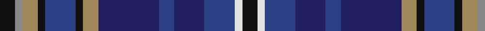

**Bands:** [KRYKBKYBBBBWK](/stripes/krykbkybbbbwk/) · **Stripes:** [K O LO K DB K LO DB DB DB DB W K](/stripes/stripes13/) K O LO K DB K LO DB DB DB DB W K

This was sourced from register-of-tartans.  It is a [13 band tartan](/bands/bands13/).

Original link https://www.tartanregister.gov.uk/tartanDetails.aspx?ref=11593

## Register references

External register numbers recorded for this tartan.

- Scottish Register of Tartans: [11593](https://www.tartanregister.gov.uk/tartanDetails.aspx?ref=11593)

## Thread count
K/8 N4 LT8 K4 B16 K4 LT8 DB32 B8 DB16 B16 LN4 K/8

## Palette
Each colour and its ΔE from the base-6 reference it is a variant of.

| Colour | Shade | Base | ΔE (OKLab) |
|---|---|---|---|
| B | <code style="background-color:#2C4084;">#2C4084</code> `#2C4084` | B <code style="background-color:#2A418A;">#2A418A</code> | 0.01 |
| DB | <code style="background-color:#202060;">#202060</code> `#202060` | B <code style="background-color:#2A418A;">#2A418A</code> | 0.11 |
| K | <code style="background-color:#101010;">#101010</code> `#101010` | K <code style="background-color:#000000;">#000000</code> | 0.17 |
| LN | <code style="background-color:#E0E0E0;">#E0E0E0</code> `#E0E0E0` | W <code style="background-color:#F7F7F7;">#F7F7F7</code> | 0.07 |
| LT | <code style="background-color:#A08858;">#A08858</code> `#A08858` | Y <code style="background-color:#F2BF00;">#F2BF00</code> | 0.21 |
| N | <code style="background-color:#888888;">#888888</code> `#888888` | R <code style="background-color:#CC0000;">#CC0000</code> | 0.24 |

## Nearest tartans

The nearest existing variants by ΔTartan distance.

1. [Scotland Forever Fashion Weavers Tartan Tartan Number: 6038. Earliest known date: pre 2003 For Alec Scott. The Lochcarron notes on this tartan say: Scotland Forever! is without doubt the best known war cry of the traditional Scottish regiments. It was most famously used by the Scots Greys on their timely and victorious charge at Waterloo in 1815. It spread throughout the ranks of the other Scottish regiments including the Royals, the 42nd and the Cameron Highlanders. See products available Copyright © Blair Urquhart, Comrie, 2015](/setts/s11/b6k3db19k6db4k3n12g4n12w2b5~x2/) — ΔT 0.66
1. [Scotland Forever](/setts/s11/db6k3dt19k6dt4k3dp12g4dp12w2db5~x2/) — ΔT 1.17
1. [South Lanarkshire](/setts/s16/k2w1dp7k1g6k1db7t1k1~x4/) — ΔT 1.18
1. [Pearl O' the Tay (Corporate)](/setts/s11/dt6g3dt3w2dt5k2dt3k2dp16m3k2~x2/) — ΔT 1.21
1. [Shandon (Personal)](/setts/s14/k20g18k2w2k5ly2k2g18k20db18b4db4b4db18~x2/) — ΔT 1.22
1. [Scottish Tourist Guides Assoc. (Corp](/setts/s13/dg12dp3lr3dp3lr3dp12db3dp3db2dp2db14lo1w3~x2/) — ΔT 1.24
1. [MacKusick (Piper) #2 (Personal)](/setts/s13/dp3k2dp5lb2db12r1db2k1g9dp3g5k12db2~x2/) — ΔT 1.24
1. [Forbes of Druminnor Artifact Tartan Tartan Number: 592. Earliest known date: 1968 Inspired by an old rug belonging to Hon. Peggy Forbes Semphill. A sample was woven by A Stewart while acting as Director of Research at the Scottish Tartans Society in 1968. See products available Copyright © Blair Urquhart, Comrie, 2015](/setts/s16/db6dr2db2dr2db2do6g8do1w2do1g8dr2do4db8dr2db2~x2/) — ΔT 1.29
1. [McLion (Corporate)](/setts/s9/w1db6g1db1g1db1db4r5lo1~x4/) — ΔT 1.30
1. [Pride of Bannockburn Fashion Tartan Tartan Number: 8978. Earliest known date: 2008 Original name was Scotland the Brave (design by Dalgleish) but changed to Spirit of Bannockburn by Lochcarron. Tartan Ribbon subsequently added a white stripe and called it Pride of Bannockburn See products available Copyright © Blair Urquhart, Comrie, 2015](/setts/s15/db20k16g3dp23m7g10m7dp23g3k16db23w2db2w2db3~x2/) — ΔT 1.32

## Neighbour map

Every grey dot is one of 14299 variants placed by the first two principal components of the ΔTartan feature space (44% of its variance). Red is this tartan; blue dots are its nearest — click one to open its page.

<svg viewBox="0 0 640 380" role="img" style="max-width:100%;height:auto;border:1px solid #e0e0e0;border-radius:4px;display:block" xmlns="http://www.w3.org/2000/svg"><image href="/nn/cloud.v1.png" width="640" height="380"/><a href="/setts/s11/b6k3db19k6db4k3n12g4n12w2b5~x2/"><circle cx="124.5" cy="179.5" r="4" fill="#3465a4"><title>Scotland Forever Fashion Weavers Tartan Tartan Number: 6038. Earliest known date: pre 2003 For Alec Scott. The Lochcarron notes on this tartan say: Scotland Forever! is without doubt the best known war cry of the traditional Scottish regiments. It was most famously used by the Scots Greys on their timely and victorious charge at Waterloo in 1815. It spread throughout the ranks of the other Scottish regiments including the Royals, the 42nd and the Cameron Highlanders. See products available Copyright © Blair Urquhart, Comrie, 2015</title></circle></a><a href="/setts/s11/db6k3dt19k6dt4k3dp12g4dp12w2db5~x2/"><circle cx="142.4" cy="188.1" r="4" fill="#3465a4"><title>Scotland Forever</title></circle></a><a href="/setts/s16/k2w1dp7k1g6k1db7t1k1~x4/"><circle cx="86.0" cy="154.5" r="4" fill="#3465a4"><title>South Lanarkshire</title></circle></a><a href="/setts/s11/dt6g3dt3w2dt5k2dt3k2dp16m3k2~x2/"><circle cx="156.7" cy="162.7" r="4" fill="#3465a4"><title>Pearl O' the Tay (Corporate)</title></circle></a><a href="/setts/s14/k20g18k2w2k5ly2k2g18k20db18b4db4b4db18~x2/"><circle cx="135.9" cy="157.3" r="4" fill="#3465a4"><title>Shandon (Personal)</title></circle></a><a href="/setts/s13/dg12dp3lr3dp3lr3dp12db3dp3db2dp2db14lo1w3~x2/"><circle cx="160.8" cy="139.3" r="4" fill="#3465a4"><title>Scottish Tourist Guides Assoc. (Corp</title></circle></a><a href="/setts/s13/dp3k2dp5lb2db12r1db2k1g9dp3g5k12db2~x2/"><circle cx="116.4" cy="153.0" r="4" fill="#3465a4"><title>MacKusick (Piper) #2 (Personal)</title></circle></a><a href="/setts/s16/db6dr2db2dr2db2do6g8do1w2do1g8dr2do4db8dr2db2~x2/"><circle cx="135.9" cy="182.6" r="4" fill="#3465a4"><title>Forbes of Druminnor Artifact Tartan Tartan Number: 592. Earliest known date: 1968 Inspired by an old rug belonging to Hon. Peggy Forbes Semphill. A sample was woven by A Stewart while acting as Director of Research at the Scottish Tartans Society in 1968. See products available Copyright © Blair Urquhart, Comrie, 2015</title></circle></a><a href="/setts/s9/w1db6g1db1g1db1db4r5lo1~x4/"><circle cx="137.7" cy="185.5" r="4" fill="#3465a4"><title>McLion (Corporate)</title></circle></a><a href="/setts/s15/db20k16g3dp23m7g10m7dp23g3k16db23w2db2w2db3~x2/"><circle cx="115.1" cy="145.9" r="4" fill="#3465a4"><title>Pride of Bannockburn Fashion Tartan Tartan Number: 8978. Earliest known date: 2008 Original name was Scotland the Brave (design by Dalgleish) but changed to Spirit of Bannockburn by Lochcarron. Tartan Ribbon subsequently added a white stripe and called it Pride of Bannockburn See products available Copyright © Blair Urquhart, Comrie, 2015</title></circle></a><circle cx="131.4" cy="181.8" r="5" fill="#c00000"/></svg>

ID: /setts/s13/k2o1lo2k1db4k1lo2db8db2db4db4w1k2~x4/
