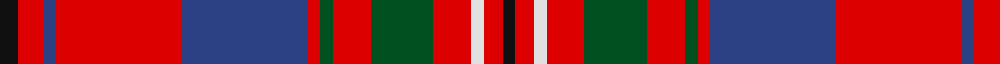

In pattern [KRBRBRGRGRWRK](/patterns/krbrbrgrgrwrk/).

This was sourced from register-of-tartans.  It is a [13 stripes tartan](/stripes/stripes13/).

Original link https://www.tartanregister.gov.uk/tartanDetails.aspx?ref=500

## Thread count
K/6 R8 B4 R40 B40 R4 G4 R12 G20 R12 LN4 R6 K/4

## Palette
Each colour and its ΔE from the base-6 reference it is a variant of.

| Colour | Shade | Base | ΔE (OKLab) |
|---|---|---|---|
| B | <code style="background-color:#2C4084;">#2C4084</code> `#2C4084` | B <code style="background-color:#2A418A;">#2A418A</code> | 0.01 |
| G | <code style="background-color:#005020;">#005020</code> `#005020` | G <code style="background-color:#006100;">#006100</code> | 0.07 |
| K | <code style="background-color:#101010;">#101010</code> `#101010` | K <code style="background-color:#000000;">#000000</code> | 0.17 |
| LN | <code style="background-color:#E0E0E0;">#E0E0E0</code> `#E0E0E0` | W <code style="background-color:#F7F7F7;">#F7F7F7</code> | 0.07 |
| R | <code style="background-color:#DC0000;">#DC0000</code> `#DC0000` | R <code style="background-color:#CC0000;">#CC0000</code> | 0.03 |

## Nearest tartans

The nearest existing variants by ΔTartan distance.

1. [Cameron of Locheil](/setts/s13/k3r4b2r20b20r2g2r6g10r6w2r3k2~b304080-g008000-k000000-rc00000-we0e0e0~x2/) — ΔT 0.41
1. [Scottish Institute of Sport](/setts/s14/y4r23ra4r2ra4b19w4b19ra4r2ra4r23y4r2~b2888c4-r880000-rac8002c-wf8f8f8-ye8c000~x2/) — ΔT 0.87
1. [Hepburn Family Tartan Tartan Number: 1381. Earliest known date: 1968 This sett was produced for Captain Charles Hepburn in 1968 by Anderson's of Edinburgh, from an existing design. Hepburns are associated with Hermitage Castle in Liddesdale and the history of Mary, Queen of Scots. James Hepburn, 4th Earl of Bothwell (1536-78), married the Queen after being implicated in the murder of her husband, Lord Darnley. See products available Copyright © Blair Urquhart, Comrie, 2015](/setts/s12/r21b4k5y2k2y2k2r7g4r2b3y2~b2c2c80-g006818-k101010-rc80000-ye8c000~x2/) — ΔT 0.87
1. [MacKinnon #3](/setts/s14/b3r4g3ba3r7g17r3ba5g4r21g7b3r6w3~b5a008c-ba2c4084-g005020-rdc0000-we0e0e0~x2/) — ΔT 0.93
1. [Nicolson/MacNicol](/setts/s13/b2r11g2r11g21r2k9ba2b11r11g2r11b2~b2c4084-ba3c82af-g005020-k101010-rdc0000~x2/) — ΔT 0.94
1. [MIT1951](/setts/s10/r24ra5y7b2y4b14r11b3r3w4~b1c1c1c-rc8002c-ra901c38-we0e0e0-yb0b0b0~x2/) — ΔT 0.96
1. [MacKinnon #8](/setts/s14/b2r3g2ba2r6g16r2ba4g2r16g8b2r4w2~b5a008c-ba2c4084-g005020-rdc0000-we0e0e0~x2/) — ΔT 0.97
1. [Fitzgerald Red](/setts/s15/k4r4w4r28b4r4b25r4g25r4b4r28w4r4k4~b1474b4-g006818-k000000-rc80000-wfcfcfc~x2/) — ΔT 0.97
1. [MacKinnon #11](/setts/s14/w3r5g3b3r14g36r3b8g3r36g14ra3r5w3~b5a008c-g005020-rdc0000-rac82828-we0e0e0~x2/) — ΔT 1.00
1. [Castle Stewart (District)](/setts/s9/y7k3b4k3r21k2r4k2w4~b2c2c80-k101010-r880000-we0e0e0-yd87c00~x2/) — ΔT 1.01

## Neighbour map

Every grey dot is one of 15726 variants placed by the first two principal components of the ΔTartan feature space (44% of its variance). Red is this tartan; blue dots are its nearest — click one to open its page.

<svg viewBox="0 0 640 380" role="img" style="max-width:100%;height:auto;border:1px solid #e0e0e0;border-radius:4px;display:block" xmlns="http://www.w3.org/2000/svg"><image href="/nn/cloud.v1.png" width="640" height="380"/><a href="/setts/s13/k3r4b2r20b20r2g2r6g10r6w2r3k2~b304080-g008000-k000000-rc00000-we0e0e0~x2/"><circle cx="238.5" cy="138.4" r="4" fill="#3465a4"><title>Cameron of Locheil</title></circle></a><a href="/setts/s14/y4r23ra4r2ra4b19w4b19ra4r2ra4r23y4r2~b2888c4-r880000-rac8002c-wf8f8f8-ye8c000~x2/"><circle cx="211.3" cy="129.6" r="4" fill="#3465a4"><title>Scottish Institute of Sport</title></circle></a><a href="/setts/s12/r21b4k5y2k2y2k2r7g4r2b3y2~b2c2c80-g006818-k101010-rc80000-ye8c000~x2/"><circle cx="256.5" cy="126.0" r="4" fill="#3465a4"><title>Hepburn Family Tartan Tartan Number: 1381. Earliest known date: 1968 This sett was produced for Captain Charles Hepburn in 1968 by Anderson's of Edinburgh, from an existing design. Hepburns are associated with Hermitage Castle in Liddesdale and the history of Mary, Queen of Scots. James Hepburn, 4th Earl of Bothwell (1536-78), married the Queen after being implicated in the murder of her husband, Lord Darnley. See products available Copyright © Blair Urquhart, Comrie, 2015</title></circle></a><a href="/setts/s14/b3r4g3ba3r7g17r3ba5g4r21g7b3r6w3~b5a008c-ba2c4084-g005020-rdc0000-we0e0e0~x2/"><circle cx="205.9" cy="159.1" r="4" fill="#3465a4"><title>MacKinnon #3</title></circle></a><a href="/setts/s13/b2r11g2r11g21r2k9ba2b11r11g2r11b2~b2c4084-ba3c82af-g005020-k101010-rdc0000~x2/"><circle cx="214.4" cy="156.6" r="4" fill="#3465a4"><title>Nicolson/MacNicol</title></circle></a><a href="/setts/s10/r24ra5y7b2y4b14r11b3r3w4~b1c1c1c-rc8002c-ra901c38-we0e0e0-yb0b0b0~x2/"><circle cx="231.8" cy="145.7" r="4" fill="#3465a4"><title>MIT1951</title></circle></a><a href="/setts/s14/b2r3g2ba2r6g16r2ba4g2r16g8b2r4w2~b5a008c-ba2c4084-g005020-rdc0000-we0e0e0~x2/"><circle cx="214.4" cy="149.4" r="4" fill="#3465a4"><title>MacKinnon #8</title></circle></a><a href="/setts/s15/k4r4w4r28b4r4b25r4g25r4b4r28w4r4k4~b1474b4-g006818-k000000-rc80000-wfcfcfc~x2/"><circle cx="209.8" cy="137.9" r="4" fill="#3465a4"><title>Fitzgerald Red</title></circle></a><a href="/setts/s14/w3r5g3b3r14g36r3b8g3r36g14ra3r5w3~b5a008c-g005020-rdc0000-rac82828-we0e0e0~x2/"><circle cx="252.7" cy="119.9" r="4" fill="#3465a4"><title>MacKinnon #11</title></circle></a><a href="/setts/s9/y7k3b4k3r21k2r4k2w4~b2c2c80-k101010-r880000-we0e0e0-yd87c00~x2/"><circle cx="237.5" cy="148.0" r="4" fill="#3465a4"><title>Castle Stewart (District)</title></circle></a><circle cx="244.6" cy="137.6" r="5" fill="#c00000"/></svg>

ID: /setts/s13/k3r4b2r20b20r2g2r6g10r6w2r3k2~b2c4084-g005020-k101010-rdc0000-we0e0e0~x2/
