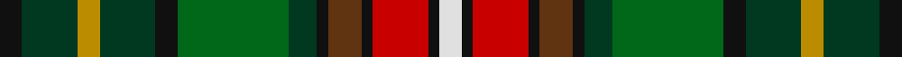

In pattern [KGYGKGGKGKRKW](/stripes/kgygkggkgkrkw/).

This was sourced from register-of-tartans.  It is a [13 stripe tartan](/stripes/stripes13/).

Original link https://www.tartanregister.gov.uk/tartanDetails.aspx?ref=4932

## Register references

External register numbers recorded for this tartan.

- Scottish Register of Tartans: [4932](https://www.tartanregister.gov.uk/tartanDetails.aspx?ref=4932)
- Scottish Tartans Authority (ITI): 7450
- Scottish Tartans World Register: 3081

## Thread count
K/8 DG20 DY8 DG20 K8 G40 DG10 K4 T12 K4 R20 K4 LN/8

## Palette
Each colour and the base-6 reference it is a variant of.

| Colour | Shade | Base |
|---|---|---|
| DG | <code style="background-color:#003820;">#003820</code> `oklch(30.0% 0.070 158.3)` <small>#003820</small> | G <code style="background-color:#006100;">#006100</code> |
| DY | <code style="background-color:#BC8C00;">#BC8C00</code> `oklch(66.8% 0.137 84.1)` <small>#BC8C00</small> | Y <code style="background-color:#F2BF00;">#F2BF00</code> |
| G | <code style="background-color:#006818;">#006818</code> `oklch(45.0% 0.142 145.0)` <small>#006818</small> | G <code style="background-color:#006100;">#006100</code> |
| K | <code style="background-color:#101010;">#101010</code> `oklch(17.3% 0.000 89.9)` <small>#101010</small> | K <code style="background-color:#000000;">#000000</code> |
| LN | <code style="background-color:#E0E0E0;">#E0E0E0</code> `oklch(90.7% 0.000 89.9)` <small>#E0E0E0</small> | W <code style="background-color:#F7F7F7;">#F7F7F7</code> |
| R | <code style="background-color:#C80000;">#C80000</code> `oklch(52.3% 0.215 29.2)` <small>#C80000</small> | R <code style="background-color:#CC0000;">#CC0000</code> |
| T | <code style="background-color:#603311;">#603311</code> `oklch(37.2% 0.079 53.9)` <small>#603311</small> | G <code style="background-color:#006100;">#006100</code> |

## Nearest tartans

The nearest existing variants by ΔTartan distance.

1. [Donegal County Crest (Fashion)](/setts/s13/k4dg10lo4dg10k4g20dg5k2lo6k2r10k2w4~x2/) — ΔT 0.94
1. [Wisconsin (US State)](/setts/s10/n11r3n2o3k12dg20ly2k12n11lo3~x2/) — ΔT 0.98
1. [Louth County, Crest Range](/setts/s11/lo16o5k8o8k16k48k4dg46w8k8lr8/) — ΔT 1.08
1. [Le Cercle des Femmes (Corporate)](/setts/s17/k12g16lb2do12g2y10k4y8o27k30lb6o27g20lo4k2lb4k4~x2/) — ΔT 1.17
1. [Gordonstoun](/setts/s12/ly3g15r2db8t2r8g8r2dg15r2dg2t2~x2/) — ΔT 1.20
1. [Culloden 1746 Artefact Tartan Tartan Number: 7422. Earliest known date: 1746 Count from the original Culloden coat discovered and later examined by Peter MacDonald on display at the Kelvingrove Museum, Glasgow. See products available Copyright © Blair Urquhart, Comrie, 2015](/setts/s14/r5lb1dt10w2k10y10k1ly3~x4/) — ΔT 1.23
1. [Humble, Gordon (Personal)](/setts/s14/o4dy2o14dy4o4p1k8dg13ly3dg13k8dy10k3dy3~x2/) — ΔT 1.26
1. [Innes Hunting Clan Tartan Tartan Number: 367. Earliest known date: pre 1992 Supposedly worn by Innes of Learney. See products available Copyright © Blair Urquhart, Comrie, 2015](/setts/s16/t3k18dy3k4dy3k3dy18ly3dy3db8dy3db3g15k3dy3w3~x2/) — ΔT 1.26
1. [Castlefield (Personal)](/setts/s12/o3k15n10dy10k1g5k1lo10k10g8k1n2~x2/) — ΔT 1.27
1. [Allen - 2001 (Personal)](/setts/s14/dt16r2dt3r4dt2dy12g18w2g18dy12dt12ly2r2ly2~x2/) — ΔT 1.29

## Neighbour map

Every grey dot is one of 14299 variants placed by the first two principal components of the ΔTartan feature space (44% of its variance). Red is this tartan; blue dots are its nearest — click one to open its page.

<svg viewBox="0 0 640 380" role="img" style="max-width:100%;height:auto;border:1px solid #e0e0e0;border-radius:4px;display:block" xmlns="http://www.w3.org/2000/svg"><image href="/nn/cloud.v1.png" width="640" height="380"/><a href="/setts/s13/k4dg10lo4dg10k4g20dg5k2lo6k2r10k2w4~x2/"><circle cx="81.5" cy="151.8" r="4" fill="#3465a4"><title>Donegal County Crest (Fashion)</title></circle></a><a href="/setts/s10/n11r3n2o3k12dg20ly2k12n11lo3~x2/"><circle cx="99.2" cy="159.7" r="4" fill="#3465a4"><title>Wisconsin (US State)</title></circle></a><a href="/setts/s11/lo16o5k8o8k16k48k4dg46w8k8lr8/"><circle cx="69.2" cy="119.7" r="4" fill="#3465a4"><title>Louth County, Crest Range</title></circle></a><a href="/setts/s17/k12g16lb2do12g2y10k4y8o27k30lb6o27g20lo4k2lb4k4~x2/"><circle cx="73.9" cy="103.6" r="4" fill="#3465a4"><title>Le Cercle des Femmes (Corporate)</title></circle></a><a href="/setts/s12/ly3g15r2db8t2r8g8r2dg15r2dg2t2~x2/"><circle cx="108.1" cy="165.6" r="4" fill="#3465a4"><title>Gordonstoun</title></circle></a><a href="/setts/s14/r5lb1dt10w2k10y10k1ly3~x4/"><circle cx="56.5" cy="129.2" r="4" fill="#3465a4"><title>Culloden 1746 Artefact Tartan Tartan Number: 7422. Earliest known date: 1746 Count from the original Culloden coat discovered and later examined by Peter MacDonald on display at the Kelvingrove Museum, Glasgow. See products available Copyright © Blair Urquhart, Comrie, 2015</title></circle></a><a href="/setts/s14/o4dy2o14dy4o4p1k8dg13ly3dg13k8dy10k3dy3~x2/"><circle cx="105.0" cy="154.7" r="4" fill="#3465a4"><title>Humble, Gordon (Personal)</title></circle></a><a href="/setts/s16/t3k18dy3k4dy3k3dy18ly3dy3db8dy3db3g15k3dy3w3~x2/"><circle cx="94.8" cy="143.3" r="4" fill="#3465a4"><title>Innes Hunting Clan Tartan Tartan Number: 367. Earliest known date: pre 1992 Supposedly worn by Innes of Learney. See products available Copyright © Blair Urquhart, Comrie, 2015</title></circle></a><a href="/setts/s12/o3k15n10dy10k1g5k1lo10k10g8k1n2~x2/"><circle cx="136.5" cy="152.2" r="4" fill="#3465a4"><title>Castlefield (Personal)</title></circle></a><a href="/setts/s14/dt16r2dt3r4dt2dy12g18w2g18dy12dt12ly2r2ly2~x2/"><circle cx="141.0" cy="163.4" r="4" fill="#3465a4"><title>Allen - 2001 (Personal)</title></circle></a><circle cx="71.9" cy="142.7" r="5" fill="#c00000"/></svg>

ID: /setts/s13/k4dg10lo4dg10k4g20dg5k2dy6k2r10k2w4~x2/
