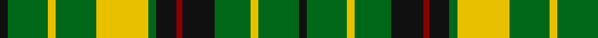

In pattern [KGYGKRKGYGYGK](/stripes/kgygkrkgygygk/).

This was sourced from tartans-authority.  It is a [13 stripe tartan](/stripes/stripes13/).

Original link http://www.tartansauthority.com/tartan-ferret/display/5115/

## Also known as

This cloth is also recorded under:

- Greenshields, Alan

## Attestations

This cloth appears in 2 source records; the oldest owns this page.

- 1997 — Greenshields, Alan (Personal) (tartans-authority, [record](http://www.tartansauthority.com/tartan-ferret/display/5115/))
- undated — Greenshields Personal Tartan Tartan Number: 5115. Earliest known date: 1997 Designed by Peter MacDoanld in 1997 for Alan Greenshields, Glasgow as a family tartan. Based by request of the customer on the MacNichol given by both Ross-Craven and Robert Bain but using yellow form the MacLeod. See products available Copyright © Blair Urquhart, Comrie, 2015 (house-of-tartan, [record](http://www.house-of-tartan.scotland.net/house/TartanViewjs.asp?colr=Def&tnam=5115))

## Thread count
K/4 G20 Y4 G20 Y26 G4 K10 DR3 K16 G18 Y4 G20 K/4

## Palette
Each colour and its ΔE from the base-6 reference it is a variant of.

| Colour | Shade | Base | ΔE (OKLab) |
|---|---|---|---|
| DR | <code style="background-color:#880000;">#880000</code> `#880000` | R <code style="background-color:#CC0000;">#CC0000</code> | 0.15 |
| G | <code style="background-color:#006818;">#006818</code> `#006818` | G <code style="background-color:#006100;">#006100</code> | 0.02 |
| K | <code style="background-color:#101010;">#101010</code> `#101010` | K <code style="background-color:#000000;">#000000</code> | 0.17 |
| Y | <code style="background-color:#E8C000;">#E8C000</code> `#E8C000` | Y <code style="background-color:#F2BF00;">#F2BF00</code> | 0.02 |

## Nearest tartans

The nearest existing variants by ΔTartan distance.

1. [Ross, hunting](/setts/s14/g4t6g3t2g3t2g3k5g3k5g20r3g4r3~x2/) — ΔT 1.22
1. [Greenshields (Personal)](/setts/s24/g20ly4g18k16r3k10g4ly26g20ly4g20k4g20ly4g20ly26g4k10r3k16g18ly4g20k4/) — ΔT 1.26
1. [Harmer](/setts/s12/dg36lo8k9lo24dg4lo12dg4lo24k9lo8dg36r4/) — ΔT 1.28
1. [Kerry County Crest (Fashion)](/setts/s10/ly14db5g25db5w2g11db7w5g6ly5~x2/) — ΔT 1.36
1. [Confessore](/setts/s15/dg12y2dg2y7ly4r2ly8r2ly4y7dg2y2dg16w2dg4~x2/) — ΔT 1.40
1. [Confessore Family Tartan Tartan Number: 2165. Earliest known date: 1994 Designed for Mr Confessore of Napoli, Italy in 1994 by Mr. Keith Lumsden, researcher at the Scottish Tartans Society. The colours reflect the shades and tones of the Italian countryside. See products available Copyright © Blair Urquhart, Comrie, 2015](/setts/s15/dg12y2dg2y7ly4o2ly8o2ly4y7dg2y2dg16w2dg4~x2/) — ΔT 1.43
1. [MacIver Hunting](/setts/s9/w2g12k3g3k16g3k3g12ly2~x2/) — ΔT 1.46
1. [Hall](/setts/s11/g4r2db4r2g8r2db4r2g8r2ly1~x3/) — ΔT 1.49
1. [Parkhead](/setts/s11/g1k1g9k7ly1g5g4w2g1w1g1~x4/) — ΔT 1.51
1. [Smeaton](/setts/s10/dt12w2dt7g15k2g4k2g15dt2k7~x2/) — ΔT 1.53

## Neighbour map

Every grey dot is one of 14299 variants placed by the first two principal components of the ΔTartan feature space (44% of its variance). Red is this tartan; blue dots are its nearest — click one to open its page.

<svg viewBox="0 0 640 380" role="img" style="max-width:100%;height:auto;border:1px solid #e0e0e0;border-radius:4px;display:block" xmlns="http://www.w3.org/2000/svg"><image href="/nn/cloud.v1.png" width="640" height="380"/><a href="/setts/s14/g4t6g3t2g3t2g3k5g3k5g20r3g4r3~x2/"><circle cx="284.2" cy="168.8" r="4" fill="#3465a4"><title>Ross, hunting</title></circle></a><a href="/setts/s24/g20ly4g18k16r3k10g4ly26g20ly4g20k4g20ly4g20ly26g4k10r3k16g18ly4g20k4/"><circle cx="216.2" cy="171.2" r="4" fill="#3465a4"><title>Greenshields (Personal)</title></circle></a><a href="/setts/s12/dg36lo8k9lo24dg4lo12dg4lo24k9lo8dg36r4/"><circle cx="228.0" cy="188.7" r="4" fill="#3465a4"><title>Harmer</title></circle></a><a href="/setts/s10/ly14db5g25db5w2g11db7w5g6ly5~x2/"><circle cx="215.1" cy="178.4" r="4" fill="#3465a4"><title>Kerry County Crest (Fashion)</title></circle></a><a href="/setts/s15/dg12y2dg2y7ly4r2ly8r2ly4y7dg2y2dg16w2dg4~x2/"><circle cx="180.1" cy="160.3" r="4" fill="#3465a4"><title>Confessore</title></circle></a><a href="/setts/s15/dg12y2dg2y7ly4o2ly8o2ly4y7dg2y2dg16w2dg4~x2/"><circle cx="180.2" cy="161.2" r="4" fill="#3465a4"><title>Confessore Family Tartan Tartan Number: 2165. Earliest known date: 1994 Designed for Mr Confessore of Napoli, Italy in 1994 by Mr. Keith Lumsden, researcher at the Scottish Tartans Society. The colours reflect the shades and tones of the Italian countryside. See products available Copyright © Blair Urquhart, Comrie, 2015</title></circle></a><a href="/setts/s9/w2g12k3g3k16g3k3g12ly2~x2/"><circle cx="273.8" cy="205.1" r="4" fill="#3465a4"><title>MacIver Hunting</title></circle></a><a href="/setts/s11/g4r2db4r2g8r2db4r2g8r2ly1~x3/"><circle cx="242.2" cy="215.3" r="4" fill="#3465a4"><title>Hall</title></circle></a><a href="/setts/s11/g1k1g9k7ly1g5g4w2g1w1g1~x4/"><circle cx="187.1" cy="163.7" r="4" fill="#3465a4"><title>Parkhead</title></circle></a><a href="/setts/s10/dt12w2dt7g15k2g4k2g15dt2k7~x2/"><circle cx="212.8" cy="210.5" r="4" fill="#3465a4"><title>Smeaton</title></circle></a><circle cx="223.6" cy="192.6" r="5" fill="#c00000"/></svg>

ID: /setts/s13/k4g20ly4g20ly26g4k10r3k16g18ly4g20k4/
