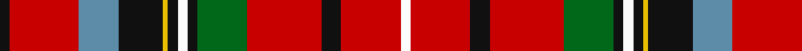

In pattern [KRBKYKWKGRKRW](/patterns/krbkykwkgrkrw/).

This was sourced from tartans-authority.  It is a [13 stripes tartan](/stripes/stripes13/).

Original link http://www.tartansauthority.com/tartan-ferret/display/6274/

## Thread count
K/4 R28 B16 K18 Y2 K4 W4 K4 G20 R30 K8 R24 W/4

## Palette
Each colour and its ΔE from the base-6 reference it is a variant of.

| Colour | Shade | Base | ΔE (OKLab) |
|---|---|---|---|
| B | <code style="background-color:#5C8CA8;">#5C8CA8</code> `#5C8CA8` | B <code style="background-color:#2C4084;">#2C4084</code> | 0.23 |
| G | <code style="background-color:#006818;">#006818</code> `#006818` | G <code style="background-color:#006400;">#006400</code> | 0.02 |
| K | <code style="background-color:#101010;">#101010</code> `#101010` | K <code style="background-color:#000000;">#000000</code> | 0.17 |
| R | <code style="background-color:#C80000;">#C80000</code> `#C80000` | R <code style="background-color:#C80000;">#C80000</code> | 0.00 |
| W | <code style="background-color:#FCFCFC;">#FCFCFC</code> `#FCFCFC` | W <code style="background-color:#F4F4F0;">#F4F4F0</code> | 0.03 |
| Y | <code style="background-color:#E8C000;">#E8C000</code> `#E8C000` | Y <code style="background-color:#E8C000;">#E8C000</code> | 0.00 |

## Nearest tartans

The nearest existing variants by ΔTartan distance.

1. [Wilson's, No 1](/setts/s13/k2r28b16k18y2k4w4k4g20r30k8r24w2-b5480b0-g008000-k000000-rc00000-we0e0e0-yf0c000/) — ΔT 0.63
1. [Caledonia](/setts/s14/r42b18k4b4k4b18k36y6g42r26k6r26w4r26-b5c8ca8-g006818-k101010-rc80000-wfcfcfc-ye8c000/) — ΔT 0.79
1. [Caledonia No 155 District Tartan Tartan Number: 1356. Earliest known date: 1819 Popular in the eighteenth century and appears in a number of guises. Romantic stories are told of its origin but in reality little is known. (G.Teall). J. Scarlett asserts that Wilson's No 155 has never been named, and that Miss Margaret MacDougall was in error when she included it in Robert Bain's 'Clans and Tartans of Scotland' (1953) as Caledonia. It is included here because of its obvious family resemblance to other Caledonia setts. See products available Copyright © Blair Urquhart, Comrie, 2015](/setts/s14/r42b18k4b4k4b18k36y6g42r26k6r26w4r26-b5c8ca8-g006818-k101010-rc80000-we0e0e0-ye8c000/) — ΔT 0.81
1. [Peacock (Personal)](/setts/s13/w8k4b8wa4g16r4g16r12k12r48wa4r8k4-b1474b4-g285800-k101010-rc80000-wfcfcfc-wa98c8e8/) — ΔT 0.86
1. [Caledonia No 155](/setts/s14/r42b18k4b4k4b18k36y6g42r26k6r26w4r26-b5480b0-g008000-k000000-rc00000-we0e0e0-yf0c000/) — ΔT 0.90
1. [Ogg of Tarragann](/setts/s12/k4b12w2r28k2r28w2k12g20y2g4y4-b237f97-g14492d-k101010-rcb2610-wffffff-ybe8f2c/) — ΔT 0.90
1. [Ogg of Tarragann (Personal)](/setts/s12/k4b12w2r28k2r28w2k12g20y2g4y4-b5c8ca8-g006818-k101010-rc80000-we0e0e0-ybc8c00/) — ΔT 0.94
1. [Drummond - 1739 Lord John (Artefact)](/setts/s14/k40r12k8r12g30w4ga10w4g30r60k8r10wa4r12-g285800-ga606000-k00002c-rc82428-wf8f8f8-wa98c8e8/) — ΔT 0.99
1. [Unidentified #16](/setts/s15/b12k6r8k4r54k24b20k6y4k6g24r20w4r6k6-b2c4084-g005020-k101010-rdc0000-we0e0e0-ye8c000/) — ΔT 1.04
1. [Christie Family Tartan Tartan Number: 1355. Earliest known date: 1930 Two woven samples in the Society's collection, were presented by Messrs Stewart Christie of Edinburgh. Very little else is known about the origin of the design. The alternative sample replaces blue with azure, but is otherwise identical. The name Christie in Scotland is thought to derive from the Norse word 'Trusty' meaning swordsman. (c.f. thrust). Christies are traditionally associated with the Clan Farquharson. See products available Copyright © Blair Urquhart, Comrie, 2015](/setts/s13/r32b8k4b12k16y4k4w4k4g32r24w4r24-b2c2c80-g006818-k101010-rc80000-we0e0e0-ye8c000/) — ΔT 1.06

## Neighbour map

Every grey dot is one of 15726 variants placed by the first two principal components of the ΔTartan feature space (44% of its variance). Red is this tartan; blue dots are its nearest — click one to open its page.

<svg viewBox="0 0 640 380" role="img" style="max-width:100%;height:auto;border:1px solid #e0e0e0;border-radius:4px;display:block" xmlns="http://www.w3.org/2000/svg"><image href="/nn/cloud.v1.png" width="640" height="380"/><a href="/setts/s13/k2r28b16k18y2k4w4k4g20r30k8r24w2-b5480b0-g008000-k000000-rc00000-we0e0e0-yf0c000/"><circle cx="195.4" cy="111.6" r="4" fill="#3465a4"><title>Wilson's, No 1</title></circle></a><a href="/setts/s14/r42b18k4b4k4b18k36y6g42r26k6r26w4r26-b5c8ca8-g006818-k101010-rc80000-wfcfcfc-ye8c000/"><circle cx="163.5" cy="133.4" r="4" fill="#3465a4"><title>Caledonia</title></circle></a><a href="/setts/s14/r42b18k4b4k4b18k36y6g42r26k6r26w4r26-b5c8ca8-g006818-k101010-rc80000-we0e0e0-ye8c000/"><circle cx="164.9" cy="134.0" r="4" fill="#3465a4"><title>Caledonia No 155 District Tartan Tartan Number: 1356. Earliest known date: 1819 Popular in the eighteenth century and appears in a number of guises. Romantic stories are told of its origin but in reality little is known. (G.Teall). J. Scarlett asserts that Wilson's No 155 has never been named, and that Miss Margaret MacDougall was in error when she included it in Robert Bain's 'Clans and Tartans of Scotland' (1953) as Caledonia. It is included here because of its obvious family resemblance to other Caledonia setts. See products available Copyright © Blair Urquhart, Comrie, 2015</title></circle></a><a href="/setts/s13/w8k4b8wa4g16r4g16r12k12r48wa4r8k4-b1474b4-g285800-k101010-rc80000-wfcfcfc-wa98c8e8/"><circle cx="198.1" cy="107.0" r="4" fill="#3465a4"><title>Peacock (Personal)</title></circle></a><a href="/setts/s14/r42b18k4b4k4b18k36y6g42r26k6r26w4r26-b5480b0-g008000-k000000-rc00000-we0e0e0-yf0c000/"><circle cx="145.7" cy="128.0" r="4" fill="#3465a4"><title>Caledonia No 155</title></circle></a><a href="/setts/s12/k4b12w2r28k2r28w2k12g20y2g4y4-b237f97-g14492d-k101010-rcb2610-wffffff-ybe8f2c/"><circle cx="199.1" cy="112.8" r="4" fill="#3465a4"><title>Ogg of Tarragann</title></circle></a><a href="/setts/s12/k4b12w2r28k2r28w2k12g20y2g4y4-b5c8ca8-g006818-k101010-rc80000-we0e0e0-ybc8c00/"><circle cx="200.6" cy="112.5" r="4" fill="#3465a4"><title>Ogg of Tarragann (Personal)</title></circle></a><a href="/setts/s14/k40r12k8r12g30w4ga10w4g30r60k8r10wa4r12-g285800-ga606000-k00002c-rc82428-wf8f8f8-wa98c8e8/"><circle cx="176.3" cy="107.0" r="4" fill="#3465a4"><title>Drummond - 1739 Lord John (Artefact)</title></circle></a><a href="/setts/s15/b12k6r8k4r54k24b20k6y4k6g24r20w4r6k6-b2c4084-g005020-k101010-rdc0000-we0e0e0-ye8c000/"><circle cx="175.3" cy="103.7" r="4" fill="#3465a4"><title>Unidentified #16</title></circle></a><a href="/setts/s13/r32b8k4b12k16y4k4w4k4g32r24w4r24-b2c2c80-g006818-k101010-rc80000-we0e0e0-ye8c000/"><circle cx="160.3" cy="139.6" r="4" fill="#3465a4"><title>Christie Family Tartan Tartan Number: 1355. Earliest known date: 1930 Two woven samples in the Society's collection, were presented by Messrs Stewart Christie of Edinburgh. Very little else is known about the origin of the design. The alternative sample replaces blue with azure, but is otherwise identical. The name Christie in Scotland is thought to derive from the Norse word 'Trusty' meaning swordsman. (c.f. thrust). Christies are traditionally associated with the Clan Farquharson. See products available Copyright © Blair Urquhart, Comrie, 2015</title></circle></a><circle cx="196.1" cy="117.6" r="5" fill="#c00000"/></svg>

ID: /setts/s13/k4r28b16k18y2k4w4k4g20r30k8r24w4-b5c8ca8-g006818-k101010-rc80000-wfcfcfc-ye8c000/
