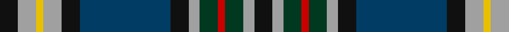

This page is one **sett** — a single exact thread-count. It belongs to the [tartan](/tartans/k5lr5ly2lr5k5dt25k5lr3dg5r2dg5lr3k5/)
(the same proportion at any scale), whose colour order is pattern [KYGRGYKBKYYYK](/stripes/kygrgykbkyyyk/).

Sourced from register-of-tartans.  It is a [13 stripe tartan](/stripes/stripes13/).

Original link https://www.tartanregister.gov.uk/tartanDetails.aspx?ref=2112

2 attestations — the source records this cloth was collapsed from (oldest owns this page)

<ul>
<li>01/06/2006 — Liberton (register-of-tartans, <a href="https://www.tartanregister.gov.uk/tartanDetails.aspx?ref=2112">record</a>)</li>
<li>2006 June — Liberton (Name) (tartans-authority, <a href="http://www.tartansauthority.com/tartan-ferret/display/6993/">record</a>)</li>
</ul>

## Register references

External register numbers recorded for this tartan.

- Scottish Register of Tartans: [2112](https://www.tartanregister.gov.uk/tartanDetails.aspx?ref=2112)
- Scottish Tartans Authority (ITI): 6993

## Thread count
K/10 N10 Y4 N10 K10 DB50 K10 N6 DG10 R4 DG10 N6 K/10

## Palette

Palette: <strong>Tartan Register</strong>
<table><thead><tr><th>Colour</th><th>Threads</th><th>Shade</th><th>Base</th><th>OKLCh</th></tr></thead><tbody><tr><td>K/</td><td style="text-align:right;font-variant-numeric:tabular-nums">10</td><td><code style="background-color:#101010;">#101010</code> <small style="color:#888">#101010</small></td><td>K <code style="background-color:#000000;">#000000</code></td><td><small style="color:#888">oklch(17.3% 0.000 89.9)</small></td></tr><tr><td>N</td><td style="text-align:right;font-variant-numeric:tabular-nums">10</td><td><code style="background-color:#A0A0A0;">#A0A0A0</code> <small style="color:#888">#A0A0A0</small></td><td>Y <code style="background-color:#F2BF00;">#F2BF00</code></td><td><small style="color:#888">oklch(70.6% 0.000 89.9)</small></td></tr><tr><td>Y</td><td style="text-align:right;font-variant-numeric:tabular-nums">4</td><td><code style="background-color:#E8C000;">#E8C000</code> <small style="color:#888">#E8C000</small></td><td>Y <code style="background-color:#F2BF00;">#F2BF00</code></td><td><small style="color:#888">oklch(81.9% 0.168 93.7)</small></td></tr><tr><td>N</td><td style="text-align:right;font-variant-numeric:tabular-nums">10</td><td><code style="background-color:#A0A0A0;">#A0A0A0</code> <small style="color:#888">#A0A0A0</small></td><td>Y <code style="background-color:#F2BF00;">#F2BF00</code></td><td><small style="color:#888">oklch(70.6% 0.000 89.9)</small></td></tr><tr><td>K</td><td style="text-align:right;font-variant-numeric:tabular-nums">10</td><td><code style="background-color:#101010;">#101010</code> <small style="color:#888">#101010</small></td><td>K <code style="background-color:#000000;">#000000</code></td><td><small style="color:#888">oklch(17.3% 0.000 89.9)</small></td></tr><tr><td>DB</td><td style="text-align:right;font-variant-numeric:tabular-nums">50</td><td><code style="background-color:#003C64;">#003C64</code> <small style="color:#888">#003C64</small></td><td>B <code style="background-color:#2A418A;">#2A418A</code></td><td><small style="color:#888">oklch(34.5% 0.089 246.0)</small></td></tr><tr><td>K</td><td style="text-align:right;font-variant-numeric:tabular-nums">10</td><td><code style="background-color:#101010;">#101010</code> <small style="color:#888">#101010</small></td><td>K <code style="background-color:#000000;">#000000</code></td><td><small style="color:#888">oklch(17.3% 0.000 89.9)</small></td></tr><tr><td>N</td><td style="text-align:right;font-variant-numeric:tabular-nums">6</td><td><code style="background-color:#A0A0A0;">#A0A0A0</code> <small style="color:#888">#A0A0A0</small></td><td>Y <code style="background-color:#F2BF00;">#F2BF00</code></td><td><small style="color:#888">oklch(70.6% 0.000 89.9)</small></td></tr><tr><td>DG</td><td style="text-align:right;font-variant-numeric:tabular-nums">10</td><td><code style="background-color:#003820;">#003820</code> <small style="color:#888">#003820</small></td><td>G <code style="background-color:#006100;">#006100</code></td><td><small style="color:#888">oklch(30.0% 0.070 158.3)</small></td></tr><tr><td>R</td><td style="text-align:right;font-variant-numeric:tabular-nums">4</td><td><code style="background-color:#C80000;">#C80000</code> <small style="color:#888">#C80000</small></td><td>R <code style="background-color:#CC0000;">#CC0000</code></td><td><small style="color:#888">oklch(52.3% 0.215 29.2)</small></td></tr><tr><td>DG</td><td style="text-align:right;font-variant-numeric:tabular-nums">10</td><td><code style="background-color:#003820;">#003820</code> <small style="color:#888">#003820</small></td><td>G <code style="background-color:#006100;">#006100</code></td><td><small style="color:#888">oklch(30.0% 0.070 158.3)</small></td></tr><tr><td>N</td><td style="text-align:right;font-variant-numeric:tabular-nums">6</td><td><code style="background-color:#A0A0A0;">#A0A0A0</code> <small style="color:#888">#A0A0A0</small></td><td>Y <code style="background-color:#F2BF00;">#F2BF00</code></td><td><small style="color:#888">oklch(70.6% 0.000 89.9)</small></td></tr><tr><td>K/</td><td style="text-align:right;font-variant-numeric:tabular-nums">10</td><td><code style="background-color:#101010;">#101010</code> <small style="color:#888">#101010</small></td><td>K <code style="background-color:#000000;">#000000</code></td><td><small style="color:#888">oklch(17.3% 0.000 89.9)</small></td></tr></tbody></table>

## Nearest tartans

The nearest existing variants by ΔTartan distance, with this tartan at the top so the swatches line up against it.

ΔTartan

Tartan

Sett

—

<a href="/ttd/edit/#slug=k5lr5ly2lr5k5dt25k5lr3dg5r2dg5lr3k5~x2">Liberton</a> <a class="nn-out" href="/setts/s13/k5lr5ly2lr5k5dt25k5lr3dg5r2dg5lr3k5~x2/" title="open its dictionary page">↗</a>

0.82

<a href="/ttd/edit/#slug=r3k2g18k18db3k3db3k3db18ly2w3~x2">Tindal</a> <a class="nn-out" href="/setts/s11/r3k2g18k18db3k3db3k3db18ly2w3~x2/" title="open its dictionary page">↗</a>

0.84

<a href="/ttd/edit/#slug=r4k2g25k2t10k2g4k2db25k2ly4~x2">Ayrton (1979) (Personal)</a> <a class="nn-out" href="/setts/s11/r4k2g25k2t10k2g4k2db25k2ly4~x2/" title="open its dictionary page">↗</a>

0.88

<a href="/ttd/edit/#slug=k6g20b2r5b2k20lo3db20g26r3db5~x2">Stephenson (Name)</a> <a class="nn-out" href="/setts/s11/k6g20b2r5b2k20lo3db20g26r3db5~x2/" title="open its dictionary page">↗</a>

0.90

<a href="/ttd/edit/#slug=ly3k2r3db20k24g20r3k2lb3~x2">Loch Awe</a> <a class="nn-out" href="/setts/s9/ly3k2r3db20k24g20r3k2lb3~x2/" title="open its dictionary page">↗</a>

0.91

<a href="/ttd/edit/#slug=db7w3g3db18lo3k15lo3g17r6g3r2g7~x2">Drennan</a> <a class="nn-out" href="/setts/s12/db7w3g3db18lo3k15lo3g17r6g3r2g7~x2/" title="open its dictionary page">↗</a>

0.95

<a href="/ttd/edit/#slug=db11r1db2r3db1do8g11w1g11do8db8ly1r1ly1~x2">Allen Northumbrian Family Tartan Tartan Number: 3208. Earliest known date: 2001 Designed by Jerry M P Allen of Hermitage, Berkshire, for use by his family and relations and others by permission of the designer See products available Copyright © Blair Urquhart, Comrie, 2015</a> <a class="nn-out" href="/setts/s14/db11r1db2r3db1do8g11w1g11do8db8ly1r1ly1~x2/" title="open its dictionary page">↗</a>

0.95

<a href="/ttd/edit/#slug=r3dt3k2dt18ly2k25g20r2g3lb3~x2">Loch Freuchie (District)</a> <a class="nn-out" href="/setts/s10/r3dt3k2dt18ly2k25g20r2g3lb3~x2/" title="open its dictionary page">↗</a>

0.97

<a href="/ttd/edit/#slug=m4k7m2db25k19w2g13k2ly3~x2">Leung (Personal)</a> <a class="nn-out" href="/setts/s9/m4k7m2db25k19w2g13k2ly3~x2/" title="open its dictionary page">↗</a>

0.97

<a href="/ttd/edit/#slug=w1db12k9g1k1g5lb1g3lo1~x4">St. Andrews Golf Club (Corporate)</a> <a class="nn-out" href="/setts/s9/w1db12k9g1k1g5lb1g3lo1~x4/" title="open its dictionary page">↗</a>

0.97

<a href="/ttd/edit/#slug=k20g18k2w2k5ly2k2g18k20db18b4db4b4db18~x2">Shandon (Personal)</a> <a class="nn-out" href="/setts/s14/k20g18k2w2k5ly2k2g18k20db18b4db4b4db18~x2/" title="open its dictionary page">↗</a>

## Neighbour map

Every grey dot is one of 14359 variants placed by the first two principal components of the ΔTartan feature space (44% of its variance). Red is this tartan; blue dots are its nearest — click one to open its page.

<svg viewBox="0 0 640 380" role="img" style="max-width:100%;height:auto;border:1px solid #e0e0e0;border-radius:4px;display:block" xmlns="http://www.w3.org/2000/svg"><image href="/nn/cloud.v1.png" width="640" height="380"/><a href="/setts/s11/r3k2g18k18db3k3db3k3db18ly2w3~x2/"><circle cx="140.9" cy="154.8" r="4" fill="#3465a4"><title>Tindal</title></circle></a><a href="/setts/s11/r4k2g25k2t10k2g4k2db25k2ly4~x2/"><circle cx="158.7" cy="130.4" r="4" fill="#3465a4"><title>Ayrton (1979) (Personal)</title></circle></a><a href="/setts/s11/k6g20b2r5b2k20lo3db20g26r3db5~x2/"><circle cx="166.8" cy="148.7" r="4" fill="#3465a4"><title>Stephenson (Name)</title></circle></a><a href="/setts/s9/ly3k2r3db20k24g20r3k2lb3~x2/"><circle cx="145.0" cy="145.2" r="4" fill="#3465a4"><title>Loch Awe</title></circle></a><a href="/setts/s12/db7w3g3db18lo3k15lo3g17r6g3r2g7~x2/"><circle cx="106.7" cy="161.1" r="4" fill="#3465a4"><title>Drennan</title></circle></a><a href="/setts/s14/db11r1db2r3db1do8g11w1g11do8db8ly1r1ly1~x2/"><circle cx="140.5" cy="149.0" r="4" fill="#3465a4"><title>Allen Northumbrian Family Tartan Tartan Number: 3208. Earliest known date: 2001 Designed by Jerry M P Allen of Hermitage, Berkshire, for use by his family and relations and others by permission of the designer See products available Copyright © Blair Urquhart, Comrie, 2015</title></circle></a><a href="/setts/s10/r3dt3k2dt18ly2k25g20r2g3lb3~x2/"><circle cx="155.8" cy="143.9" r="4" fill="#3465a4"><title>Loch Freuchie (District)</title></circle></a><a href="/setts/s9/m4k7m2db25k19w2g13k2ly3~x2/"><circle cx="152.2" cy="148.8" r="4" fill="#3465a4"><title>Leung (Personal)</title></circle></a><a href="/setts/s9/w1db12k9g1k1g5lb1g3lo1~x4/"><circle cx="164.4" cy="150.6" r="4" fill="#3465a4"><title>St. Andrews Golf Club (Corporate)</title></circle></a><a href="/setts/s14/k20g18k2w2k5ly2k2g18k20db18b4db4b4db18~x2/"><circle cx="135.9" cy="158.2" r="4" fill="#3465a4"><title>Shandon (Personal)</title></circle></a><circle cx="131.4" cy="131.5" r="5" fill="#c00000"/></svg>

ID: /setts/s13/k5lr5ly2lr5k5dt25k5lr3dg5r2dg5lr3k5~x2/
