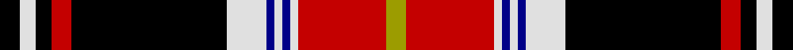

**Bands:** [KWKRKKWBWBWRY](/stripes/kwkrkkwbwbwry/) · **Stripes:** [K W K R K K W DB W DB W R LY](/stripes/stripes13/) K W K R K K W DB W DB W R LY

This was sourced from tartans-authority.  It is a [13 band tartan](/bands/bands13/).

Original link http://www.tartansauthority.com/tartan-ferret/display/1820/

## Thread count
K/10 LN8 Ka8 R10 Ka70 Ka8 LN20 DB4 LN4 DB4 LN4 R44 LG/10

## Palette
Each colour and its ΔE from the base-6 reference it is a variant of.

| Colour | Shade | Base | ΔE (OKLab) |
|---|---|---|---|
| DB | <code style="background-color:#000088;">#000088</code> `#000088` | B <code style="background-color:#2A418A;">#2A418A</code> | 0.14 |
| K | <code style="background-color:#000000;">#000000</code> `#000000` | K <code style="background-color:#000000;">#000000</code> | 0.00 |
| Ka | <code style="background-color:#000000;">#000000</code> `#000000` | K <code style="background-color:#000000;">#000000</code> | 0.00 |
| LG | <code style="background-color:#9C9C00;">#9C9C00</code> `#9C9C00` | Y <code style="background-color:#F2BF00;">#F2BF00</code> | 0.17 |
| LN | <code style="background-color:#E0E0E0;">#E0E0E0</code> `#E0E0E0` | W <code style="background-color:#F7F7F7;">#F7F7F7</code> | 0.07 |
| R | <code style="background-color:#C40000;">#C40000</code> `#C40000` | R <code style="background-color:#CC0000;">#CC0000</code> | 0.02 |

## Nearest tartans

The nearest existing variants by ΔTartan distance.

1. [Boyd](/setts/s12/w1k1r1g1r12k6db1k1db1k1g6ly1~x4/) — ΔT 1.11
1. [Unidentified 30](/setts/s15/db6k3r4k2r27k12db10k3ly2k3g12r10w2r3k3~x2/) — ΔT 1.13
1. [Boyd](/setts/s12/ly5dg22k2db2k2db2k10r38dg5r4k4lb5/) — ΔT 1.16
1. [Aberdeen Forever](/setts/s12/ly4w2r19n8k1n3k2n2k3n2k26lb4~x2/) — ΔT 1.17
1. [MacLean](/setts/s12/db4lb1k3ly1dg1lb1k1dg8r12lb1r2k1~x2/) — ΔT 1.18
1. [Boyd](/setts/s12/lr5k4r4dg5r38k10db2k2db2k2dg22ly5~x2/) — ΔT 1.18
1. [Boyd](/setts/s12/lr5k4r4dg5r38k10db2k2db2k2dg22ly5/) — ΔT 1.18
1. [Aberdeen Forever (District)](/setts/s12/ly4w2r16o8k1o3k2o2k3o2k22lb4~x2/) — ΔT 1.22
1. [Boyd](/setts/s12/w5k4r4g5r38k10db2k2db2k2g22ly5~x2/) — ΔT 1.22
1. [O'Keefe](/setts/s12/k8r2k3ly2k2w3k2y12o22r2o2k1~x2/) — ΔT 1.25

## Neighbour map

Every grey dot is one of 14299 variants placed by the first two principal components of the ΔTartan feature space (44% of its variance). Red is this tartan; blue dots are its nearest — click one to open its page.

<svg viewBox="0 0 640 380" role="img" style="max-width:100%;height:auto;border:1px solid #e0e0e0;border-radius:4px;display:block" xmlns="http://www.w3.org/2000/svg"><image href="/nn/cloud.v1.png" width="640" height="380"/><a href="/setts/s12/w1k1r1g1r12k6db1k1db1k1g6ly1~x4/"><circle cx="157.7" cy="95.6" r="4" fill="#3465a4"><title>Boyd</title></circle></a><a href="/setts/s15/db6k3r4k2r27k12db10k3ly2k3g12r10w2r3k3~x2/"><circle cx="163.3" cy="100.4" r="4" fill="#3465a4"><title>Unidentified 30</title></circle></a><a href="/setts/s12/ly5dg22k2db2k2db2k10r38dg5r4k4lb5/"><circle cx="187.9" cy="77.6" r="4" fill="#3465a4"><title>Boyd</title></circle></a><a href="/setts/s12/ly4w2r19n8k1n3k2n2k3n2k26lb4~x2/"><circle cx="195.2" cy="67.0" r="4" fill="#3465a4"><title>Aberdeen Forever</title></circle></a><a href="/setts/s12/db4lb1k3ly1dg1lb1k1dg8r12lb1r2k1~x2/"><circle cx="143.3" cy="100.3" r="4" fill="#3465a4"><title>MacLean</title></circle></a><a href="/setts/s12/lr5k4r4dg5r38k10db2k2db2k2dg22ly5~x2/"><circle cx="201.0" cy="87.8" r="4" fill="#3465a4"><title>Boyd</title></circle></a><a href="/setts/s12/lr5k4r4dg5r38k10db2k2db2k2dg22ly5/"><circle cx="201.0" cy="87.8" r="4" fill="#3465a4"><title>Boyd</title></circle></a><a href="/setts/s12/ly4w2r16o8k1o3k2o2k3o2k22lb4~x2/"><circle cx="176.7" cy="82.2" r="4" fill="#3465a4"><title>Aberdeen Forever (District)</title></circle></a><a href="/setts/s12/w5k4r4g5r38k10db2k2db2k2g22ly5~x2/"><circle cx="188.0" cy="78.7" r="4" fill="#3465a4"><title>Boyd</title></circle></a><a href="/setts/s12/k8r2k3ly2k2w3k2y12o22r2o2k1~x2/"><circle cx="172.4" cy="79.5" r="4" fill="#3465a4"><title>O'Keefe</title></circle></a><circle cx="169.7" cy="78.6" r="5" fill="#c00000"/></svg>

ID: /setts/s13/k5w4k4r5k35k4w10db2w2db2w2r22ly5~x2/
