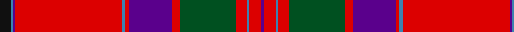

In pattern [BRBRGRBRBRBBK](/patterns/brbrgrbrbrbbk/).

This was sourced from register-of-tartans.  It is a [13 stripes tartan](/stripes/stripes13/).

Original link https://www.tartanregister.gov.uk/tartanDetails.aspx?ref=2441

## Register references

External register numbers recorded for this tartan.

- Scottish Register of Tartans: [2441](https://www.tartanregister.gov.uk/tartanDetails.aspx?ref=2441)
- Scottish Tartans World Register: 447

## Thread count
K/12 B2 P2 R114 B4 R4 P46 R8 G60 R12 B2 R12 P/4

## Palette
Each colour and its ΔE from the base-6 reference it is a variant of.

| Colour | Shade | Base | ΔE (OKLab) |
|---|---|---|---|
| B | <code style="background-color:#3C82AF;">#3C82AF</code> `#3C82AF` | B <code style="background-color:#2A418A;">#2A418A</code> | 0.19 |
| G | <code style="background-color:#005020;">#005020</code> `#005020` | G <code style="background-color:#006100;">#006100</code> | 0.07 |
| K | <code style="background-color:#101010;">#101010</code> `#101010` | K <code style="background-color:#000000;">#000000</code> | 0.17 |
| P | <code style="background-color:#5A008C;">#5A008C</code> `#5A008C` | B <code style="background-color:#2A418A;">#2A418A</code> | 0.13 |
| R | <code style="background-color:#DC0000;">#DC0000</code> `#DC0000` | R <code style="background-color:#CC0000;">#CC0000</code> | 0.03 |

## Nearest tartans

The nearest existing variants by ΔTartan distance.

1. [MacGillivray](/setts/s13/k6b1ba1r57b2r2ba23r4g30r6b1r6ba2~b5480b0-ba800080-g008000-k000000-rc00000~x2/) — ΔT 0.42
1. [MacFarlane (Lord Lyon sett)](/setts/s14/r42k1g12w2r3k1r3w2g2b12k4r3w4g3~b780078-g285800-k101010-ra00048-we0e0e0~x2/) — ΔT 0.73
1. [Lendrum (Clan)](/setts/s14/r42k1g12w2r3k1r3w2g2b12k4r3w4g3~b780078-g006818-k101010-ra00048-we0e0e0~x2/) — ΔT 0.75
1. [MacFarlane](/setts/s14/r42k1g12w2r3k1r3w2g2b12k4r3w4g3~b5a3094-g004c00-k000000-rc80000-wd0d0d0~x2/) — ΔT 0.78
1. [MacFarlane Red Artifact Tartan Tartan Number: 947. Earliest known date: 1822 The threadcount is taken from a silk, satin-weave sash, (1822) in the collection of the Scottish Tartans Museum in Comrie, Perthshire. (Reproduced at 50% actual count.) The sett varies slightly from the one registered with Lord Lyon but is often the manufacturers choice. MacFarlanes, 'sons of Parlan', were proscribed and their lands forfeited, in the same way as the MacGregors. Many emigrated and some changed their name: Bartholomew is a Southern form of the name. The chiefship is vacant. See products available Copyright © Blair Urquhart, Comrie, 2015](/setts/s14/r103k8g16w4r9k3r9w4g7b41k14r14w10g6~b2c2c80-g006818-k101010-rc80000-we0e0e0/) — ΔT 0.84
1. [MacFarlane, or Lendrum](/setts/s14/r42k1g12w2r3k1r3w2g2b12k4r3w4g3~b800080-g008000-k000000-r900030-we0e0e0~x2/) — ΔT 0.88
1. [MacFarlane](/setts/s14/r42k1g12y2r3k1r3y2g2b12k4r3y4g3~b6e5058-g11450d-k000000-raa0000-yaaaaaa~x2/) — ΔT 0.95
1. [Stratford City Police PB (Corp)](/setts/s13/r5b2y1r46b4w1k5ba9b2y2b2k10w2~b2c2c80-ba2888c4-k101010-rc80000-we0e0e0-yfccc00~x2/) — ΔT 1.11
1. [Stratford Police PB (Corporate)](/setts/s13/r5b2y1r45b4w1k4ba9b2y2b2k10w2~b2888c4-ba5c8ca8-k101010-rc80000-wfcfcfc-ybc8c00~x2/) — ΔT 1.12
1. [MacFarlane, Red](/setts/s14/r103k8g16w4r9k3r9w4g7b41k14r14w10g6~b304080-g008000-k000000-rc00000-we0e0e0/) — ΔT 1.16

## Neighbour map

Every grey dot is one of 15726 variants placed by the first two principal components of the ΔTartan feature space (44% of its variance). Red is this tartan; blue dots are its nearest — click one to open its page.

<svg viewBox="0 0 640 380" role="img" style="max-width:100%;height:auto;border:1px solid #e0e0e0;border-radius:4px;display:block" xmlns="http://www.w3.org/2000/svg"><image href="/nn/cloud.v1.png" width="640" height="380"/><a href="/setts/s13/k6b1ba1r57b2r2ba23r4g30r6b1r6ba2~b5480b0-ba800080-g008000-k000000-rc00000~x2/"><circle cx="357.1" cy="56.6" r="4" fill="#3465a4"><title>MacGillivray</title></circle></a><a href="/setts/s14/r42k1g12w2r3k1r3w2g2b12k4r3w4g3~b780078-g285800-k101010-ra00048-we0e0e0~x2/"><circle cx="351.2" cy="57.0" r="4" fill="#3465a4"><title>MacFarlane (Lord Lyon sett)</title></circle></a><a href="/setts/s14/r42k1g12w2r3k1r3w2g2b12k4r3w4g3~b780078-g006818-k101010-ra00048-we0e0e0~x2/"><circle cx="347.2" cy="55.8" r="4" fill="#3465a4"><title>Lendrum (Clan)</title></circle></a><a href="/setts/s14/r42k1g12w2r3k1r3w2g2b12k4r3w4g3~b5a3094-g004c00-k000000-rc80000-wd0d0d0~x2/"><circle cx="331.9" cy="48.1" r="4" fill="#3465a4"><title>MacFarlane</title></circle></a><a href="/setts/s14/r103k8g16w4r9k3r9w4g7b41k14r14w10g6~b2c2c80-g006818-k101010-rc80000-we0e0e0/"><circle cx="321.7" cy="61.7" r="4" fill="#3465a4"><title>MacFarlane Red Artifact Tartan Tartan Number: 947. Earliest known date: 1822 The threadcount is taken from a silk, satin-weave sash, (1822) in the collection of the Scottish Tartans Museum in Comrie, Perthshire. (Reproduced at 50% actual count.) The sett varies slightly from the one registered with Lord Lyon but is often the manufacturers choice. MacFarlanes, 'sons of Parlan', were proscribed and their lands forfeited, in the same way as the MacGregors. Many emigrated and some changed their name: Bartholomew is a Southern form of the name. The chiefship is vacant. See products available Copyright © Blair Urquhart, Comrie, 2015</title></circle></a><a href="/setts/s14/r42k1g12w2r3k1r3w2g2b12k4r3w4g3~b800080-g008000-k000000-r900030-we0e0e0~x2/"><circle cx="331.7" cy="51.9" r="4" fill="#3465a4"><title>MacFarlane, or Lendrum</title></circle></a><a href="/setts/s14/r42k1g12y2r3k1r3y2g2b12k4r3y4g3~b6e5058-g11450d-k000000-raa0000-yaaaaaa~x2/"><circle cx="358.4" cy="62.3" r="4" fill="#3465a4"><title>MacFarlane</title></circle></a><a href="/setts/s13/r5b2y1r46b4w1k5ba9b2y2b2k10w2~b2c2c80-ba2888c4-k101010-rc80000-we0e0e0-yfccc00~x2/"><circle cx="334.9" cy="27.6" r="4" fill="#3465a4"><title>Stratford City Police PB (Corp)</title></circle></a><a href="/setts/s13/r5b2y1r45b4w1k4ba9b2y2b2k10w2~b2888c4-ba5c8ca8-k101010-rc80000-wfcfcfc-ybc8c00~x2/"><circle cx="336.9" cy="28.7" r="4" fill="#3465a4"><title>Stratford Police PB (Corporate)</title></circle></a><a href="/setts/s14/r103k8g16w4r9k3r9w4g7b41k14r14w10g6~b304080-g008000-k000000-rc00000-we0e0e0/"><circle cx="311.0" cy="59.1" r="4" fill="#3465a4"><title>MacFarlane, Red</title></circle></a><circle cx="355.5" cy="54.7" r="5" fill="#c00000"/></svg>

ID: /setts/s13/k6b1ba1r57b2r2ba23r4g30r6b1r6ba2~b3c82af-ba5a008c-g005020-k101010-rdc0000~x2/
