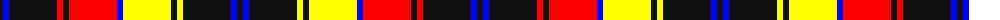

In pattern [KBKRKRBYKYKBK](/patterns/kbkrkrbykykbk/).

This was sourced from register-of-tartans.  It is a [13 stripes tartan](/stripes/stripes13/).

Original link https://www.tartanregister.gov.uk/tartanDetails.aspx?ref=5790

## Thread count
K/6 B6 K48 R6 K6 R48 B6 Y48 K6 Y6 K48 B6 K/6

## Palette
Each colour and its ΔE from the base-6 reference it is a variant of.

| Colour | Shade | Base | ΔE (OKLab) |
|---|---|---|---|
| B | <code style="background-color:#0000FF;">#0000FF</code> `#0000FF` | B <code style="background-color:#2C4084;">#2C4084</code> | 0.21 |
| K | <code style="background-color:#101010;">#101010</code> `#101010` | K <code style="background-color:#000000;">#000000</code> | 0.17 |
| R | <code style="background-color:#FF0000;">#FF0000</code> `#FF0000` | R <code style="background-color:#C80000;">#C80000</code> | 0.11 |
| Y | <code style="background-color:#FFFF00;">#FFFF00</code> `#FFFF00` | Y <code style="background-color:#E8C000;">#E8C000</code> | 0.16 |

ID: /setts/s13/k6b6k48r6k6r48b6y48k6y6k48b6k6-b0000ff-k101010-rff0000-yffff00/
