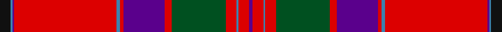

In pattern [BRBRGRBRBRBBK](/stripes/brbrgrbrbrbbk/).

This was sourced from register-of-tartans.  It is a [13 stripe tartan](/stripes/stripes13/).

Original link https://www.tartanregister.gov.uk/tartanDetails.aspx?ref=2441

## Also known as

This cloth is also recorded under:

- MacGillivray #2

## Register references

External register numbers recorded for this tartan.

- Scottish Register of Tartans: [2441](https://www.tartanregister.gov.uk/tartanDetails.aspx?ref=2441)
- Scottish Tartans World Register: 447

## Thread count
K/12 B2 P2 R114 B4 R4 P46 R8 G60 R12 B2 R12 P/4

## Palette
Each colour and the base-6 reference it is a variant of.

| Colour | Shade | Base |
|---|---|---|
| B | <code style="background-color:#3C82AF;">#3C82AF</code> `oklch(58.1% 0.099 239.8)` <small>#3C82AF</small> | B <code style="background-color:#2A418A;">#2A418A</code> |
| G | <code style="background-color:#005020;">#005020</code> `oklch(37.7% 0.105 149.6)` <small>#005020</small> | G <code style="background-color:#006100;">#006100</code> |
| K | <code style="background-color:#101010;">#101010</code> `oklch(17.3% 0.000 89.9)` <small>#101010</small> | K <code style="background-color:#000000;">#000000</code> |
| P | <code style="background-color:#5A008C;">#5A008C</code> `oklch(37.0% 0.191 306.3)` <small>#5A008C</small> | B <code style="background-color:#2A418A;">#2A418A</code> |
| R | <code style="background-color:#DC0000;">#DC0000</code> `oklch(56.2% 0.230 29.2)` <small>#DC0000</small> | R <code style="background-color:#CC0000;">#CC0000</code> |

## Nearest tartans

The nearest existing variants by ΔTartan distance.

1. [MacGillivray](/setts/s13/k6t1p1r57t2r2p23r4g30r6t1r6p2~x2/) — ΔT 0.42
1. [MacFarlane (Lord Lyon sett)](/setts/s14/m42k1dg12w2m3k1m3w2dg2dp12k4m3w4dg3~x2/) — ΔT 0.73
1. [Lendrum (Clan)](/setts/s14/m42k1g12w2m3k1m3w2g2dp12k4m3w4g3~x2/) — ΔT 0.75
1. [MacFarlane](/setts/s14/r42k1dg12lb2r3k1r3lb2dg2dp12k4r3lb4dg3/) — ΔT 0.78
1. [MacFarlane, or Lendrum](/setts/s14/r42k1g12w2r3k1r3w2g2p12k4r3w4g3~x2/) — ΔT 0.88
1. [MacFarlane](/setts/s14/r42k1dg12lr2r3k1r3lr2dg2n12k4r3lr4dg3~x2/) — ΔT 0.95
1. [MacFarlane](/setts/s14/r42k1dg12lr2r3k1r3lr2dg2n12k4r3lr4dg3/) — ΔT 0.95
1. [Stratford City Police PB (Corp)](/setts/s13/r5db2ly1r46db4w1k5t9db2ly2db2k10w2~x2/) — ΔT 1.11
1. [Stratford Police PB (Corporate)](/setts/s13/r5t2lo1r45t4w1k4t9t2lo2t2k10w2~x2/) — ΔT 1.12
1. [MacFarlane, Red](/setts/s14/r103k8g16w4r9k3r9w4g7db41k14r14w10g6/) — ΔT 1.16

## Neighbour map

Every grey dot is one of 14299 variants placed by the first two principal components of the ΔTartan feature space (44% of its variance). Red is this tartan; blue dots are its nearest — click one to open its page.

<svg viewBox="0 0 640 380" role="img" style="max-width:100%;height:auto;border:1px solid #e0e0e0;border-radius:4px;display:block" xmlns="http://www.w3.org/2000/svg"><image href="/nn/cloud.v1.png" width="640" height="380"/><a href="/setts/s13/k6t1p1r57t2r2p23r4g30r6t1r6p2~x2/"><circle cx="357.2" cy="55.8" r="4" fill="#3465a4"><title>MacGillivray</title></circle></a><a href="/setts/s14/m42k1dg12w2m3k1m3w2dg2dp12k4m3w4dg3~x2/"><circle cx="351.7" cy="56.8" r="4" fill="#3465a4"><title>MacFarlane (Lord Lyon sett)</title></circle></a><a href="/setts/s14/m42k1g12w2m3k1m3w2g2dp12k4m3w4g3~x2/"><circle cx="347.8" cy="55.3" r="4" fill="#3465a4"><title>Lendrum (Clan)</title></circle></a><a href="/setts/s14/r42k1dg12lb2r3k1r3lb2dg2dp12k4r3lb4dg3/"><circle cx="332.4" cy="45.3" r="4" fill="#3465a4"><title>MacFarlane</title></circle></a><a href="/setts/s14/r42k1g12w2r3k1r3w2g2p12k4r3w4g3~x2/"><circle cx="332.6" cy="50.0" r="4" fill="#3465a4"><title>MacFarlane, or Lendrum</title></circle></a><a href="/setts/s14/r42k1dg12lr2r3k1r3lr2dg2n12k4r3lr4dg3~x2/"><circle cx="358.7" cy="63.1" r="4" fill="#3465a4"><title>MacFarlane</title></circle></a><a href="/setts/s14/r42k1dg12lr2r3k1r3lr2dg2n12k4r3lr4dg3/"><circle cx="358.7" cy="63.1" r="4" fill="#3465a4"><title>MacFarlane</title></circle></a><a href="/setts/s13/r5db2ly1r46db4w1k5t9db2ly2db2k10w2~x2/"><circle cx="335.3" cy="25.2" r="4" fill="#3465a4"><title>Stratford City Police PB (Corp)</title></circle></a><a href="/setts/s13/r5t2lo1r45t4w1k4t9t2lo2t2k10w2~x2/"><circle cx="337.3" cy="26.6" r="4" fill="#3465a4"><title>Stratford Police PB (Corporate)</title></circle></a><a href="/setts/s14/r103k8g16w4r9k3r9w4g7db41k14r14w10g6/"><circle cx="311.7" cy="55.9" r="4" fill="#3465a4"><title>MacFarlane, Red</title></circle></a><circle cx="355.7" cy="53.5" r="5" fill="#c00000"/></svg>

ID: /setts/s13/k6t1dp1r57t2r2dp23r4dg30r6t1r6dp2~x2/
