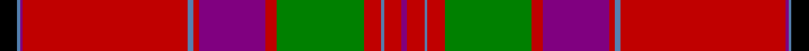

In pattern [BRBRGRBRBRBBK](/stripes/brbrgrbrbrbbk/).

This was sourced from weddslist.  It is a [13 stripe tartan](/stripes/stripes13/).

Original link http://www.weddslist.com/cgi-bin/tartans/pg.pl?source=sts

## Also known as

This cloth is also recorded under:

- MacGillivray #2

## Thread count
K/12 B2 P2 R114 B4 R4 P46 R8 G60 R12 B2 R12 P/4

## Palette
Each colour and the base-6 reference it is a variant of.

| Colour | Shade | Base |
|---|---|---|
| B | <code style="background-color:#5480B0;">#5480B0</code> `oklch(58.8% 0.089 251.5)` <small>#5480B0</small> | B <code style="background-color:#2A418A;">#2A418A</code> |
| G | <code style="background-color:#008000;">#008000</code> `oklch(52.0% 0.177 142.5)` <small>#008000</small> | G <code style="background-color:#006100;">#006100</code> |
| K | <code style="background-color:#000000;">#000000</code> `oklch(0.0% 0.000 0.0)` <small>#000000</small> | K <code style="background-color:#000000;">#000000</code> |
| P | <code style="background-color:#800080;">#800080</code> `oklch(42.1% 0.193 328.4)` <small>#800080</small> | B <code style="background-color:#2A418A;">#2A418A</code> |
| R | <code style="background-color:#C00000;">#C00000</code> `oklch(50.7% 0.208 29.2)` <small>#C00000</small> | R <code style="background-color:#CC0000;">#CC0000</code> |

## Nearest tartans

The nearest existing variants by ΔTartan distance.

1. [MacGillivray #2](/setts/s13/k6t1dp1r57t2r2dp23r4dg30r6t1r6dp2~x2/) — ΔT 0.42
1. [MacFarlane](/setts/s14/r42k1dg12lr2r3k1r3lr2dg2n12k4r3lr4dg3~x2/) — ΔT 0.66
1. [MacFarlane](/setts/s14/r42k1dg12lr2r3k1r3lr2dg2n12k4r3lr4dg3/) — ΔT 0.66
1. [MacFarlane](/setts/s14/r42k1dg12lb2r3k1r3lb2dg2dp12k4r3lb4dg3/) — ΔT 0.76
1. [MacFarlane, or Lendrum](/setts/s14/r42k1g12w2r3k1r3w2g2p12k4r3w4g3~x2/) — ΔT 0.99
1. [MacFarlane (Lord Lyon sett)](/setts/s14/m42k1dg12w2m3k1m3w2dg2dp12k4m3w4dg3~x2/) — ΔT 1.00
1. [Lendrum (Clan)](/setts/s14/m42k1g12w2m3k1m3w2g2dp12k4m3w4g3~x2/) — ΔT 1.00
1. [Dalzell](/setts/s17/r24w1db2r8g52r8db2w1r8db12r8w1db2r52g4r6g6~x2/) — ΔT 1.03
1. [Lochiel (Cameron)](/setts/s17/r36ly2dp1r3g41r3dp1ly2r3dp12r3ly2dp1r37g3r3g4~x2/) — ΔT 1.04
1. [Munro (Clan)](/setts/s17/r36ly2db1r3g41r3db1ly2r3db12r3ly2db1r36g3r3g4~x2/) — ΔT 1.05

## Neighbour map

Every grey dot is one of 14299 variants placed by the first two principal components of the ΔTartan feature space (44% of its variance). Red is this tartan; blue dots are its nearest — click one to open its page.

<svg viewBox="0 0 640 380" role="img" style="max-width:100%;height:auto;border:1px solid #e0e0e0;border-radius:4px;display:block" xmlns="http://www.w3.org/2000/svg"><image href="/nn/cloud.v1.png" width="640" height="380"/><a href="/setts/s13/k6t1dp1r57t2r2dp23r4dg30r6t1r6dp2~x2/"><circle cx="355.7" cy="53.5" r="4" fill="#3465a4"><title>MacGillivray #2</title></circle></a><a href="/setts/s14/r42k1dg12lr2r3k1r3lr2dg2n12k4r3lr4dg3~x2/"><circle cx="358.7" cy="63.1" r="4" fill="#3465a4"><title>MacFarlane</title></circle></a><a href="/setts/s14/r42k1dg12lr2r3k1r3lr2dg2n12k4r3lr4dg3/"><circle cx="358.7" cy="63.1" r="4" fill="#3465a4"><title>MacFarlane</title></circle></a><a href="/setts/s14/r42k1dg12lb2r3k1r3lb2dg2dp12k4r3lb4dg3/"><circle cx="332.4" cy="45.3" r="4" fill="#3465a4"><title>MacFarlane</title></circle></a><a href="/setts/s14/r42k1g12w2r3k1r3w2g2p12k4r3w4g3~x2/"><circle cx="332.6" cy="50.0" r="4" fill="#3465a4"><title>MacFarlane, or Lendrum</title></circle></a><a href="/setts/s14/m42k1dg12w2m3k1m3w2dg2dp12k4m3w4dg3~x2/"><circle cx="351.7" cy="56.8" r="4" fill="#3465a4"><title>MacFarlane (Lord Lyon sett)</title></circle></a><a href="/setts/s14/m42k1g12w2m3k1m3w2g2dp12k4m3w4g3~x2/"><circle cx="347.8" cy="55.3" r="4" fill="#3465a4"><title>Lendrum (Clan)</title></circle></a><a href="/setts/s17/r24w1db2r8g52r8db2w1r8db12r8w1db2r52g4r6g6~x2/"><circle cx="376.5" cy="58.5" r="4" fill="#3465a4"><title>Dalzell</title></circle></a><a href="/setts/s17/r36ly2dp1r3g41r3dp1ly2r3dp12r3ly2dp1r37g3r3g4~x2/"><circle cx="371.6" cy="58.5" r="4" fill="#3465a4"><title>Lochiel (Cameron)</title></circle></a><a href="/setts/s17/r36ly2db1r3g41r3db1ly2r3db12r3ly2db1r36g3r3g4~x2/"><circle cx="361.9" cy="57.6" r="4" fill="#3465a4"><title>Munro (Clan)</title></circle></a><circle cx="357.2" cy="55.8" r="5" fill="#c00000"/></svg>

ID: /setts/s13/k6t1p1r57t2r2p23r4g30r6t1r6p2~x2/
