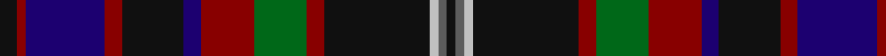

In pattern [KBWKRGRBKRBRK](/patterns/kbwkrgrbkrbrk/).

This was sourced from tartans-authority.  It is a [13 stripes tartan](/stripes/stripes13/).

Original link http://www.tartansauthority.com/tartan-ferret/display/5530/

## Thread count
K/8 DR4 DB36 DR8 K28 DB8 DR24 G24 DR8 K48 Na4 N4 K/4

## Palette
Each colour and its ΔE from the base-6 reference it is a variant of.

| Colour | Shade | Base | ΔE (OKLab) |
|---|---|---|---|
| DB | <code style="background-color:#1C0070;">#1C0070</code> `#1C0070` | B <code style="background-color:#2C4084;">#2C4084</code> | 0.14 |
| DR | <code style="background-color:#880000;">#880000</code> `#880000` | R <code style="background-color:#C80000;">#C80000</code> | 0.14 |
| G | <code style="background-color:#006818;">#006818</code> `#006818` | G <code style="background-color:#006400;">#006400</code> | 0.02 |
| K | <code style="background-color:#101010;">#101010</code> `#101010` | K <code style="background-color:#000000;">#000000</code> | 0.17 |
| N | <code style="background-color:#5C5C5C;">#5C5C5C</code> `#5C5C5C` | B <code style="background-color:#2C4084;">#2C4084</code> | 0.14 |
| Na | <code style="background-color:#C0C0C0;">#C0C0C0</code> `#C0C0C0` | W <code style="background-color:#F4F4F0;">#F4F4F0</code> | 0.16 |

## Nearest tartans

The nearest existing variants by ΔTartan distance.

1. [Ogg of Tarragann Hunting](/setts/s12/r4b12r2k28r2k28r2ka12g20y2g4y4-b237f97-g14492d-k2f0d0a-ka101010-rcb2610-ybe8f2c/) — ΔT 0.97
1. [Crieff Primary School](/setts/s10/k12g4r4b24ba8b4ba4b4r40w4-b081434-ba646064-g3c6838-k000000-r742434-wd8d4d4/) — ΔT 1.09
1. [Souza Nery (Personal)](/setts/s12/b74r6k34r6g44ka8g44r6k34r6b74w6-b2c2c80-g006818-k101010-ka000000-rc8002c-we0e0e0/) — ΔT 1.10
1. [Renton (Personal)](/setts/s18/r16k4r16ka8ra6ka8k16ka4k16ka8b42ba16ka4k6ka4ba16b48ka6-b244458-ba405c74-k000000-ka101010-r886044-raa00028/) — ΔT 1.11
1. [Hines Snr, Raymond Lee (Personal)](/setts/s11/k8g4w4b44k32r16k6r8k6y8k6-b440044-g285800-k101010-r960028-wf8f8f8-yc89800/) — ΔT 1.12
1. [United Arrows House Check](/setts/s9/b90r8k40w6ra18ba8ra6ba18k22-b202060-ba4c0000-k1c1714-rdc0000-rab07430-we8ccb8/) — ΔT 1.13
1. [van der Watt Personal)](/setts/s12/r4b24k4b4k32g4k32ba8g4k4g24y4-b202060-ba440044-g006818-k101010-rc80000-yd09800/) — ΔT 1.16
1. [Stinson Ancient U.S.A. Tartan Tartan Number: 438. Earliest known date: 1985 A kilt in this material was brought into the Scottish Tartans Museum in Comrie which could be dated to before 1930. It belonged to a member of the Stewart Society at that time. The threadcount and the name were documented by Mackinlay, who studied and collected tartans between 1930 and 1950. See products available Copyright © Blair Urquhart, Comrie, 2015](/setts/s11/k14b40ba4r12ba4k40y6g40b54r6b12-b2c2c80-ba5c8ca8-g006818-k101010-rc80000-ye8c000/) — ΔT 1.17
1. [Paget (Personal)](/setts/s14/r6g8ga4g20k36g4b36g6b36g4k36g36w2r6-b440044-g006818-ga5c6428-k101010-rc80000-wfcfcfc/) — ΔT 1.20
1. [Forbes - 1970 (WCWM #2)](/setts/s16/b72w4r32w4ba64bb32w4b72w4b80bb32b24g32ba40g40ba4-b1c1c1c-ba1c0070-bb440044-g408060-ra07c58-we0e0e0/) — ΔT 1.22

## Neighbour map

Every grey dot is one of 15726 variants placed by the first two principal components of the ΔTartan feature space (44% of its variance). Red is this tartan; blue dots are its nearest — click one to open its page.

<svg viewBox="0 0 640 380" role="img" style="max-width:100%;height:auto;border:1px solid #e0e0e0;border-radius:4px;display:block" xmlns="http://www.w3.org/2000/svg"><image href="/nn/cloud.v1.png" width="640" height="380"/><a href="/setts/s12/r4b12r2k28r2k28r2ka12g20y2g4y4-b237f97-g14492d-k2f0d0a-ka101010-rcb2610-ybe8f2c/"><circle cx="223.9" cy="140.2" r="4" fill="#3465a4"><title>Ogg of Tarragann Hunting</title></circle></a><a href="/setts/s10/k12g4r4b24ba8b4ba4b4r40w4-b081434-ba646064-g3c6838-k000000-r742434-wd8d4d4/"><circle cx="187.1" cy="144.3" r="4" fill="#3465a4"><title>Crieff Primary School</title></circle></a><a href="/setts/s12/b74r6k34r6g44ka8g44r6k34r6b74w6-b2c2c80-g006818-k101010-ka000000-rc8002c-we0e0e0/"><circle cx="186.7" cy="147.7" r="4" fill="#3465a4"><title>Souza Nery (Personal)</title></circle></a><a href="/setts/s18/r16k4r16ka8ra6ka8k16ka4k16ka8b42ba16ka4k6ka4ba16b48ka6-b244458-ba405c74-k000000-ka101010-r886044-raa00028/"><circle cx="142.6" cy="134.3" r="4" fill="#3465a4"><title>Renton (Personal)</title></circle></a><a href="/setts/s11/k8g4w4b44k32r16k6r8k6y8k6-b440044-g285800-k101010-r960028-wf8f8f8-yc89800/"><circle cx="189.9" cy="142.5" r="4" fill="#3465a4"><title>Hines Snr, Raymond Lee (Personal)</title></circle></a><a href="/setts/s9/b90r8k40w6ra18ba8ra6ba18k22-b202060-ba4c0000-k1c1714-rdc0000-rab07430-we8ccb8/"><circle cx="219.4" cy="142.2" r="4" fill="#3465a4"><title>United Arrows House Check</title></circle></a><a href="/setts/s12/r4b24k4b4k32g4k32ba8g4k4g24y4-b202060-ba440044-g006818-k101010-rc80000-yd09800/"><circle cx="221.3" cy="172.5" r="4" fill="#3465a4"><title>van der Watt Personal)</title></circle></a><a href="/setts/s11/k14b40ba4r12ba4k40y6g40b54r6b12-b2c2c80-ba5c8ca8-g006818-k101010-rc80000-ye8c000/"><circle cx="197.5" cy="151.3" r="4" fill="#3465a4"><title>Stinson Ancient U.S.A. Tartan Tartan Number: 438. Earliest known date: 1985 A kilt in this material was brought into the Scottish Tartans Museum in Comrie which could be dated to before 1930. It belonged to a member of the Stewart Society at that time. The threadcount and the name were documented by Mackinlay, who studied and collected tartans between 1930 and 1950. See products available Copyright © Blair Urquhart, Comrie, 2015</title></circle></a><a href="/setts/s14/r6g8ga4g20k36g4b36g6b36g4k36g36w2r6-b440044-g006818-ga5c6428-k101010-rc80000-wfcfcfc/"><circle cx="167.0" cy="132.6" r="4" fill="#3465a4"><title>Paget (Personal)</title></circle></a><a href="/setts/s16/b72w4r32w4ba64bb32w4b72w4b80bb32b24g32ba40g40ba4-b1c1c1c-ba1c0070-bb440044-g408060-ra07c58-we0e0e0/"><circle cx="200.9" cy="131.7" r="4" fill="#3465a4"><title>Forbes - 1970 (WCWM #2)</title></circle></a><circle cx="192.8" cy="151.0" r="5" fill="#c00000"/></svg>

ID: /setts/s13/k8r4b36r8k28b8r24g24r8k48w4ba4k4-b1c0070-ba5c5c5c-g006818-k101010-r880000-wc0c0c0/
