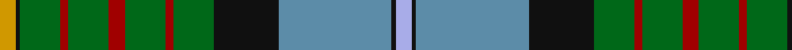

**Bands:** [WKBKGRGRGRGKY](/stripes/wkbkgrgrgrgky/) · **Stripes:** [LB K T K G R G R G R G K LO](/stripes/stripes13/) LB K T K G R G R G R G K LO

This was sourced from house-of-tartan.  It is a [13 band tartan](/bands/bands13/).

Original link http://www.house-of-tartan.scotland.net/house/TartanViewjs.asp?colr=Def&tnam=2454

## Thread count
DY/8 K2 G20 DR4 G20 DR8 G20 DR4 G20 K32 Ba56 K2 LP/8

## Palette
Each colour and its ΔE from the base-6 reference it is a variant of.

| Colour | Shade | Base | ΔE (OKLab) |
|---|---|---|---|
| B | <code style="background-color:#2474E8;">#2474E8</code> `#2474E8` | B <code style="background-color:#2A418A;">#2A418A</code> | 0.19 |
| Ba | <code style="background-color:#5C8CA8;">#5C8CA8</code> `#5C8CA8` | B <code style="background-color:#2A418A;">#2A418A</code> | 0.23 |
| DB | <code style="background-color:#1C0070;">#1C0070</code> `#1C0070` | B <code style="background-color:#2A418A;">#2A418A</code> | 0.14 |
| DR | <code style="background-color:#A00000;">#A00000</code> `#A00000` | R <code style="background-color:#CC0000;">#CC0000</code> | 0.09 |
| DY | <code style="background-color:#D09800;">#D09800</code> `#D09800` | Y <code style="background-color:#F2BF00;">#F2BF00</code> | 0.12 |
| G | <code style="background-color:#006818;">#006818</code> `#006818` | G <code style="background-color:#006100;">#006100</code> | 0.02 |
| K | <code style="background-color:#101010;">#101010</code> `#101010` | K <code style="background-color:#000000;">#000000</code> | 0.17 |
| LP | <code style="background-color:#A8ACE8;">#A8ACE8</code> `#A8ACE8` | W <code style="background-color:#F7F7F7;">#F7F7F7</code> | 0.23 |

## Nearest tartans

The nearest existing variants by ΔTartan distance.

1. [California State](/setts/s13/lb4k1t28k16g10r2g10r4g10r2g10k1ly4~x2/) — ΔT 0.24
1. [Currie](/setts/s11/db16w3db1ly4g24r1g3r4g3r1t8~x2/) — ΔT 0.97
1. [Campbell, Brown](/setts/s13/ly9k1o31g30db36g3db3g3db36g30o31k1w9~x2/) — ΔT 0.97
1. [Stirling University #2](/setts/s14/g22r3w1g2r3t16k3ly2k3t16r3g2w1r3~x4/) — ΔT 0.99
1. [Birch Family Tartan Tartan Number: 2157. Earliest known date: 1993 The Birch family tartan was designed and produced by Mr Robin Birch of Connell Reid kiltmaker, Blairgowrie. The new sett has been recorded by the Scottish Tartans Society. See products available Copyright © Blair Urquhart, Comrie, 2015](/setts/s9/g3dp4g23k10r2k10t18k1w3~x2/) — ΔT 1.08
1. [Tait #2](/setts/s12/w4k1r2k1g9k2b24k2r6k2g12ly2~x2/) — ΔT 1.09
1. [California](/setts/s13/b4k1db28k16g10r2g10r4g10r2g10k1ly4~x2/) — ΔT 1.09
1. [Mill o Forest Primary School (Corp)](/setts/s13/db3dg22r5dg5o5w1o1dg1g8db6o1db5dg2~x2/) — ΔT 1.13
1. [Groen (Personal)](/setts/s11/n12r2n3r4n15k24dg18ly1k3dg3w3~x2/) — ΔT 1.14
1. [Baron of Greencastle (Personal)](/setts/s13/g4ly2g24r2k12db3k2db2k2db12w1db1w3~x2/) — ΔT 1.21

## Neighbour map

Every grey dot is one of 14313 variants placed by the first two principal components of the ΔTartan feature space (44% of its variance). Red is this tartan; blue dots are its nearest — click one to open its page.

<svg viewBox="0 0 640 380" role="img" style="max-width:100%;height:auto;border:1px solid #e0e0e0;border-radius:4px;display:block" xmlns="http://www.w3.org/2000/svg"><image href="/nn/cloud.v1.png" width="640" height="380"/><a href="/setts/s13/lb4k1t28k16g10r2g10r4g10r2g10k1ly4~x2/"><circle cx="181.5" cy="103.2" r="4" fill="#3465a4"><title>California State</title></circle></a><a href="/setts/s11/db16w3db1ly4g24r1g3r4g3r1t8~x2/"><circle cx="217.7" cy="104.0" r="4" fill="#3465a4"><title>Currie</title></circle></a><a href="/setts/s13/ly9k1o31g30db36g3db3g3db36g30o31k1w9~x2/"><circle cx="190.6" cy="112.2" r="4" fill="#3465a4"><title>Campbell, Brown</title></circle></a><a href="/setts/s14/g22r3w1g2r3t16k3ly2k3t16r3g2w1r3~x4/"><circle cx="204.9" cy="93.3" r="4" fill="#3465a4"><title>Stirling University #2</title></circle></a><a href="/setts/s9/g3dp4g23k10r2k10t18k1w3~x2/"><circle cx="160.9" cy="128.4" r="4" fill="#3465a4"><title>Birch Family Tartan Tartan Number: 2157. Earliest known date: 1993 The Birch family tartan was designed and produced by Mr Robin Birch of Connell Reid kiltmaker, Blairgowrie. The new sett has been recorded by the Scottish Tartans Society. See products available Copyright © Blair Urquhart, Comrie, 2015</title></circle></a><a href="/setts/s12/w4k1r2k1g9k2b24k2r6k2g12ly2~x2/"><circle cx="167.9" cy="90.5" r="4" fill="#3465a4"><title>Tait #2</title></circle></a><a href="/setts/s13/b4k1db28k16g10r2g10r4g10r2g10k1ly4~x2/"><circle cx="163.0" cy="96.7" r="4" fill="#3465a4"><title>California</title></circle></a><a href="/setts/s13/db3dg22r5dg5o5w1o1dg1g8db6o1db5dg2~x2/"><circle cx="240.4" cy="118.8" r="4" fill="#3465a4"><title>Mill o Forest Primary School (Corp)</title></circle></a><a href="/setts/s11/n12r2n3r4n15k24dg18ly1k3dg3w3~x2/"><circle cx="176.1" cy="120.7" r="4" fill="#3465a4"><title>Groen (Personal)</title></circle></a><a href="/setts/s13/g4ly2g24r2k12db3k2db2k2db12w1db1w3~x2/"><circle cx="193.7" cy="92.1" r="4" fill="#3465a4"><title>Baron of Greencastle (Personal)</title></circle></a><circle cx="187.7" cy="107.3" r="5" fill="#c00000"/></svg>

ID: /setts/s13/lb4k1t28k16g10r2g10r4g10r2g10k1lo4~x2/
