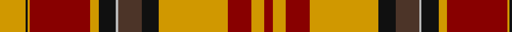

In pattern [RYRYKBYKYRYKY](/stripes/ryrykbykyryky/).

This was sourced from register-of-tartans.  It is a [13 stripe tartan](/stripes/stripes13/).

Original link https://www.tartanregister.gov.uk/tartanDetails.aspx?ref=5170

## Also known as

This cloth is also recorded under:

- Aboyne I

## Attestations

This cloth appears in 2 source records; the oldest owns this page.

- undated — Aboyne (register-of-tartans, [record](https://www.tartanregister.gov.uk/tartanDetails.aspx?ref=5170))
- 1988s — Aboyne I (Fashion) (tartans-authority, [record](http://www.tartansauthority.com/tartan-ferret/display/3014/))

## Register references

External register numbers recorded for this tartan.

- Scottish Register of Tartans: [5170](https://www.tartanregister.gov.uk/tartanDetails.aspx?ref=5170)
- Scottish Tartans Authority (ITI): 3014

## Thread count
DY/24 K2 DY2 DR56 DY8 K16 N2 T22 K16 DY64 DR22 DY12 DR/8

## Palette
Each colour and its ΔE from the base-6 reference it is a variant of.

| Colour | Shade | Base | ΔE (OKLab) |
|---|---|---|---|
| DR | <code style="background-color:#880000;">#880000</code> `#880000` | R <code style="background-color:#CC0000;">#CC0000</code> | 0.15 |
| DY | <code style="background-color:#D09800;">#D09800</code> `#D09800` | Y <code style="background-color:#F2BF00;">#F2BF00</code> | 0.12 |
| K | <code style="background-color:#101010;">#101010</code> `#101010` | K <code style="background-color:#000000;">#000000</code> | 0.17 |
| N | <code style="background-color:#B8B8B8;">#B8B8B8</code> `#B8B8B8` | Y <code style="background-color:#F2BF00;">#F2BF00</code> | 0.17 |
| T | <code style="background-color:#4C3428;">#4C3428</code> `#4C3428` | B <code style="background-color:#2A418A;">#2A418A</code> | 0.17 |

## Nearest tartans

The nearest existing variants by ΔTartan distance.

1. [Unidentified 9](/setts/s14/r35ly7w1dg3w1ly7dg19w2g17r12g5r5r5g2~x2/) — ΔT 1.10
1. [Stewart of Galloway Clan Tartan Tartan Number: 851. Earliest known date: c.1820 Count taken from the specimen at the Smith Institute in Stirling. See products available Copyright © Blair Urquhart, Comrie, 2015](/setts/s12/g9r52t13k16ly2k3w4k3g23r15g7ly3~x2/) — ΔT 1.16
1. [Brown-Wells (Personal)](/setts/s16/r4dt1ly3dt1r20dt4g9r3g9dt4lb3dt1g7dt2r6ly2~x2/) — ΔT 1.27
1. [Shaw of Tordarroch Red (Dress)](/setts/s14/t5k1r30dp15r8g30r8dp2~x2/) — ΔT 1.27
1. [MacDonald of Glencoe #3](/setts/s13/g8r1r6g3r40y2k12r6g30r3k2r1r6~x2/) — ΔT 1.33
1. [MacQuarrie #2](/setts/s14/r4t2r50db26r10dg44r4r10r4dg44r51db2r4t2~x2/) — ΔT 1.35
1. [Drummond Relic](/setts/s12/r26w1k8ly1dg13k1w4k1ly2k4t3r8~x4/) — ΔT 1.38
1. [MacQuarrie 1](/setts/s14/r4t2r50db26r10g44r4r10r4g44r51db2r4t2~x2/) — ΔT 1.38
1. [Confrerie de Vouvray](/setts/s17/dt8r4ly18r4r19ly4r19dt6r4g1r4g1r4g1r4g1r4~x2/) — ΔT 1.45
1. [MacDougall](/setts/s20/lb1r3r1dg23r3dg1r3db6r4r1r4dg6r6dg6r2db1r24r1r1lb1~x2/) — ΔT 1.46

## Neighbour map

Every grey dot is one of 14299 variants placed by the first two principal components of the ΔTartan feature space (44% of its variance). Red is this tartan; blue dots are its nearest — click one to open its page.

<svg viewBox="0 0 640 380" role="img" style="max-width:100%;height:auto;border:1px solid #e0e0e0;border-radius:4px;display:block" xmlns="http://www.w3.org/2000/svg"><image href="/nn/cloud.v1.png" width="640" height="380"/><a href="/setts/s14/r35ly7w1dg3w1ly7dg19w2g17r12g5r5r5g2~x2/"><circle cx="213.9" cy="64.2" r="4" fill="#3465a4"><title>Unidentified 9</title></circle></a><a href="/setts/s12/g9r52t13k16ly2k3w4k3g23r15g7ly3~x2/"><circle cx="225.6" cy="83.8" r="4" fill="#3465a4"><title>Stewart of Galloway Clan Tartan Tartan Number: 851. Earliest known date: c.1820 Count taken from the specimen at the Smith Institute in Stirling. See products available Copyright © Blair Urquhart, Comrie, 2015</title></circle></a><a href="/setts/s16/r4dt1ly3dt1r20dt4g9r3g9dt4lb3dt1g7dt2r6ly2~x2/"><circle cx="219.4" cy="112.7" r="4" fill="#3465a4"><title>Brown-Wells (Personal)</title></circle></a><a href="/setts/s14/t5k1r30dp15r8g30r8dp2~x2/"><circle cx="283.5" cy="118.8" r="4" fill="#3465a4"><title>Shaw of Tordarroch Red (Dress)</title></circle></a><a href="/setts/s13/g8r1r6g3r40y2k12r6g30r3k2r1r6~x2/"><circle cx="330.3" cy="77.7" r="4" fill="#3465a4"><title>MacDonald of Glencoe #3</title></circle></a><a href="/setts/s14/r4t2r50db26r10dg44r4r10r4dg44r51db2r4t2~x2/"><circle cx="309.7" cy="105.7" r="4" fill="#3465a4"><title>MacQuarrie #2</title></circle></a><a href="/setts/s12/r26w1k8ly1dg13k1w4k1ly2k4t3r8~x4/"><circle cx="229.7" cy="67.6" r="4" fill="#3465a4"><title>Drummond Relic</title></circle></a><a href="/setts/s14/r4t2r50db26r10g44r4r10r4g44r51db2r4t2~x2/"><circle cx="312.9" cy="110.7" r="4" fill="#3465a4"><title>MacQuarrie 1</title></circle></a><a href="/setts/s17/dt8r4ly18r4r19ly4r19dt6r4g1r4g1r4g1r4g1r4~x2/"><circle cx="278.5" cy="101.2" r="4" fill="#3465a4"><title>Confrerie de Vouvray</title></circle></a><a href="/setts/s20/lb1r3r1dg23r3dg1r3db6r4r1r4dg6r6dg6r2db1r24r1r1lb1~x2/"><circle cx="255.2" cy="69.5" r="4" fill="#3465a4"><title>MacDougall</title></circle></a><circle cx="246.6" cy="93.3" r="5" fill="#c00000"/></svg>

ID: /setts/s13/lo12k1lo1r28lo4k8lr1do11k8lo32r11lo6r4~x2/
