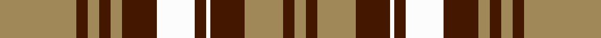

This page is one **sett** — a single exact thread-count. It belongs to the [tartan](/tartans/lt20dr3lt3dr3lt3dr9w10dr3w1dr9lt10dr3lt3/)
(the same proportion at any scale), whose colour order is pattern [YBYBWBWBYBYBY](/stripes/ybybwbwbybyby/).

Sourced from register-of-tartans.  It is a [13 stripe tartan](/stripes/stripes13/).

Original link https://www.tartanregister.gov.uk/tartanDetails.aspx?ref=393

2 attestations — the source records this cloth was collapsed from (oldest owns this page)

<ul>
<li>01/01/2002 — Brown Watch Dress (register-of-tartans, <a href="https://www.tartanregister.gov.uk/tartanDetails.aspx?ref=393">record</a>)</li>
<li>pre 2002 — Brown Watch Dress (Fashion) (tartans-authority, <a href="http://www.tartansauthority.com/tartan-ferret/display/1746/">record</a>)</li>
</ul>

## Register references

External register numbers recorded for this tartan.

- Scottish Register of Tartans: [393](https://www.tartanregister.gov.uk/tartanDetails.aspx?ref=393)
- Scottish Tartans Authority (ITI): 1746
- Scottish Tartans World Register: 1746

## Thread count
LT/40 DR6 LT6 DR6 LT6 DR18 W20 DR6 W2 DR18 LT20 DR6 LT/6

## Palette
Each colour and the base-6 reference it is a variant of.

| Colour | Shade | Base |
|---|---|---|
| DR | <code style="background-color:#441800;">#441800</code> `oklch(27.3% 0.076 46.3)` <small>#441800</small> | B <code style="background-color:#2A418A;">#2A418A</code> |
| LT | <code style="background-color:#A08858;">#A08858</code> `oklch(63.7% 0.071 84.0)` <small>#A08858</small> | Y <code style="background-color:#F2BF00;">#F2BF00</code> |
| W | <code style="background-color:#FCFCFC;">#FCFCFC</code> `oklch(99.1% 0.000 89.9)` <small>#FCFCFC</small> | W <code style="background-color:#F7F7F7;">#F7F7F7</code> |

## Nearest tartans

The nearest existing variants by ΔTartan distance, with this tartan at the top so the swatches line up against it.

ΔTartan

Tartan

Sett

—

<a href="/ttd/edit/#slug=lo20do3lo3do3lo3do9w10do3w1do9lo10do3lo3~x2">Brown Watch Dress</a> <a class="nn-out" href="/setts/s13/lo20do3lo3do3lo3do9w10do3w1do9lo10do3lo3~x2/" title="open its dictionary page">↗</a>

0.85

<a href="/ttd/edit/#slug=o20dr3o3dr3o3dr9w10dr3w1dr9o10dr3o3~x2">Brown, Watch dress</a> <a class="nn-out" href="/setts/s13/o20dr3o3dr3o3dr9w10dr3w1dr9o10dr3o3~x2/" title="open its dictionary page">↗</a>

1.13

<a href="/ttd/edit/#slug=k6lo8k13w1lo11k1lo11w4k2lo1k2~x2">Oregon State University (Corporate)</a> <a class="nn-out" href="/setts/s11/k6lo8k13w1lo11k1lo11w4k2lo1k2~x2/" title="open its dictionary page">↗</a>

1.30

<a href="/ttd/edit/#slug=dg5r4dg17lt5r32lt5dg17r4dg5w2~x2">Wilson's No.005</a> <a class="nn-out" href="/setts/s10/dg5r4dg17lt5r32lt5dg17r4dg5w2~x2/" title="open its dictionary page">↗</a>

1.38

<a href="/ttd/edit/#slug=k2dg2lr10dg2lr7dg2lr7dg2lr5dg2r14lr1dg2~x2">Glenaffric Fragment</a> <a class="nn-out" href="/setts/s13/k2dg2lr10dg2lr7dg2lr7dg2lr5dg2r14lr1dg2~x2/" title="open its dictionary page">↗</a>

1.40

<a href="/ttd/edit/#slug=k2g2lr10g2lr7g2lr7g2lr5g2r14lr1g2~x2">Glen Affric, Fragment</a> <a class="nn-out" href="/setts/s13/k2g2lr10g2lr7g2lr7g2lr5g2r14lr1g2~x2/" title="open its dictionary page">↗</a>

1.46

<a href="/ttd/edit/#slug=r8w1k3r3k10w3k5w25k3r3k12w3~x2">Buildbase</a> <a class="nn-out" href="/setts/s12/r8w1k3r3k10w3k5w25k3r3k12w3~x2/" title="open its dictionary page">↗</a>

1.48

<a href="/ttd/edit/#slug=g6r3k3r24g4k10r2g4r2g24r6g2~x2">MacNeish</a> <a class="nn-out" href="/setts/s12/g6r3k3r24g4k10r2g4r2g24r6g2~x2/" title="open its dictionary page">↗</a>

1.48

<a href="/ttd/edit/#slug=w3k1o15k6o5k3o8k2o5ly3w2ly4k1w3~x2">Avalon - Washington House</a> <a class="nn-out" href="/setts/s14/w3k1o15k6o5k3o8k2o5ly3w2ly4k1w3~x2/" title="open its dictionary page">↗</a>

1.48

<a href="/ttd/edit/#slug=k9lr4k2lr4k2lr29k9lr4lg14ly2~x2">Hannay Dress (Dance)</a> <a class="nn-out" href="/setts/s10/k9lr4k2lr4k2lr29k9lr4lg14ly2~x2/" title="open its dictionary page">↗</a>

1.49

<a href="/ttd/edit/#slug=w2k35g30k3lo30k2lo4k2lo30k3w2">Vaughan (Welsh Series)</a> <a class="nn-out" href="/setts/s11/w2k35g30k3lo30k2lo4k2lo30k3w2/" title="open its dictionary page">↗</a>

## Neighbour map

Every grey dot is one of 14299 variants placed by the first two principal components of the ΔTartan feature space (44% of its variance). Red is this tartan; blue dots are its nearest — click one to open its page.

<svg viewBox="0 0 640 380" role="img" style="max-width:100%;height:auto;border:1px solid #e0e0e0;border-radius:4px;display:block" xmlns="http://www.w3.org/2000/svg"><image href="/nn/cloud.v1.png" width="640" height="380"/><a href="/setts/s13/o20dr3o3dr3o3dr9w10dr3w1dr9o10dr3o3~x2/"><circle cx="293.1" cy="157.9" r="4" fill="#3465a4"><title>Brown, Watch dress</title></circle></a><a href="/setts/s11/k6lo8k13w1lo11k1lo11w4k2lo1k2~x2/"><circle cx="276.1" cy="169.2" r="4" fill="#3465a4"><title>Oregon State University (Corporate)</title></circle></a><a href="/setts/s10/dg5r4dg17lt5r32lt5dg17r4dg5w2~x2/"><circle cx="261.7" cy="148.5" r="4" fill="#3465a4"><title>Wilson's No.005</title></circle></a><a href="/setts/s13/k2dg2lr10dg2lr7dg2lr7dg2lr5dg2r14lr1dg2~x2/"><circle cx="261.3" cy="147.2" r="4" fill="#3465a4"><title>Glenaffric Fragment</title></circle></a><a href="/setts/s13/k2g2lr10g2lr7g2lr7g2lr5g2r14lr1g2~x2/"><circle cx="259.5" cy="148.5" r="4" fill="#3465a4"><title>Glen Affric, Fragment</title></circle></a><a href="/setts/s12/r8w1k3r3k10w3k5w25k3r3k12w3~x2/"><circle cx="239.4" cy="122.7" r="4" fill="#3465a4"><title>Buildbase</title></circle></a><a href="/setts/s12/g6r3k3r24g4k10r2g4r2g24r6g2~x2/"><circle cx="268.1" cy="162.8" r="4" fill="#3465a4"><title>MacNeish</title></circle></a><a href="/setts/s14/w3k1o15k6o5k3o8k2o5ly3w2ly4k1w3~x2/"><circle cx="240.2" cy="141.2" r="4" fill="#3465a4"><title>Avalon - Washington House</title></circle></a><a href="/setts/s10/k9lr4k2lr4k2lr29k9lr4lg14ly2~x2/"><circle cx="268.0" cy="139.0" r="4" fill="#3465a4"><title>Hannay Dress (Dance)</title></circle></a><a href="/setts/s11/w2k35g30k3lo30k2lo4k2lo30k3w2/"><circle cx="235.6" cy="128.5" r="4" fill="#3465a4"><title>Vaughan (Welsh Series)</title></circle></a><circle cx="274.8" cy="149.2" r="5" fill="#c00000"/></svg>

ID: /setts/s13/lo20do3lo3do3lo3do9w10do3w1do9lo10do3lo3~x2/
