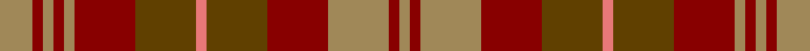

In pattern [YRYRGRGRYRYRY](/stripes/yryrgrgryryry/).

This was sourced from tartans-authority.  It is a [13 stripe tartan](/stripes/stripes13/).

Original link http://www.tartansauthority.com/tartan-ferret/display/7716/

## Thread count
LT/25 DR8 LT8 DR8 LT8 DR46 T46 LR8 T46 DR46 LT46 DR8 LT/8

## Palette
Each colour and the base-6 reference it is a variant of.

| Colour | Shade | Base |
|---|---|---|
| DR | <code style="background-color:#880000;">#880000</code> `oklch(39.4% 0.162 29.2)` <small>#880000</small> | R <code style="background-color:#CC0000;">#CC0000</code> |
| LR | <code style="background-color:#E87878;">#E87878</code> `oklch(70.0% 0.139 21.2)` <small>#E87878</small> | R <code style="background-color:#CC0000;">#CC0000</code> |
| LT | <code style="background-color:#A08858;">#A08858</code> `oklch(63.7% 0.071 84.0)` <small>#A08858</small> | Y <code style="background-color:#F2BF00;">#F2BF00</code> |
| T | <code style="background-color:#604000;">#604000</code> `oklch(39.8% 0.083 76.8)` <small>#604000</small> | G <code style="background-color:#006100;">#006100</code> |

## Nearest tartans

The nearest existing variants by ΔTartan distance.

1. [Glenmorangie #2](/setts/s11/dy6m2dy2m4dy13dy12o13m4o2m2o6~x2/) — ΔT 1.24
1. [Monaghan, County](/setts/s16/lo3do2o14lo8do14dg16o13do2lo3~x2/) — ΔT 1.27
1. [MacNab](/setts/s13/dg8r1dg1r1dg1r6r8r1r8r6dg7r1dg1/) — ΔT 1.31
1. [Mauthe Unidentified (Name?)](/setts/s15/r20dy2r2dy2r2dy15g13dy2w2dy2g13dy15r14dy2r2~x2/) — ΔT 1.31
1. [Buchanan Variation (Fashion)](/setts/s18/r7do1do3do1dg4do3dg4do1do4do1dg4do1dg4do1do4do1r7dg1~x4/) — ΔT 1.41
1. [MacNab](/setts/s13/dg8dr1dg1dr1dg1dr6r8dr1r8dr6dg7dr1dg1~x2/) — ΔT 1.42
1. [MacNab](/setts/s13/dg8dr1dg1dr1dg1dr6r8dr1r8dr6dg7dr1dg1/) — ΔT 1.42
1. [MacNab (Logan)](/setts/s13/g8m1g1m1g1m6r8m1r8m6g7m1g1~x4/) — ΔT 1.42
1. [MacNab Clan Tartan Tartan Number: 857. Earliest known date: c.1816 The structure of the MacNab is identical with that of the Black Watch; but, by a translation of colours, the most subdued of tartans becomes one of the most striking. D.C.Stewart suggests looking at the pattern through a green filter to see the effect. James Logan recorded ths pattern in his book, 'The Scottish Gael' in 1831, despite receiving a different sett from the largest weaving company of the time, William Wilson and Company, Bannockburn. Wilson's MacNab survives as an alternative tartan for the clan. James Charles MacNab of MacNab, Wester Kilmany, Fife, was recognised as chief in 1970. See products available Copyright © Blair Urquhart, Comrie, 2015](/setts/s13/g8m1g1m1g1m6r8m1r8m6g7m1g1~x2/) — ΔT 1.42
1. [Monaghan, County (District)](/setts/s9/lo3do2o14lo8do14dg16o13do2lo3~x2/) — ΔT 1.45

## Neighbour map

Every grey dot is one of 14299 variants placed by the first two principal components of the ΔTartan feature space (44% of its variance). Red is this tartan; blue dots are its nearest — click one to open its page.

<svg viewBox="0 0 640 380" role="img" style="max-width:100%;height:auto;border:1px solid #e0e0e0;border-radius:4px;display:block" xmlns="http://www.w3.org/2000/svg"><image href="/nn/cloud.v1.png" width="640" height="380"/><a href="/setts/s11/dy6m2dy2m4dy13dy12o13m4o2m2o6~x2/"><circle cx="181.9" cy="225.1" r="4" fill="#3465a4"><title>Glenmorangie #2</title></circle></a><a href="/setts/s16/lo3do2o14lo8do14dg16o13do2lo3~x2/"><circle cx="198.8" cy="216.4" r="4" fill="#3465a4"><title>Monaghan, County</title></circle></a><a href="/setts/s13/dg8r1dg1r1dg1r6r8r1r8r6dg7r1dg1/"><circle cx="258.1" cy="215.9" r="4" fill="#3465a4"><title>MacNab</title></circle></a><a href="/setts/s15/r20dy2r2dy2r2dy15g13dy2w2dy2g13dy15r14dy2r2~x2/"><circle cx="252.3" cy="180.8" r="4" fill="#3465a4"><title>Mauthe Unidentified (Name?)</title></circle></a><a href="/setts/s18/r7do1do3do1dg4do3dg4do1do4do1dg4do1dg4do1do4do1r7dg1~x4/"><circle cx="211.7" cy="210.8" r="4" fill="#3465a4"><title>Buchanan Variation (Fashion)</title></circle></a><a href="/setts/s13/dg8dr1dg1dr1dg1dr6r8dr1r8dr6dg7dr1dg1~x2/"><circle cx="284.6" cy="238.7" r="4" fill="#3465a4"><title>MacNab</title></circle></a><a href="/setts/s13/dg8dr1dg1dr1dg1dr6r8dr1r8dr6dg7dr1dg1/"><circle cx="284.6" cy="238.7" r="4" fill="#3465a4"><title>MacNab</title></circle></a><a href="/setts/s13/g8m1g1m1g1m6r8m1r8m6g7m1g1~x4/"><circle cx="249.7" cy="211.2" r="4" fill="#3465a4"><title>MacNab (Logan)</title></circle></a><a href="/setts/s13/g8m1g1m1g1m6r8m1r8m6g7m1g1~x2/"><circle cx="249.7" cy="211.2" r="4" fill="#3465a4"><title>MacNab Clan Tartan Tartan Number: 857. Earliest known date: c.1816 The structure of the MacNab is identical with that of the Black Watch; but, by a translation of colours, the most subdued of tartans becomes one of the most striking. D.C.Stewart suggests looking at the pattern through a green filter to see the effect. James Logan recorded ths pattern in his book, 'The Scottish Gael' in 1831, despite receiving a different sett from the largest weaving company of the time, William Wilson and Company, Bannockburn. Wilson's MacNab survives as an alternative tartan for the clan. James Charles MacNab of MacNab, Wester Kilmany, Fife, was recognised as chief in 1970. See products available Copyright © Blair Urquhart, Comrie, 2015</title></circle></a><a href="/setts/s9/lo3do2o14lo8do14dg16o13do2lo3~x2/"><circle cx="201.9" cy="231.3" r="4" fill="#3465a4"><title>Monaghan, County (District)</title></circle></a><circle cx="237.4" cy="227.3" r="5" fill="#c00000"/></svg>

ID: /setts/s13/lo25r8lo8r8lo8r46dy46r8dy46r46lo46r8lo8/
