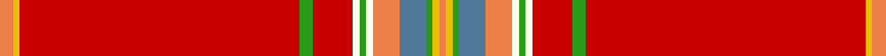

In pattern [YYGBYWGWRGRYY](/stripes/yygbywgwrgryy/).

This was sourced from tartans-authority.  It is a [13 stripe tartan](/stripes/stripes13/).

Original link http://www.tartansauthority.com/tartan-ferret/display/7322/

## Thread count
O/4 Y2 R84 G4 R12 W2 G2 W2 O8 B8 G2 Y2 O/2

## Palette
Each colour and the base-6 reference it is a variant of.

| Colour | Shade | Base |
|---|---|---|
| B | <code style="background-color:#507898;">#507898</code> `oklch(55.6% 0.067 243.5)` <small>#507898</small> | B <code style="background-color:#2A418A;">#2A418A</code> |
| G | <code style="background-color:#289C18;">#289C18</code> `oklch(60.6% 0.191 141.6)` <small>#289C18</small> | G <code style="background-color:#006100;">#006100</code> |
| O | <code style="background-color:#EC8048;">#EC8048</code> `oklch(71.0% 0.150 46.4)` <small>#EC8048</small> | Y <code style="background-color:#F2BF00;">#F2BF00</code> |
| R | <code style="background-color:#C80000;">#C80000</code> `oklch(52.3% 0.215 29.2)` <small>#C80000</small> | R <code style="background-color:#CC0000;">#CC0000</code> |
| W | <code style="background-color:#FCFCEC;">#FCFCEC</code> `oklch(98.7% 0.021 106.8)` <small>#FCFCEC</small> | W <code style="background-color:#F7F7F7;">#F7F7F7</code> |
| Y | <code style="background-color:#E8C000;">#E8C000</code> `oklch(81.9% 0.168 93.7)` <small>#E8C000</small> | Y <code style="background-color:#F2BF00;">#F2BF00</code> |

## Nearest tartans

The nearest existing variants by ΔTartan distance.

1. [Brittish Lions Corporate Tartan Tartan Number: 6636. Earliest known date: 2005 March Designed for the British Lions rugby team and unveiled in New York in April at the 2005 Tartan Day celebrations. Originally called Lion's Pride this tartan has a shield and other emblems woven into the red squares./Threadcount and colours aren't 100% original. Generated manually./ See products available Copyright © Blair Urquhart, Comrie, 2015](/setts/s12/r70w2r1w4r1k2dt9k1ly2r1g9w3~x2/) — ΔT 1.20
1. [Royal Stewart - 1819](/setts/s12/r134db10k14ly2k3w3k3g21r11k3r4w2/) — ΔT 1.35
1. [Firenze ~ Florence](/setts/s16/r46w1ly3db1ly3db1ly3db1ly3w1r46dp14r2w2g2dp14~x2/) — ΔT 1.48
1. [MacAulay of Ardincaple (Clan)](/setts/s9/r50db3g6db1r3db1g8k1lb3~x2/) — ΔT 1.57
1. [Rathmore (Fashion)](/setts/s12/r40lb2r6n2r2n2lo2n9w5r2w4lo1~x2/) — ΔT 1.58
1. [MacAulay (MacGregor)](/setts/s9/r96db1dg24db1r10db1dg12k1w4~x2/) — ΔT 1.58
1. [Scotia Village (Corporate)](/setts/s18/r90k1r2db8r2k9k3w1k2ly1k3g13r11k1g2k1r5w2~x2/) — ΔT 1.59
1. [Stewart/Stuart, Royal](/setts/s12/r87db8k11ly2k3w2k3g13r11k2r5w3/) — ΔT 1.59
1. [MacFarhadian (Personal)](/setts/s18/r55dp1ly1r3dp7r3ly1dp1r3g16r3dp1ly1k3w1g5r3k2~x2/) — ΔT 1.64
1. [Junor](/setts/s9/r72g6ly2g11b2g2b2r9k2~x2/) — ΔT 1.67

## Neighbour map

Every grey dot is one of 14299 variants placed by the first two principal components of the ΔTartan feature space (44% of its variance). Red is this tartan; blue dots are its nearest — click one to open its page.

<svg viewBox="0 0 640 380" role="img" style="max-width:100%;height:auto;border:1px solid #e0e0e0;border-radius:4px;display:block" xmlns="http://www.w3.org/2000/svg"><image href="/nn/cloud.v1.png" width="640" height="380"/><a href="/setts/s12/r70w2r1w4r1k2dt9k1ly2r1g9w3~x2/"><circle cx="470.8" cy="14.7" r="4" fill="#3465a4"><title>Brittish Lions Corporate Tartan Tartan Number: 6636. Earliest known date: 2005 March Designed for the British Lions rugby team and unveiled in New York in April at the 2005 Tartan Day celebrations. Originally called Lion's Pride this tartan has a shield and other emblems woven into the red squares./Threadcount and colours aren't 100% original. Generated manually./ See products available Copyright © Blair Urquhart, Comrie, 2015</title></circle></a><a href="/setts/s12/r134db10k14ly2k3w3k3g21r11k3r4w2/"><circle cx="485.3" cy="23.1" r="4" fill="#3465a4"><title>Royal Stewart - 1819</title></circle></a><a href="/setts/s16/r46w1ly3db1ly3db1ly3db1ly3w1r46dp14r2w2g2dp14~x2/"><circle cx="437.0" cy="25.0" r="4" fill="#3465a4"><title>Firenze ~ Florence</title></circle></a><a href="/setts/s9/r50db3g6db1r3db1g8k1lb3~x2/"><circle cx="506.7" cy="66.7" r="4" fill="#3465a4"><title>MacAulay of Ardincaple (Clan)</title></circle></a><a href="/setts/s12/r40lb2r6n2r2n2lo2n9w5r2w4lo1~x2/"><circle cx="407.4" cy="43.8" r="4" fill="#3465a4"><title>Rathmore (Fashion)</title></circle></a><a href="/setts/s9/r96db1dg24db1r10db1dg12k1w4~x2/"><circle cx="513.7" cy="61.6" r="4" fill="#3465a4"><title>MacAulay (MacGregor)</title></circle></a><a href="/setts/s18/r90k1r2db8r2k9k3w1k2ly1k3g13r11k1g2k1r5w2~x2/"><circle cx="477.6" cy="14.0" r="4" fill="#3465a4"><title>Scotia Village (Corporate)</title></circle></a><a href="/setts/s12/r87db8k11ly2k3w2k3g13r11k2r5w3/"><circle cx="448.7" cy="31.6" r="4" fill="#3465a4"><title>Stewart/Stuart, Royal</title></circle></a><a href="/setts/s18/r55dp1ly1r3dp7r3ly1dp1r3g16r3dp1ly1k3w1g5r3k2~x2/"><circle cx="431.6" cy="14.0" r="4" fill="#3465a4"><title>MacFarhadian (Personal)</title></circle></a><a href="/setts/s9/r72g6ly2g11b2g2b2r9k2~x2/"><circle cx="532.4" cy="74.1" r="4" fill="#3465a4"><title>Junor</title></circle></a><circle cx="508.4" cy="30.8" r="5" fill="#c00000"/></svg>

ID: /setts/s13/lo2ly1r42g2r6w1g1w1lo4t4g1ly1lo1~x2/
