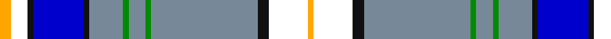

**Bands:** [YWKBKBGBGBKWY](/stripes/ywkbkbgbgbkwy/) · **Stripes:** [LO W K DB K T G T G T K W LO](/stripes/stripes13/) LO W K DB K T G T G T K W LO

This was sourced from register-of-tartans.  It is a [13 band tartan](/bands/bands13/).

Original link https://www.tartanregister.gov.uk/tartanDetails.aspx?ref=10324

## Register references

External register numbers recorded for this tartan.

- Scottish Register of Tartans: [10324](https://www.tartanregister.gov.uk/tartanDetails.aspx?ref=10324)

## Thread count
Y/4 W6 K2 B18 K2 N12 G2 N6 G2 N38 K4 W14 Y/2

## Palette
Each colour and its ΔE from the base-6 reference it is a variant of.

| Colour | Shade | Base | ΔE (OKLab) |
|---|---|---|---|
| B | <code style="background-color:#0000CD;">#0000CD</code> `#0000CD` | B <code style="background-color:#2A418A;">#2A418A</code> | 0.14 |
| G | <code style="background-color:#008B00;">#008B00</code> `#008B00` | G <code style="background-color:#006100;">#006100</code> | 0.13 |
| K | <code style="background-color:#101010;">#101010</code> `#101010` | K <code style="background-color:#000000;">#000000</code> | 0.17 |
| N | <code style="background-color:#778899;">#778899</code> `#778899` | B <code style="background-color:#2A418A;">#2A418A</code> | 0.24 |
| W | <code style="background-color:#FFFFFF;">#FFFFFF</code> `#FFFFFF` | W <code style="background-color:#F7F7F7;">#F7F7F7</code> | 0.02 |
| Y | <code style="background-color:#FFA500;">#FFA500</code> `#FFA500` | Y <code style="background-color:#F2BF00;">#F2BF00</code> | 0.06 |

## Nearest tartans

The nearest existing variants by ΔTartan distance.

1. [Letang (Personal)](/setts/s14/b14lb2ly2lb2b25k6w17r3w3r3w3r3w3r3~x2/) — ΔT 0.92
1. [Corryvrechan Dress (Corporate)](/setts/s10/t40db12ly2db2t2db2g6w21r2t2~x2/) — ΔT 0.93
1. [Ethiopia](/setts/s14/w4k1b24k1r8lo8g8k1b16lo2b1lo2b1lo4~x2/) — ΔT 0.93
1. [Tom Morris (Official)](/setts/s13/lr38p5lr6p5lr4k20lr38y12w3n30w3n2w7/) — ΔT 0.95
1. [Kirk in the Hills](/setts/s10/lb16db6k1ly1k1db1lb4dy4k1r1~x4/) — ΔT 1.00
1. [Congo, The Democratic Republic of the](/setts/s11/w4k1db16b20ly2r8ly2b20ly2b1ly4~x2/) — ΔT 1.02
1. [Edinburgh, dress](/setts/s10/w4k2w30g3p3g3p7db14g3r3~x2/) — ΔT 1.11
1. [Morris, Tom (Corporate)](/setts/s13/lb38dp5lb6dp5lb4db20lb38o12lb3n30lb3n2lb7/) — ΔT 1.12
1. [Baudoux et amis picards](/setts/s11/ly4db7ly4db26dg3k1dg3w9r2w4r2~x2/) — ΔT 1.14
1. [Hamburg #2 (Corporate)](/setts/s11/lb3k2lb3r2lb3k2lb24dt24r3lb3w2~x2/) — ΔT 1.15

## Neighbour map

Every grey dot is one of 14299 variants placed by the first two principal components of the ΔTartan feature space (44% of its variance). Red is this tartan; blue dots are its nearest — click one to open its page.

<svg viewBox="0 0 640 380" role="img" style="max-width:100%;height:auto;border:1px solid #e0e0e0;border-radius:4px;display:block" xmlns="http://www.w3.org/2000/svg"><image href="/nn/cloud.v1.png" width="640" height="380"/><a href="/setts/s14/b14lb2ly2lb2b25k6w17r3w3r3w3r3w3r3~x2/"><circle cx="166.0" cy="96.9" r="4" fill="#3465a4"><title>Letang (Personal)</title></circle></a><a href="/setts/s10/t40db12ly2db2t2db2g6w21r2t2~x2/"><circle cx="228.7" cy="91.4" r="4" fill="#3465a4"><title>Corryvrechan Dress (Corporate)</title></circle></a><a href="/setts/s14/w4k1b24k1r8lo8g8k1b16lo2b1lo2b1lo4~x2/"><circle cx="242.9" cy="82.8" r="4" fill="#3465a4"><title>Ethiopia</title></circle></a><a href="/setts/s13/lr38p5lr6p5lr4k20lr38y12w3n30w3n2w7/"><circle cx="197.9" cy="89.3" r="4" fill="#3465a4"><title>Tom Morris (Official)</title></circle></a><a href="/setts/s10/lb16db6k1ly1k1db1lb4dy4k1r1~x4/"><circle cx="256.0" cy="99.1" r="4" fill="#3465a4"><title>Kirk in the Hills</title></circle></a><a href="/setts/s11/w4k1db16b20ly2r8ly2b20ly2b1ly4~x2/"><circle cx="226.7" cy="106.8" r="4" fill="#3465a4"><title>Congo, The Democratic Republic of the</title></circle></a><a href="/setts/s10/w4k2w30g3p3g3p7db14g3r3~x2/"><circle cx="182.5" cy="90.0" r="4" fill="#3465a4"><title>Edinburgh, dress</title></circle></a><a href="/setts/s13/lb38dp5lb6dp5lb4db20lb38o12lb3n30lb3n2lb7/"><circle cx="210.8" cy="96.6" r="4" fill="#3465a4"><title>Morris, Tom (Corporate)</title></circle></a><a href="/setts/s11/ly4db7ly4db26dg3k1dg3w9r2w4r2~x2/"><circle cx="220.0" cy="75.4" r="4" fill="#3465a4"><title>Baudoux et amis picards</title></circle></a><a href="/setts/s11/lb3k2lb3r2lb3k2lb24dt24r3lb3w2~x2/"><circle cx="168.4" cy="96.0" r="4" fill="#3465a4"><title>Hamburg #2 (Corporate)</title></circle></a><circle cx="206.5" cy="82.1" r="5" fill="#c00000"/></svg>

ID: /setts/s13/lo2w3k1db9k1t6g1t3g1t19k2w7lo1~x2/
