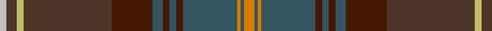

**Bands:** [YBYBBBBBBBYBW](/stripes/ybybbbbbbbybw/) · **Stripes:** [LO N LO N DO N DO N DO DO LY DO LB](/stripes/stripes13/) LO N LO N DO N DO N DO DO LY DO LB

This was sourced from register-of-tartans.  It is a [13 band tartan](/bands/bands13/).

Original link https://www.tartanregister.gov.uk/tartanDetails.aspx?ref=435

## Attestations

This cloth appears in 2 source records; the oldest owns this page.

- 01/01/1998 — Buglass (register-of-tartans, [record](https://www.tartanregister.gov.uk/tartanDetails.aspx?ref=435))
- 1998 — Buglass (Personal) (tartans-authority, [record](http://www.tartansauthority.com/tartan-ferret/display/2569/))

## Register references

External register numbers recorded for this tartan.

- Scottish Register of Tartans: [435](https://www.tartanregister.gov.uk/tartanDetails.aspx?ref=435)
- Scottish Tartans Authority (ITI): 2569
- Scottish Tartans World Register: 2569

## Thread count
O/6 Na2 O2 Na32 DR4 Na4 DR4 Na6 DR24 T52 LG4 T6 N/4

## Palette
Each colour and its ΔE from the base-6 reference it is a variant of.

| Colour | Shade | Base | ΔE (OKLab) |
|---|---|---|---|
| DR | <code style="background-color:#441800;">#441800</code> `#441800` | B <code style="background-color:#2A418A;">#2A418A</code> | 0.23 |
| LG | <code style="background-color:#C4BC68;">#C4BC68</code> `#C4BC68` | Y <code style="background-color:#F2BF00;">#F2BF00</code> | 0.08 |
| N | <code style="background-color:#C0C0C0;">#C0C0C0</code> `#C0C0C0` | W <code style="background-color:#F7F7F7;">#F7F7F7</code> | 0.17 |
| Na | <code style="background-color:#345460;">#345460</code> `#345460` | B <code style="background-color:#2A418A;">#2A418A</code> | 0.10 |
| O | <code style="background-color:#D87C00;">#D87C00</code> `#D87C00` | Y <code style="background-color:#F2BF00;">#F2BF00</code> | 0.17 |
| T | <code style="background-color:#4C3428;">#4C3428</code> `#4C3428` | B <code style="background-color:#2A418A;">#2A418A</code> | 0.17 |

## Nearest tartans

The nearest existing variants by ΔTartan distance.

1. [Bowhunter](/setts/s12/n3dg10n2dt25do3lr4do3dg10dt3n2lr3n1~x2/) — ΔT 0.88
1. [Hard Rock Café](/setts/s10/r4do4r4do12k32dy15r1dy7ly1r1~x2/) — ΔT 1.16
1. [Faulkner (Personal)](/setts/s11/n8k2o26lo1o6k3dg10lg1k3n22lg1~x2/) — ΔT 1.24
1. [Kelvin Family (Personal)](/setts/s12/db9k2db4k2dr6o3dy2db2dr11dy23t1k8~x2/) — ΔT 1.25
1. [Giants Causeway, The](/setts/s13/n38y8t3n20y44k2g6k2y5w2t10y2k6/) — ΔT 1.25
1. [Isle of Skye District Tartan Tartan Number: 2155. Earliest known date: 1993 The tartan was instigated and registered by Mrs Rosemary Nicolson Samios in 1992, an Australian of Skye descent, now living in Skye. It was selected through a worldwide competition won by Angus MacLeod from Lewis. Angus, a weaver by trade, produced the first commercial quantities in the traditional kilt weight in 1993 at Lochcarron Weavers in North Strome. The colours of the tartan depict those of the island, often called the 'Misty Isle'. Worn by the Torphican and Bathgate pipe band. (A patented design No. 0600930) See products available Copyright © Blair Urquhart, Comrie, 2015](/setts/s11/dy20dp2dy2dp2dy3dp8dg9g8y8dg1lr2~x2/) — ΔT 1.27
1. [Langerman (Anchorage)](/setts/s16/db1y2db1y3dg6db1y6db2r5r13do23r1do1r1do2r1~x2/) — ΔT 1.28
1. [Caithness](/setts/s15/o28r3dr2y2dr2r3y8o2dr8o5dr3w2dr2o3dr1~x2/) — ΔT 1.31
1. [Strathmore (District)](/setts/s16/g3r15g2r2g2r2g18dy2g2dy2g2dy27k2dy2k6lo2~x2/) — ΔT 1.40
1. [McMeeken](/setts/s10/o7dg20y2dg4k5db4k2db20k3w1~x2/) — ΔT 1.47

## Neighbour map

Every grey dot is one of 14299 variants placed by the first two principal components of the ΔTartan feature space (44% of its variance). Red is this tartan; blue dots are its nearest — click one to open its page.

<svg viewBox="0 0 640 380" role="img" style="max-width:100%;height:auto;border:1px solid #e0e0e0;border-radius:4px;display:block" xmlns="http://www.w3.org/2000/svg"><image href="/nn/cloud.v1.png" width="640" height="380"/><a href="/setts/s12/n3dg10n2dt25do3lr4do3dg10dt3n2lr3n1~x2/"><circle cx="252.1" cy="132.9" r="4" fill="#3465a4"><title>Bowhunter</title></circle></a><a href="/setts/s10/r4do4r4do12k32dy15r1dy7ly1r1~x2/"><circle cx="294.5" cy="136.6" r="4" fill="#3465a4"><title>Hard Rock Café</title></circle></a><a href="/setts/s11/n8k2o26lo1o6k3dg10lg1k3n22lg1~x2/"><circle cx="310.5" cy="149.7" r="4" fill="#3465a4"><title>Faulkner (Personal)</title></circle></a><a href="/setts/s12/db9k2db4k2dr6o3dy2db2dr11dy23t1k8~x2/"><circle cx="242.7" cy="150.0" r="4" fill="#3465a4"><title>Kelvin Family (Personal)</title></circle></a><a href="/setts/s13/n38y8t3n20y44k2g6k2y5w2t10y2k6/"><circle cx="282.6" cy="136.4" r="4" fill="#3465a4"><title>Giants Causeway, The</title></circle></a><a href="/setts/s11/dy20dp2dy2dp2dy3dp8dg9g8y8dg1lr2~x2/"><circle cx="227.8" cy="154.9" r="4" fill="#3465a4"><title>Isle of Skye District Tartan Tartan Number: 2155. Earliest known date: 1993 The tartan was instigated and registered by Mrs Rosemary Nicolson Samios in 1992, an Australian of Skye descent, now living in Skye. It was selected through a worldwide competition won by Angus MacLeod from Lewis. Angus, a weaver by trade, produced the first commercial quantities in the traditional kilt weight in 1993 at Lochcarron Weavers in North Strome. The colours of the tartan depict those of the island, often called the 'Misty Isle'. Worn by the Torphican and Bathgate pipe band. (A patented design No. 0600930) See products available Copyright © Blair Urquhart, Comrie, 2015</title></circle></a><a href="/setts/s16/db1y2db1y3dg6db1y6db2r5r13do23r1do1r1do2r1~x2/"><circle cx="273.4" cy="116.8" r="4" fill="#3465a4"><title>Langerman (Anchorage)</title></circle></a><a href="/setts/s15/o28r3dr2y2dr2r3y8o2dr8o5dr3w2dr2o3dr1~x2/"><circle cx="252.3" cy="90.5" r="4" fill="#3465a4"><title>Caithness</title></circle></a><a href="/setts/s16/g3r15g2r2g2r2g18dy2g2dy2g2dy27k2dy2k6lo2~x2/"><circle cx="233.1" cy="129.4" r="4" fill="#3465a4"><title>Strathmore (District)</title></circle></a><a href="/setts/s10/o7dg20y2dg4k5db4k2db20k3w1~x2/"><circle cx="253.0" cy="169.8" r="4" fill="#3465a4"><title>McMeeken</title></circle></a><circle cx="280.9" cy="121.9" r="5" fill="#c00000"/></svg>

ID: /setts/s13/lo3n1lo1n16do2n2do2n3do12do26ly2do3lb2~x2/
