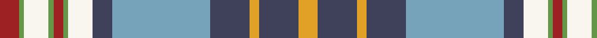

**Bands:** [RGWGRGWBYBYBY](/stripes/rgwgrgwbybyby/) · **Stripes:** [R G W G R G W DT LG DT LO DT LO](/stripes/stripes13/) R G W G R G W DT LG DT LO DT LO

This was sourced from register-of-tartans.  It is a [13 band tartan](/bands/bands13/).

Original link https://www.tartanregister.gov.uk/tartanDetails.aspx?ref=10345

## Register references

External register numbers recorded for this tartan.

- Scottish Register of Tartans: [10345](https://www.tartanregister.gov.uk/tartanDetails.aspx?ref=10345)

## Thread count
DR/8 LG2 W10 LG2 DR4 LG2 W10 N8 B40 N16 Y4 N16 Y/8

## Palette
Each colour and its ΔE from the base-6 reference it is a variant of.

| Colour | Shade | Base | ΔE (OKLab) |
|---|---|---|---|
| B | <code style="background-color:#76A3B9;">#76A3B9</code> `#76A3B9` | Y <code style="background-color:#F2BF00;">#F2BF00</code> | 0.26 |
| DR | <code style="background-color:#9D2123;">#9D2123</code> `#9D2123` | R <code style="background-color:#CC0000;">#CC0000</code> | 0.09 |
| LG | <code style="background-color:#649848;">#649848</code> `#649848` | G <code style="background-color:#006100;">#006100</code> | 0.20 |
| N | <code style="background-color:#3F4059;">#3F4059</code> `#3F4059` | B <code style="background-color:#2A418A;">#2A418A</code> | 0.09 |
| W | <code style="background-color:#F9F5EF;">#F9F5EF</code> `#F9F5EF` | W <code style="background-color:#F7F7F7;">#F7F7F7</code> | 0.01 |
| Y | <code style="background-color:#E0A126;">#E0A126</code> `#E0A126` | Y <code style="background-color:#F2BF00;">#F2BF00</code> | 0.08 |

## Nearest tartans

The nearest existing variants by ΔTartan distance.

1. [Chalk, Robert (Personal)](/setts/s11/dp2w5dp5ly11w5dg12lr1dg2lr26do2dp2~x2/) — ΔT 0.87
1. [Enable (Corporate)](/setts/s13/ly3g4n14dp3n2dp18lb16g14n2dp3lb3n2lo1~x2/) — ΔT 0.97
1. [Westwood MacAndreas](/setts/s18/r5b6r2b9r14k5lo2k2lo2k5w5k5t23r1k2r1t5b4~x2/) — ΔT 1.02
1. [City of Edinburgh (2001) (District)](/setts/s16/r18t1o18k1g18w1t18r1o18g1r18k3w4k3w4k3~x2/) — ΔT 1.10
1. [Highlands of Haliburton Dress (Dist.](/setts/s15/lg4w2lg1w14r2do4lg8g4w2lg3lo2g2do2w2lo2~x2/) — ΔT 1.18
1. [Bouguet, Adrian Dress (Personal)](/setts/s11/lb16dg5lo20o3dg3o3lo4g14lo2o2r1~x2/) — ΔT 1.19
1. [Spirit of Romania](/setts/s16/dp4db1dp2db1b16db1ly16r16db1b4db2b4db2b12db1w4~x2/) — ΔT 1.21
1. [Dalrymple of Castleton](/setts/s14/lo2r15lo3dr2lo3k14lo2t6w2t6lo2r7t10w1~x2/) — ΔT 1.25
1. [Declaration of Scottish Independence](/setts/s19/w16b38db2b6db2b4db4b2db6b2db12r16k8ly8r4ly3r2ly16r10/) — ΔT 1.25
1. [Un-named (USA Bedheads)](/setts/s13/k4lg9lb30k2lb4w5k2w2k1w2r7r15k3~x2/) — ΔT 1.25

## Neighbour map

Every grey dot is one of 14313 variants placed by the first two principal components of the ΔTartan feature space (44% of its variance). Red is this tartan; blue dots are its nearest — click one to open its page.

<svg viewBox="0 0 640 380" role="img" style="max-width:100%;height:auto;border:1px solid #e0e0e0;border-radius:4px;display:block" xmlns="http://www.w3.org/2000/svg"><image href="/nn/cloud.v1.png" width="640" height="380"/><a href="/setts/s11/dp2w5dp5ly11w5dg12lr1dg2lr26do2dp2~x2/"><circle cx="154.6" cy="83.4" r="4" fill="#3465a4"><title>Chalk, Robert (Personal)</title></circle></a><a href="/setts/s13/ly3g4n14dp3n2dp18lb16g14n2dp3lb3n2lo1~x2/"><circle cx="106.7" cy="105.4" r="4" fill="#3465a4"><title>Enable (Corporate)</title></circle></a><a href="/setts/s18/r5b6r2b9r14k5lo2k2lo2k5w5k5t23r1k2r1t5b4~x2/"><circle cx="110.2" cy="79.6" r="4" fill="#3465a4"><title>Westwood MacAndreas</title></circle></a><a href="/setts/s16/r18t1o18k1g18w1t18r1o18g1r18k3w4k3w4k3~x2/"><circle cx="110.4" cy="93.0" r="4" fill="#3465a4"><title>City of Edinburgh (2001) (District)</title></circle></a><a href="/setts/s15/lg4w2lg1w14r2do4lg8g4w2lg3lo2g2do2w2lo2~x2/"><circle cx="119.7" cy="102.6" r="4" fill="#3465a4"><title>Highlands of Haliburton Dress (Dist.</title></circle></a><a href="/setts/s11/lb16dg5lo20o3dg3o3lo4g14lo2o2r1~x2/"><circle cx="154.6" cy="106.0" r="4" fill="#3465a4"><title>Bouguet, Adrian Dress (Personal)</title></circle></a><a href="/setts/s16/dp4db1dp2db1b16db1ly16r16db1b4db2b4db2b12db1w4~x2/"><circle cx="149.3" cy="82.9" r="4" fill="#3465a4"><title>Spirit of Romania</title></circle></a><a href="/setts/s14/lo2r15lo3dr2lo3k14lo2t6w2t6lo2r7t10w1~x2/"><circle cx="95.3" cy="107.6" r="4" fill="#3465a4"><title>Dalrymple of Castleton</title></circle></a><a href="/setts/s19/w16b38db2b6db2b4db4b2db6b2db12r16k8ly8r4ly3r2ly16r10/"><circle cx="95.5" cy="70.0" r="4" fill="#3465a4"><title>Declaration of Scottish Independence</title></circle></a><a href="/setts/s13/k4lg9lb30k2lb4w5k2w2k1w2r7r15k3~x2/"><circle cx="164.0" cy="55.4" r="4" fill="#3465a4"><title>Un-named (USA Bedheads)</title></circle></a><circle cx="122.8" cy="92.8" r="5" fill="#c00000"/></svg>

ID: /setts/s13/lo4dt8lo2dt8lg20dt4w5g1r2g1w5g1r4~x2/
