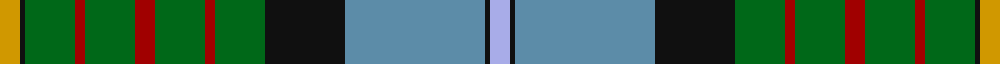

This page is one **sett** — a single exact thread-count. It belongs to the [tartan](/tartans/lo4k1g10r2g10r4g10r2g10k16t28k1lb4/)
(the same proportion at any scale), whose colour order is pattern [WKBKGRGRGRGKY](/stripes/wkbkgrgrgrgky/).

Sourced from house-of-tartan.  It is a [13 stripe tartan](/stripes/stripes13/).

Original link http://www.house-of-tartan.scotland.net/house/TartanViewjs.asp?colr=Def&tnam=2454

## Thread count
DY/8 K2 G20 DR4 G20 DR8 G20 DR4 G20 K32 Ba56 K2 LP/8

## Palette

Palette: <strong>Tartan Register</strong> <small style="color:#888">(7 of 8 colours)</small>
<table><thead><tr><th>Colour</th><th>Threads</th><th>Shade</th><th>Base</th><th>OKLCh</th></tr></thead><tbody><tr><td>DY/</td><td style="text-align:right;font-variant-numeric:tabular-nums">8</td><td><code style="background-color:#D09800;">#D09800</code> <small style="color:#888">#D09800</small></td><td>Y <code style="background-color:#F2BF00;">#F2BF00</code></td><td><small style="color:#888">oklch(71.4% 0.147 82.1)</small></td></tr><tr><td>K</td><td style="text-align:right;font-variant-numeric:tabular-nums">2</td><td><code style="background-color:#101010;">#101010</code> <small style="color:#888">#101010</small></td><td>K <code style="background-color:#000000;">#000000</code></td><td><small style="color:#888">oklch(17.3% 0.000 89.9)</small></td></tr><tr><td>G</td><td style="text-align:right;font-variant-numeric:tabular-nums">20</td><td><code style="background-color:#006818;">#006818</code> <small style="color:#888">#006818</small></td><td>G <code style="background-color:#006100;">#006100</code></td><td><small style="color:#888">oklch(45.0% 0.142 145.0)</small></td></tr><tr><td>DR</td><td style="text-align:right;font-variant-numeric:tabular-nums">4</td><td><code style="background-color:#A00000;">#A00000</code> <small style="color:#888">#A00000</small></td><td>R <code style="background-color:#CC0000;">#CC0000</code></td><td><small style="color:#888">oklch(44.3% 0.182 29.2)</small></td></tr><tr><td>G</td><td style="text-align:right;font-variant-numeric:tabular-nums">20</td><td><code style="background-color:#006818;">#006818</code> <small style="color:#888">#006818</small></td><td>G <code style="background-color:#006100;">#006100</code></td><td><small style="color:#888">oklch(45.0% 0.142 145.0)</small></td></tr><tr><td>DR</td><td style="text-align:right;font-variant-numeric:tabular-nums">8</td><td><code style="background-color:#A00000;">#A00000</code> <small style="color:#888">#A00000</small></td><td>R <code style="background-color:#CC0000;">#CC0000</code></td><td><small style="color:#888">oklch(44.3% 0.182 29.2)</small></td></tr><tr><td>G</td><td style="text-align:right;font-variant-numeric:tabular-nums">20</td><td><code style="background-color:#006818;">#006818</code> <small style="color:#888">#006818</small></td><td>G <code style="background-color:#006100;">#006100</code></td><td><small style="color:#888">oklch(45.0% 0.142 145.0)</small></td></tr><tr><td>DR</td><td style="text-align:right;font-variant-numeric:tabular-nums">4</td><td><code style="background-color:#A00000;">#A00000</code> <small style="color:#888">#A00000</small></td><td>R <code style="background-color:#CC0000;">#CC0000</code></td><td><small style="color:#888">oklch(44.3% 0.182 29.2)</small></td></tr><tr><td>G</td><td style="text-align:right;font-variant-numeric:tabular-nums">20</td><td><code style="background-color:#006818;">#006818</code> <small style="color:#888">#006818</small></td><td>G <code style="background-color:#006100;">#006100</code></td><td><small style="color:#888">oklch(45.0% 0.142 145.0)</small></td></tr><tr><td>K</td><td style="text-align:right;font-variant-numeric:tabular-nums">32</td><td><code style="background-color:#101010;">#101010</code> <small style="color:#888">#101010</small></td><td>K <code style="background-color:#000000;">#000000</code></td><td><small style="color:#888">oklch(17.3% 0.000 89.9)</small></td></tr><tr><td>Ba</td><td style="text-align:right;font-variant-numeric:tabular-nums">56</td><td><code style="background-color:#5C8CA8;">#5C8CA8</code> <small style="color:#888">#5C8CA8</small></td><td>B <code style="background-color:#2A418A;">#2A418A</code></td><td><small style="color:#888">oklch(61.7% 0.067 235.0)</small></td></tr><tr><td>K</td><td style="text-align:right;font-variant-numeric:tabular-nums">2</td><td><code style="background-color:#101010;">#101010</code> <small style="color:#888">#101010</small></td><td>K <code style="background-color:#000000;">#000000</code></td><td><small style="color:#888">oklch(17.3% 0.000 89.9)</small></td></tr><tr><td>LP/</td><td style="text-align:right;font-variant-numeric:tabular-nums">8</td><td><code style="background-color:#A8ACE8;">#A8ACE8</code> <small style="color:#888">#A8ACE8</small></td><td>W <code style="background-color:#F7F7F7;">#F7F7F7</code></td><td><small style="color:#888">oklch(76.3% 0.086 281.2)</small></td></tr></tbody></table>

## Nearest tartans

The nearest existing variants by ΔTartan distance, with this tartan at the top so the swatches line up against it.

ΔTartan

Tartan

Sett

—

<a href="/ttd/edit/#slug=lo4k1g10r2g10r4g10r2g10k16t28k1lb4~x2">California State American District Tartan Tartan Number: 2454. Earliest known date: 1998 Designed by J.Howard Standing of Tarzana, California and Thomas Ferguson of Sydney, British Columbia. Adopted as the 'official' California State tartan by the State Legislature. For general use by all those living in the State. Based on Muir, after the famous botanist and environmentalist John Muir who lived in California. Assembly Bill 2362, february 20th 1998. See products available Copyright © Blair Urquhart, Comrie, 2015</a> <a class="nn-out" href="/setts/s13/lo4k1g10r2g10r4g10r2g10k16t28k1lb4~x2/" title="open its dictionary page">↗</a>

0.23

<a href="/ttd/edit/#slug=ly4k1g10r2g10r4g10r2g10k16t28k1lb4~x2">California State</a> <a class="nn-out" href="/setts/s13/ly4k1g10r2g10r4g10r2g10k16t28k1lb4~x2/" title="open its dictionary page">↗</a>

0.97

<a href="/ttd/edit/#slug=db16w3db1ly4g24r1g3r4g3r1t8~x2">Currie</a> <a class="nn-out" href="/setts/s11/db16w3db1ly4g24r1g3r4g3r1t8~x2/" title="open its dictionary page">↗</a>

0.99

<a href="/setts/s14/g22r3w1g2r3t16k3ly2~x4/">Stirling University #2</a>

1.08

<a href="/ttd/edit/#slug=g3dp4g23k10r2k10t18k1w3~x2">Birch Family Tartan Tartan Number: 2157. Earliest known date: 1993 The Birch family tartan was designed and produced by Mr Robin Birch of Connell Reid kiltmaker, Blairgowrie. The new sett has been recorded by the Scottish Tartans Society. See products available Copyright © Blair Urquhart, Comrie, 2015</a> <a class="nn-out" href="/setts/s9/g3dp4g23k10r2k10t18k1w3~x2/" title="open its dictionary page">↗</a>

1.09

<a href="/ttd/edit/#slug=b4k1db28k16g10r2g10r4g10r2g10k1ly4~x2">California</a> <a class="nn-out" href="/setts/s13/b4k1db28k16g10r2g10r4g10r2g10k1ly4~x2/" title="open its dictionary page">↗</a>

1.09

<a href="/ttd/edit/#slug=w4k1r2k1g9k2b24k2r6k2g12ly2~x2">Tait #2</a> <a class="nn-out" href="/setts/s12/w4k1r2k1g9k2b24k2r6k2g12ly2~x2/" title="open its dictionary page">↗</a>

1.12

<a href="/ttd/edit/#slug=db3dg22r5dg5o5w1o1dg1g8db6o1db5dg2~x2">Mill o Forest Primary School (Corp)</a> <a class="nn-out" href="/setts/s13/db3dg22r5dg5o5w1o1dg1g8db6o1db5dg2~x2/" title="open its dictionary page">↗</a>

1.14

<a href="/ttd/edit/#slug=n12r2n3r4n15k24dg18ly1k3dg3w3~x2">Groen (Personal)</a> <a class="nn-out" href="/setts/s11/n12r2n3r4n15k24dg18ly1k3dg3w3~x2/" title="open its dictionary page">↗</a>

1.20

<a href="/ttd/edit/#slug=g4ly2g24r2k12db3k2db2k2db12w1db1w3~x2">Baron of Greencastle (Personal)</a> <a class="nn-out" href="/setts/s13/g4ly2g24r2k12db3k2db2k2db12w1db1w3~x2/" title="open its dictionary page">↗</a>

1.24

<a href="/ttd/edit/#slug=gi55k13b4k3g6lo3b2k3dy10k12b14~x2">State Seal of South Carolina (Fash)</a> <a class="nn-out" href="/setts/s11/gi55k13b4k3g6lo3b2k3dy10k12b14~x2/" title="open its dictionary page">↗</a>

## Neighbour map

Every grey dot is one of 14359 variants placed by the first two principal components of the ΔTartan feature space (44% of its variance). Red is this tartan; blue dots are its nearest — click one to open its page.

<svg viewBox="0 0 640 380" role="img" style="max-width:100%;height:auto;border:1px solid #e0e0e0;border-radius:4px;display:block" xmlns="http://www.w3.org/2000/svg"><image href="/nn/cloud.v1.png" width="640" height="380"/><a href="/setts/s13/ly4k1g10r2g10r4g10r2g10k16t28k1lb4~x2/"><circle cx="181.0" cy="103.7" r="4" fill="#3465a4"><title>California State</title></circle></a><a href="/setts/s11/db16w3db1ly4g24r1g3r4g3r1t8~x2/"><circle cx="217.0" cy="104.3" r="4" fill="#3465a4"><title>Currie</title></circle></a><a href="/setts/s14/g22r3w1g2r3t16k3ly2~x4/"><circle cx="204.2" cy="93.7" r="4" fill="#3465a4"><title>Stirling University #2</title></circle></a><a href="/setts/s9/g3dp4g23k10r2k10t18k1w3~x2/"><circle cx="160.6" cy="129.2" r="4" fill="#3465a4"><title>Birch Family Tartan Tartan Number: 2157. Earliest known date: 1993 The Birch family tartan was designed and produced by Mr Robin Birch of Connell Reid kiltmaker, Blairgowrie. The new sett has been recorded by the Scottish Tartans Society. See products available Copyright © Blair Urquhart, Comrie, 2015</title></circle></a><a href="/setts/s13/b4k1db28k16g10r2g10r4g10r2g10k1ly4~x2/"><circle cx="162.6" cy="97.3" r="4" fill="#3465a4"><title>California</title></circle></a><a href="/setts/s12/w4k1r2k1g9k2b24k2r6k2g12ly2~x2/"><circle cx="167.4" cy="91.1" r="4" fill="#3465a4"><title>Tait #2</title></circle></a><a href="/setts/s13/db3dg22r5dg5o5w1o1dg1g8db6o1db5dg2~x2/"><circle cx="239.9" cy="119.2" r="4" fill="#3465a4"><title>Mill o Forest Primary School (Corp)</title></circle></a><a href="/setts/s11/n12r2n3r4n15k24dg18ly1k3dg3w3~x2/"><circle cx="175.8" cy="121.5" r="4" fill="#3465a4"><title>Groen (Personal)</title></circle></a><a href="/setts/s13/g4ly2g24r2k12db3k2db2k2db12w1db1w3~x2/"><circle cx="193.3" cy="92.6" r="4" fill="#3465a4"><title>Baron of Greencastle (Personal)</title></circle></a><a href="/setts/s11/gi55k13b4k3g6lo3b2k3dy10k12b14~x2/"><circle cx="237.0" cy="102.3" r="4" fill="#3465a4"><title>State Seal of South Carolina (Fash)</title></circle></a><circle cx="187.3" cy="107.8" r="5" fill="#c00000"/></svg>

ID: /setts/s13/lo4k1g10r2g10r4g10r2g10k16t28k1lb4~x2/
