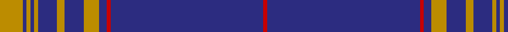

In pattern [RBRBYBYBYBYBY](/stripes/rbrbybybybyby/).

This was sourced from tartans-authority.  It is a [13 stripe tartan](/stripes/stripes13/).

Original link http://www.tartansauthority.com/tartan-ferret/display/10038/

## Attestations

This cloth appears in 2 source records; the oldest owns this page.

- Mar. 2009 — Angotta (Name) (tartans-authority, [record](http://www.tartansauthority.com/tartan-ferret/display/10038/))
- undated — Angotta Name Tartan Tartan Number: 10038. Earliest known date: 2009 Designed by Scottish Tartans Authority for the armigerous Donald Paul Angotta of the USA, based on an unidentified 19th century sett. The yellow and blue are the major colours of the Angotta arms granted in South Africa in 2001 and the red highlights are from the helm in that coat of arms. See products available Copyright © Blair Urquhart, Comrie, 2015 (house-of-tartan, [record](http://www.house-of-tartan.scotland.net/house/TartanViewjs.asp?colr=Def&tnam=10038))

## Thread count
DY/12 DB2 DY2 DB2 DY2 DB10 DY4 DB10 DY8 DB4 R2 DB80 R/2

## Palette
Each colour and its ΔE from the base-6 reference it is a variant of.

| Colour | Shade | Base | ΔE (OKLab) |
|---|---|---|---|
| DB | <code style="background-color:#2C2C80;">#2C2C80</code> `#2C2C80` | B <code style="background-color:#2A418A;">#2A418A</code> | 0.06 |
| DY | <code style="background-color:#BC8C00;">#BC8C00</code> `#BC8C00` | Y <code style="background-color:#F2BF00;">#F2BF00</code> | 0.16 |
| R | <code style="background-color:#C80000;">#C80000</code> `#C80000` | R <code style="background-color:#CC0000;">#CC0000</code> | 0.01 |

## Nearest tartans

The nearest existing variants by ΔTartan distance.

1. [Angotta](/setts/s13/ly6db1ly1db1ly1db5ly2db5ly4db2r1db40r1~x2/) — ΔT 1.20
1. [United States (Personal)](/setts/s16/b7db5w6db5r7db2b2db70w2/) — ΔT 1.32
1. [United States (Corporate)](/setts/s9/b7db5w6db5r7db2b2db70w2/) — ΔT 1.42
1. [Worsoff (Personal)](/setts/s14/b32db1w2b1w2db1b32db1w2db1w2db1ly5db1~x2/) — ΔT 1.47
1. [University of Delaware (Corporate)](/setts/s9/db43ly5db1ly4db1ly2db7w1db2~x2/) — ΔT 1.48
1. [Inverness, Duke of York](/setts/s8/db122r11w4r15ly4db6ly4db30/) — ΔT 1.60
1. [Alpha Chi Sigma Fraternity](/setts/s10/dt35ly1dt3ly1dt3ly1dt20r6w1r5~x2/) — ΔT 1.61
1. [Miyuki](/setts/s10/dt40lo1dt1r9dt1lo1dt6lo1dt1r9~x2/) — ΔT 1.61
1. [Ottawa Fire Service (Corporate)](/setts/s11/db63lo3w3db8lo3db3w3db3r14db9lo3~x2/) — ΔT 1.69
1. [Wcwm 9275-1446](/setts/s12/db56r1g4r1g3r1db10g1r10db2r3lb2~x4/) — ΔT 1.69

## Neighbour map

Every grey dot is one of 14299 variants placed by the first two principal components of the ΔTartan feature space (44% of its variance). Red is this tartan; blue dots are its nearest — click one to open its page.

<svg viewBox="0 0 640 380" role="img" style="max-width:100%;height:auto;border:1px solid #e0e0e0;border-radius:4px;display:block" xmlns="http://www.w3.org/2000/svg"><image href="/nn/cloud.v1.png" width="640" height="380"/><a href="/setts/s13/ly6db1ly1db1ly1db5ly2db5ly4db2r1db40r1~x2/"><circle cx="547.8" cy="89.0" r="4" fill="#3465a4"><title>Angotta</title></circle></a><a href="/setts/s16/b7db5w6db5r7db2b2db70w2/"><circle cx="545.5" cy="88.7" r="4" fill="#3465a4"><title>United States (Personal)</title></circle></a><a href="/setts/s9/b7db5w6db5r7db2b2db70w2/"><circle cx="525.5" cy="107.7" r="4" fill="#3465a4"><title>United States (Corporate)</title></circle></a><a href="/setts/s14/b32db1w2b1w2db1b32db1w2db1w2db1ly5db1~x2/"><circle cx="523.3" cy="91.0" r="4" fill="#3465a4"><title>Worsoff (Personal)</title></circle></a><a href="/setts/s9/db43ly5db1ly4db1ly2db7w1db2~x2/"><circle cx="581.2" cy="110.6" r="4" fill="#3465a4"><title>University of Delaware (Corporate)</title></circle></a><a href="/setts/s8/db122r11w4r15ly4db6ly4db30/"><circle cx="576.2" cy="137.7" r="4" fill="#3465a4"><title>Inverness, Duke of York</title></circle></a><a href="/setts/s10/dt35ly1dt3ly1dt3ly1dt20r6w1r5~x2/"><circle cx="559.6" cy="131.5" r="4" fill="#3465a4"><title>Alpha Chi Sigma Fraternity</title></circle></a><a href="/setts/s10/dt40lo1dt1r9dt1lo1dt6lo1dt1r9~x2/"><circle cx="527.0" cy="126.4" r="4" fill="#3465a4"><title>Miyuki</title></circle></a><a href="/setts/s11/db63lo3w3db8lo3db3w3db3r14db9lo3~x2/"><circle cx="482.7" cy="119.3" r="4" fill="#3465a4"><title>Ottawa Fire Service (Corporate)</title></circle></a><a href="/setts/s12/db56r1g4r1g3r1db10g1r10db2r3lb2~x4/"><circle cx="538.8" cy="96.5" r="4" fill="#3465a4"><title>Wcwm 9275-1446</title></circle></a><circle cx="569.2" cy="104.4" r="5" fill="#c00000"/></svg>

ID: /setts/s13/lo6db1lo1db1lo1db5lo2db5lo4db2r1db40r1~x2/
