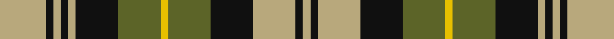

This page is one **sett** — a single exact thread-count. It belongs to the [tartan](/tartans/lg25k4lg4k4lg4k23g23y4g23k23lg23k4lg4/)
(the same proportion at any scale), whose colour order is pattern [YKYKGYGKYKYKY](/stripes/ykykgygkykyky/).

Sourced from tartans-authority.  It is a [13 stripe tartan](/stripes/stripes13/).

Original link http://www.tartansauthority.com/tartan-ferret/display/7508/

## Also known as

This cloth is also recorded under:

- Poulter, Green

3 attestations — the source records this cloth was collapsed from (oldest owns this page)

<ul>
<li>pre 2008 — Poulter, Green (Corporate) (tartans-authority, <a href="http://www.tartansauthority.com/tartan-ferret/display/7508/">record</a>)</li>
<li>undated — Poulter Green (register-of-tartans, <a href="https://www.tartanregister.gov.uk/tartanDetails.aspx?ref=5546">record</a>)</li>
<li>undated — Poulter Green Corporate Tartan Tartan Number: 7508. Earliest known date: 2008 One of four colourways for corporate tartans for professional golfer Ian Poulter's fashion range. Woven in polyster/viscose. Count and sample from Lochcarron. See products available Copyright © Blair Urquhart, Comrie, 2015 (house-of-tartan, <a href="http://www.house-of-tartan.scotland.net/house/TartanViewjs.asp?colr=Def&tnam=7508">record</a>)</li>
</ul>

## Register references

External register numbers recorded for this tartan.

- Scottish Register of Tartans: [5546](https://www.tartanregister.gov.uk/tartanDetails.aspx?ref=5546)
- Scottish Tartans Authority (ITI): 7508

## Thread count
LG/50 K8 LG8 K8 LG8 K46 G46 Y8 G46 K46 LG46 K8 LG/8

## Palette
Each colour and the base-6 reference it is a variant of.

| Colour | Shade | Base |
|---|---|---|
| G | <code style="background-color:#5C6428;">#5C6428</code> `oklch(48.3% 0.084 116.0)` <small>#5C6428</small> | G <code style="background-color:#006100;">#006100</code> |
| K | <code style="background-color:#101010;">#101010</code> `oklch(17.3% 0.000 89.9)` <small>#101010</small> | K <code style="background-color:#000000;">#000000</code> |
| LG | <code style="background-color:#B8A87C;">#B8A87C</code> `oklch(73.4% 0.062 90.4)` <small>#B8A87C</small> | Y <code style="background-color:#F2BF00;">#F2BF00</code> |
| Y | <code style="background-color:#E8C000;">#E8C000</code> `oklch(81.9% 0.168 93.7)` <small>#E8C000</small> | Y <code style="background-color:#F2BF00;">#F2BF00</code> |

## Nearest tartans

The nearest existing variants by ΔTartan distance, with this tartan at the top so the swatches line up against it.

ΔTartan

Tartan

Sett

—

<a href="/ttd/edit/#slug=ly25k4ly4k4ly4k23y23ly4y23k23ly23k4ly4~x2">Poulter, Green (Corporate)</a> <a class="nn-out" href="/setts/s13/ly25k4ly4k4ly4k23y23ly4y23k23ly23k4ly4~x2/" title="open its dictionary page">↗</a>

1.13

<a href="/ttd/edit/#slug=g6ly1r2ly1r2ly1db6ly1db6ly1r2ly1r2ly1g6r1~x8">Stevenson (Personal)</a> <a class="nn-out" href="/setts/s16/g6ly1r2ly1r2ly1db6ly1db6ly1r2ly1r2ly1g6r1~x8/" title="open its dictionary page">↗</a>

1.16

<a href="/ttd/edit/#slug=db11r2db2r4db15r2k15g15r4g2r2g11~x2">MacDonald 7</a> <a class="nn-out" href="/setts/s12/db11r2db2r4db15r2k15g15r4g2r2g11~x2/" title="open its dictionary page">↗</a>

1.17

<a href="/ttd/edit/#slug=g10lo8r5k2g3k2r5lo8g12k2r6k2g2~x4">Londonderry Irish County Tartan Tartan Number: 2279. Earliest known date: 1995 One of a series of Irish District tartans designed by Polly Wittering of the House of Edgar, with colours reminiscent of the Country with soft warm colours dominating. See products available Copyright © Blair Urquhart, Comrie, 2015</a> <a class="nn-out" href="/setts/s13/g10lo8r5k2g3k2r5lo8g12k2r6k2g2~x4/" title="open its dictionary page">↗</a>

1.19

<a href="/ttd/edit/#slug=g10k10lb4k2ly2k2lb3k12lb12k2lb3~x2">Dalgliesh Dress</a> <a class="nn-out" href="/setts/s11/g10k10lb4k2ly2k2lb3k12lb12k2lb3~x2/" title="open its dictionary page">↗</a>

1.19

<a href="/ttd/edit/#slug=r18g4k4w4g16db4g16w4k4r5g4w4g3r5k4~x2">Gayre Bodyguard (Clan)</a> <a class="nn-out" href="/setts/s15/r18g4k4w4g16db4g16w4k4r5g4w4g3r5k4~x2/" title="open its dictionary page">↗</a>

1.20

<a href="/ttd/edit/#slug=g18r18k3r3db3r3db4r3k9r4g18w6k3~x2">Maguire</a> <a class="nn-out" href="/setts/s13/g18r18k3r3db3r3db4r3k9r4g18w6k3~x2/" title="open its dictionary page">↗</a>

1.21

<a href="/ttd/edit/#slug=lo12k2lo2k2lo2k10g12k3g12k10lo12k2lo2~x2">Brown Watch</a> <a class="nn-out" href="/setts/s13/lo12k2lo2k2lo2k10g12k3g12k10lo12k2lo2~x2/" title="open its dictionary page">↗</a>

1.21

<a href="/ttd/edit/#slug=db8r2db2r4db10r2k11g10r4g2r2g8~x2">MacDonald 2</a> <a class="nn-out" href="/setts/s12/db8r2db2r4db10r2k11g10r4g2r2g8~x2/" title="open its dictionary page">↗</a>

1.21

<a href="/ttd/edit/#slug=db23k3db3k3db3k17ly22k4ly22k17db22k3db3~x2">Gordon (Clan)</a> <a class="nn-out" href="/setts/s13/db23k3db3k3db3k17ly22k4ly22k17db22k3db3~x2/" title="open its dictionary page">↗</a>

1.23

<a href="/ttd/edit/#slug=dy3k7dy2w2lo12k2lo2dy3~x2">Daks (Brown)</a> <a class="nn-out" href="/setts/s8/dy3k7dy2w2lo12k2lo2dy3~x2/" title="open its dictionary page">↗</a>

## Neighbour map

Every grey dot is one of 14299 variants placed by the first two principal components of the ΔTartan feature space (44% of its variance). Red is this tartan; blue dots are its nearest — click one to open its page.

<svg viewBox="0 0 640 380" role="img" style="max-width:100%;height:auto;border:1px solid #e0e0e0;border-radius:4px;display:block" xmlns="http://www.w3.org/2000/svg"><image href="/nn/cloud.v1.png" width="640" height="380"/><a href="/setts/s16/g6ly1r2ly1r2ly1db6ly1db6ly1r2ly1r2ly1g6r1~x8/"><circle cx="107.4" cy="177.9" r="4" fill="#3465a4"><title>Stevenson (Personal)</title></circle></a><a href="/setts/s12/db11r2db2r4db15r2k15g15r4g2r2g11~x2/"><circle cx="129.2" cy="190.6" r="4" fill="#3465a4"><title>MacDonald 7</title></circle></a><a href="/setts/s13/g10lo8r5k2g3k2r5lo8g12k2r6k2g2~x4/"><circle cx="146.3" cy="202.6" r="4" fill="#3465a4"><title>Londonderry Irish County Tartan Tartan Number: 2279. Earliest known date: 1995 One of a series of Irish District tartans designed by Polly Wittering of the House of Edgar, with colours reminiscent of the Country with soft warm colours dominating. See products available Copyright © Blair Urquhart, Comrie, 2015</title></circle></a><a href="/setts/s11/g10k10lb4k2ly2k2lb3k12lb12k2lb3~x2/"><circle cx="166.3" cy="195.0" r="4" fill="#3465a4"><title>Dalgliesh Dress</title></circle></a><a href="/setts/s15/r18g4k4w4g16db4g16w4k4r5g4w4g3r5k4~x2/"><circle cx="140.9" cy="165.5" r="4" fill="#3465a4"><title>Gayre Bodyguard (Clan)</title></circle></a><a href="/setts/s13/g18r18k3r3db3r3db4r3k9r4g18w6k3~x2/"><circle cx="130.4" cy="166.3" r="4" fill="#3465a4"><title>Maguire</title></circle></a><a href="/setts/s13/lo12k2lo2k2lo2k10g12k3g12k10lo12k2lo2~x2/"><circle cx="174.9" cy="222.3" r="4" fill="#3465a4"><title>Brown Watch</title></circle></a><a href="/setts/s12/db8r2db2r4db10r2k11g10r4g2r2g8~x2/"><circle cx="95.8" cy="211.3" r="4" fill="#3465a4"><title>MacDonald 2</title></circle></a><a href="/setts/s13/db23k3db3k3db3k17ly22k4ly22k17db22k3db3~x2/"><circle cx="142.9" cy="174.0" r="4" fill="#3465a4"><title>Gordon (Clan)</title></circle></a><a href="/setts/s8/dy3k7dy2w2lo12k2lo2dy3~x2/"><circle cx="179.3" cy="204.2" r="4" fill="#3465a4"><title>Daks (Brown)</title></circle></a><circle cx="138.7" cy="189.0" r="5" fill="#c00000"/></svg>

ID: /setts/s13/ly25k4ly4k4ly4k23y23ly4y23k23ly23k4ly4~x2/
