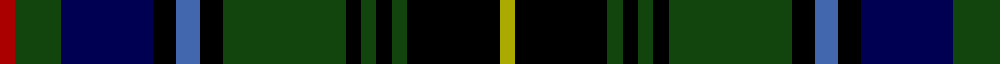

**Bands:** [RGBKBKGKGKGKY](/stripes/rgbkbkgkgkgky/) · **Stripes:** [R DG DB K B K DG K DG K DG K LY](/stripes/stripes13/) R DG DB K B K DG K DG K DG K LY

This was sourced from weddslist.  It is a [13 band tartan](/bands/bands13/).

Original link http://www.weddslist.com/cgi-bin/tartans/pg.pl?source=x

## Register references

External register numbers recorded for this tartan.

- Scottish Register of Tartans: [2540](https://www.tartanregister.gov.uk/tartanDetails.aspx?ref=2540)
- Scottish Register of Tartans: [2625](https://www.tartanregister.gov.uk/tartanDetails.aspx?ref=2625)
- Scottish Register of Tartans: [3555](https://www.tartanregister.gov.uk/tartanDetails.aspx?ref=3555)
- Scottish Tartans Authority (ITI): 1429
- Scottish Tartans Authority (ITI): 218
- Scottish Tartans World Register: 1429
- Scottish Tartans World Register: 218
- Scottish Tartans World Register: 864

## Variants

Other setts woven to the same stripe pattern.

- [MacInnes](/setts/s13/ly2k12dg2k2dg2k2dg16k3b3k3db12dg6r2~x2/)

## Thread count
DR/2 DG6 DB12 K3 B3 K3 DG16 K2 DG2 K2 DG2 K12 LG/2

## Palette
Each colour and its ΔE from the base-6 reference it is a variant of.

| Colour | Shade | Base | ΔE (OKLab) |
|---|---|---|---|
| B | <code style="background-color:#4367AE;">#4367AE</code> `#4367AE` | B <code style="background-color:#2A418A;">#2A418A</code> | 0.12 |
| DB | <code style="background-color:#000052;">#000052</code> `#000052` | B <code style="background-color:#2A418A;">#2A418A</code> | 0.20 |
| DG | <code style="background-color:#11450D;">#11450D</code> `#11450D` | G <code style="background-color:#006100;">#006100</code> | 0.09 |
| DR | <code style="background-color:#AA0000;">#AA0000</code> `#AA0000` | R <code style="background-color:#CC0000;">#CC0000</code> | 0.07 |
| K | <code style="background-color:#000000;">#000000</code> `#000000` | K <code style="background-color:#000000;">#000000</code> | 0.00 |
| LG | <code style="background-color:#AAAA00;">#AAAA00</code> `#AAAA00` | Y <code style="background-color:#F2BF00;">#F2BF00</code> | 0.13 |

## Nearest tartans

The nearest existing variants by ΔTartan distance.

1. [MacInnes](/setts/s13/ly2k12dg2k2dg2k2dg16k3b3k3db12dg6r2~x2/) — ΔT 0.00
1. [MacInnes](/setts/s13/ly2k12dg2k2dg2k2dg16k3lb3k3db12dg6r2/) — ΔT 0.87
1. [Malcolm](/setts/s14/db1r1db6k6dg6k1ly1k1lb1k1dg6k6db6r1/) — ΔT 0.89
1. [Malcolm (a)](/setts/s14/db1r1db6k6dg6k1ly1k1b1k1dg6k6db6r1~x2/) — ΔT 0.91
1. [Malcolm](/setts/s14/db1r1db6k6dg6k1ly1k1b1k1dg6k6db6r1/) — ΔT 0.91
1. [MacNicol Hunting](/setts/s17/db10k1dg1k1dg1k1db10r3k10r3dg10k1ly1k1lr1k1dg10~x2/) — ΔT 0.97
1. [MacNicol Hunting](/setts/s17/db10k1dg1k1dg1k1db10r3k10r3dg10k1ly1k1lr1k1dg10/) — ΔT 0.97
1. [MacNicol Hunting](/setts/s17/db10k1dg1k1dg1k1db10r3k10r3dg10k1ly1k1lb1k1dg10/) — ΔT 1.05
1. [Farquharson](/setts/s14/r2db4k1db1k1db1k8dg8ly2dg8k8db8k1r2~x2/) — ΔT 1.07
1. [Thormanby Buccaneer Bay](/setts/s16/dg17k2dg2k2dg2k15db15r7db15k15dg2k2dg2k2dg17lo2~x2/) — ΔT 1.07

## Neighbour map

Every grey dot is one of 14313 variants placed by the first two principal components of the ΔTartan feature space (44% of its variance). Red is this tartan; blue dots are its nearest — click one to open its page.

<svg viewBox="0 0 640 380" role="img" style="max-width:100%;height:auto;border:1px solid #e0e0e0;border-radius:4px;display:block" xmlns="http://www.w3.org/2000/svg"><image href="/nn/cloud.v1.png" width="640" height="380"/><a href="/setts/s13/ly2k12dg2k2dg2k2dg16k3b3k3db12dg6r2~x2/"><circle cx="149.3" cy="163.6" r="4" fill="#3465a4"><title>MacInnes</title></circle></a><a href="/setts/s13/ly2k12dg2k2dg2k2dg16k3lb3k3db12dg6r2/"><circle cx="124.5" cy="150.4" r="4" fill="#3465a4"><title>MacInnes</title></circle></a><a href="/setts/s14/db1r1db6k6dg6k1ly1k1lb1k1dg6k6db6r1/"><circle cx="96.7" cy="174.3" r="4" fill="#3465a4"><title>Malcolm</title></circle></a><a href="/setts/s14/db1r1db6k6dg6k1ly1k1b1k1dg6k6db6r1~x2/"><circle cx="113.9" cy="183.8" r="4" fill="#3465a4"><title>Malcolm (a)</title></circle></a><a href="/setts/s14/db1r1db6k6dg6k1ly1k1b1k1dg6k6db6r1/"><circle cx="113.9" cy="183.8" r="4" fill="#3465a4"><title>Malcolm</title></circle></a><a href="/setts/s17/db10k1dg1k1dg1k1db10r3k10r3dg10k1ly1k1lr1k1dg10~x2/"><circle cx="138.3" cy="134.7" r="4" fill="#3465a4"><title>MacNicol Hunting</title></circle></a><a href="/setts/s17/db10k1dg1k1dg1k1db10r3k10r3dg10k1ly1k1lr1k1dg10/"><circle cx="138.3" cy="134.7" r="4" fill="#3465a4"><title>MacNicol Hunting</title></circle></a><a href="/setts/s17/db10k1dg1k1dg1k1db10r3k10r3dg10k1ly1k1lb1k1dg10/"><circle cx="123.2" cy="126.5" r="4" fill="#3465a4"><title>MacNicol Hunting</title></circle></a><a href="/setts/s14/r2db4k1db1k1db1k8dg8ly2dg8k8db8k1r2~x2/"><circle cx="136.0" cy="183.5" r="4" fill="#3465a4"><title>Farquharson</title></circle></a><a href="/setts/s16/dg17k2dg2k2dg2k15db15r7db15k15dg2k2dg2k2dg17lo2~x2/"><circle cx="153.4" cy="168.3" r="4" fill="#3465a4"><title>Thormanby Buccaneer Bay</title></circle></a><circle cx="149.3" cy="163.6" r="5" fill="#c00000"/></svg>

ID: /setts/s13/ly2k12dg2k2dg2k2dg16k3b3k3db12dg6r2/
