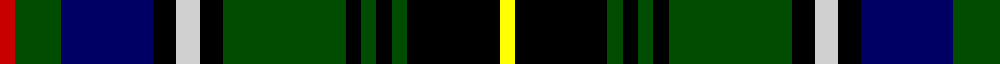

**Bands:** [RGBKWKGKGKGKY](/stripes/rgbkwkgkgkgky/) · **Stripes:** [R DG DB K LB K DG K DG K DG K LY](/stripes/stripes13/) R DG DB K LB K DG K DG K DG K LY

This was sourced from weddslist.  It is a [13 band tartan](/bands/bands13/).

Original link http://www.weddslist.com/cgi-bin/tartans/pg.pl?source=rb

## Register references

External register numbers recorded for this tartan.

- Scottish Register of Tartans: [2540](https://www.tartanregister.gov.uk/tartanDetails.aspx?ref=2540)
- Scottish Register of Tartans: [2666](https://www.tartanregister.gov.uk/tartanDetails.aspx?ref=2666)
- Scottish Register of Tartans: [3808](https://www.tartanregister.gov.uk/tartanDetails.aspx?ref=3808)
- Scottish Tartans Authority (ITI): 218
- Scottish Tartans World Register: 1010
- Scottish Tartans World Register: 1585
- Scottish Tartans World Register: 218

## Thread count
R/2 G6 DB12 K3 N3 K3 G16 K2 G2 K2 G2 K12 Y/2

## Palette
Each colour and its ΔE from the base-6 reference it is a variant of.

| Colour | Shade | Base | ΔE (OKLab) |
|---|---|---|---|
| DB | <code style="background-color:#000064;">#000064</code> `#000064` | B <code style="background-color:#2A418A;">#2A418A</code> | 0.18 |
| G | <code style="background-color:#004C00;">#004C00</code> `#004C00` | G <code style="background-color:#006100;">#006100</code> | 0.07 |
| K | <code style="background-color:#000000;">#000000</code> `#000000` | K <code style="background-color:#000000;">#000000</code> | 0.00 |
| N | <code style="background-color:#D0D0D0;">#D0D0D0</code> `#D0D0D0` | W <code style="background-color:#F7F7F7;">#F7F7F7</code> | 0.12 |
| R | <code style="background-color:#C80000;">#C80000</code> `#C80000` | R <code style="background-color:#CC0000;">#CC0000</code> | 0.01 |
| Y | <code style="background-color:#FFFF00;">#FFFF00</code> `#FFFF00` | Y <code style="background-color:#F2BF00;">#F2BF00</code> | 0.16 |

## Nearest tartans

The nearest existing variants by ΔTartan distance.

1. [Elgin - Landshut](/setts/s14/r1k6g1k1g1k1g6k1b1k1k3k3g3w1~x8/) — ΔT 0.70
1. [MacInnes](/setts/s13/ly2k12g2k2g2k2g16k3t3k3db12g6r2~x2/) — ΔT 0.78
1. [Malcolm](/setts/s14/k1ly1k1g6k6db6r1db1r1db6k6g6k1t1~x4/) — ΔT 0.86
1. [MacInnes](/setts/s13/ly2k12dg2k2dg2k2dg16k3b3k3db12dg6r2~x2/) — ΔT 0.87
1. [MacInnes](/setts/s13/ly2k12dg2k2dg2k2dg16k3b3k3db12dg6r2/) — ΔT 0.87
1. [Veere](/setts/s12/t4k3t2db6k15ly2g16db4t2db2k8w4~x2/) — ΔT 0.90
1. [Urquhart](/setts/s14/g1k1g8k8db8r1db8k8g1k1g1k1g3w1~x2/) — ΔT 0.96
1. [Malcolm](/setts/s15/db2g1db6k6g6k1ly1k1t1k1g6k6db6r1db2~x4/) — ΔT 1.00
1. [Cornish Hunting](/setts/s12/k26ly2dg24db8k4r3k4db8dg24ly2k26w5~x2/) — ΔT 1.01
1. [Stephenson, hunting](/setts/s15/g5k3db25k25g25k3w3k6w3k3g25k25db25k3r5~x2/) — ΔT 1.01

## Neighbour map

Every grey dot is one of 14313 variants placed by the first two principal components of the ΔTartan feature space (44% of its variance). Red is this tartan; blue dots are its nearest — click one to open its page.

<svg viewBox="0 0 640 380" role="img" style="max-width:100%;height:auto;border:1px solid #e0e0e0;border-radius:4px;display:block" xmlns="http://www.w3.org/2000/svg"><image href="/nn/cloud.v1.png" width="640" height="380"/><a href="/setts/s14/r1k6g1k1g1k1g6k1b1k1k3k3g3w1~x8/"><circle cx="87.7" cy="160.7" r="4" fill="#3465a4"><title>Elgin - Landshut</title></circle></a><a href="/setts/s13/ly2k12g2k2g2k2g16k3t3k3db12g6r2~x2/"><circle cx="117.1" cy="144.9" r="4" fill="#3465a4"><title>MacInnes</title></circle></a><a href="/setts/s14/k1ly1k1g6k6db6r1db1r1db6k6g6k1t1~x4/"><circle cx="80.8" cy="162.8" r="4" fill="#3465a4"><title>Malcolm</title></circle></a><a href="/setts/s13/ly2k12dg2k2dg2k2dg16k3b3k3db12dg6r2~x2/"><circle cx="149.3" cy="163.6" r="4" fill="#3465a4"><title>MacInnes</title></circle></a><a href="/setts/s13/ly2k12dg2k2dg2k2dg16k3b3k3db12dg6r2/"><circle cx="149.3" cy="163.6" r="4" fill="#3465a4"><title>MacInnes</title></circle></a><a href="/setts/s12/t4k3t2db6k15ly2g16db4t2db2k8w4~x2/"><circle cx="88.5" cy="148.3" r="4" fill="#3465a4"><title>Veere</title></circle></a><a href="/setts/s14/g1k1g8k8db8r1db8k8g1k1g1k1g3w1~x2/"><circle cx="140.1" cy="161.6" r="4" fill="#3465a4"><title>Urquhart</title></circle></a><a href="/setts/s15/db2g1db6k6g6k1ly1k1t1k1g6k6db6r1db2~x4/"><circle cx="83.0" cy="165.0" r="4" fill="#3465a4"><title>Malcolm</title></circle></a><a href="/setts/s12/k26ly2dg24db8k4r3k4db8dg24ly2k26w5~x2/"><circle cx="178.2" cy="144.7" r="4" fill="#3465a4"><title>Cornish Hunting</title></circle></a><a href="/setts/s15/g5k3db25k25g25k3w3k6w3k3g25k25db25k3r5~x2/"><circle cx="127.2" cy="158.8" r="4" fill="#3465a4"><title>Stephenson, hunting</title></circle></a><circle cx="124.5" cy="150.4" r="5" fill="#c00000"/></svg>

ID: /setts/s13/ly2k12dg2k2dg2k2dg16k3lb3k3db12dg6r2/
