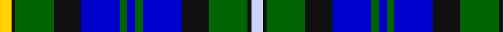

In pattern [WKGKBGBGBKGKY](/stripes/wkgkbgbgbkgky/).

This was sourced from register-of-tartans.  It is a [13 stripe tartan](/stripes/stripes13/).

Original link https://www.tartanregister.gov.uk/tartanDetails.aspx?ref=10806

## Register references

External register numbers recorded for this tartan.

- Scottish Register of Tartans: [10806](https://www.tartanregister.gov.uk/tartanDetails.aspx?ref=10806)

## Thread count
Y/6 K2 G20 K14 B20 G4 B4 G4 B20 K14 G20 K2 LN/6

## Palette
Each colour and its ΔE from the base-6 reference it is a variant of.

| Colour | Shade | Base | ΔE (OKLab) |
|---|---|---|---|
| B | <code style="background-color:#0000CD;">#0000CD</code> `#0000CD` | B <code style="background-color:#2A418A;">#2A418A</code> | 0.14 |
| G | <code style="background-color:#006400;">#006400</code> `#006400` | G <code style="background-color:#006100;">#006100</code> | 0.01 |
| K | <code style="background-color:#101010;">#101010</code> `#101010` | K <code style="background-color:#000000;">#000000</code> | 0.17 |
| LN | <code style="background-color:#C8D3FA;">#C8D3FA</code> `#C8D3FA` | W <code style="background-color:#F7F7F7;">#F7F7F7</code> | 0.12 |
| Y | <code style="background-color:#FFD200;">#FFD200</code> `#FFD200` | Y <code style="background-color:#F2BF00;">#F2BF00</code> | 0.05 |

## Nearest tartans

The nearest existing variants by ΔTartan distance.

1. [Scottish Women's Rural Institutes](/setts/s12/db6t2db20k15g20ly2g6t2g20k15db20ly4~x2/) — ΔT 1.12
1. [Biskup (Personal)](/setts/s10/db12r4db18r2k19g18r4g3lo2g8~x2/) — ΔT 1.13
1. [Dyce](/setts/s14/b9k1b1k1b1k8g8ly1k1ly1g8k8b8w1~x4/) — ΔT 1.15
1. [Spar (UK) Ltd](/setts/s12/g9k9b10k1b2k2b10k9g9w1g2r1~x4/) — ΔT 1.15
1. [Doon Valley Crafters (Corporate)](/setts/s13/ly3k1g10k7db10g2db2g2db10k7g10k1lg3~x2/) — ΔT 1.16
1. [Logan Rogers Hunting](/setts/s13/db11k1db1w1db1k8g8ly1g8k8db8w1db1~x2/) — ΔT 1.17
1. [Glengoyne Distillery Corporate Tartan Tartan Number: 1144. Earliest known date: 1993 Designed for the Glengoyne Distillery by Lochcarron of Scotland in 1993. See products available Copyright © Blair Urquhart, Comrie, 2015](/setts/s15/db11k3db3k3db3k9g9k1ly3k1g9k9db9k1w3~x2/) — ΔT 1.18
1. [Auchinachie](/setts/s12/k2db12k8lg10w1lg10k4r1k4db12k2g2~x2/) — ΔT 1.19
1. [Bowlers (Commemorative)](/setts/s11/w4db20g5k6g2w3g2k6g13dp8g2~x2/) — ΔT 1.19
1. [MacLeod of Skye (Johnston)](/setts/s14/b9k1b1k1b1k7g8k1ly2k1g8k7b8r2~x4/) — ΔT 1.19

## Neighbour map

Every grey dot is one of 14299 variants placed by the first two principal components of the ΔTartan feature space (44% of its variance). Red is this tartan; blue dots are its nearest — click one to open its page.

<svg viewBox="0 0 640 380" role="img" style="max-width:100%;height:auto;border:1px solid #e0e0e0;border-radius:4px;display:block" xmlns="http://www.w3.org/2000/svg"><image href="/nn/cloud.v1.png" width="640" height="380"/><a href="/setts/s12/db6t2db20k15g20ly2g6t2g20k15db20ly4~x2/"><circle cx="118.6" cy="176.4" r="4" fill="#3465a4"><title>Scottish Women's Rural Institutes</title></circle></a><a href="/setts/s10/db12r4db18r2k19g18r4g3lo2g8~x2/"><circle cx="117.8" cy="183.2" r="4" fill="#3465a4"><title>Biskup (Personal)</title></circle></a><a href="/setts/s14/b9k1b1k1b1k8g8ly1k1ly1g8k8b8w1~x4/"><circle cx="138.5" cy="164.6" r="4" fill="#3465a4"><title>Dyce</title></circle></a><a href="/setts/s12/g9k9b10k1b2k2b10k9g9w1g2r1~x4/"><circle cx="150.3" cy="186.6" r="4" fill="#3465a4"><title>Spar (UK) Ltd</title></circle></a><a href="/setts/s13/ly3k1g10k7db10g2db2g2db10k7g10k1lg3~x2/"><circle cx="142.3" cy="184.5" r="4" fill="#3465a4"><title>Doon Valley Crafters (Corporate)</title></circle></a><a href="/setts/s13/db11k1db1w1db1k8g8ly1g8k8db8w1db1~x2/"><circle cx="159.8" cy="160.4" r="4" fill="#3465a4"><title>Logan Rogers Hunting</title></circle></a><a href="/setts/s15/db11k3db3k3db3k9g9k1ly3k1g9k9db9k1w3~x2/"><circle cx="142.3" cy="174.5" r="4" fill="#3465a4"><title>Glengoyne Distillery Corporate Tartan Tartan Number: 1144. Earliest known date: 1993 Designed for the Glengoyne Distillery by Lochcarron of Scotland in 1993. See products available Copyright © Blair Urquhart, Comrie, 2015</title></circle></a><a href="/setts/s12/k2db12k8lg10w1lg10k4r1k4db12k2g2~x2/"><circle cx="110.1" cy="142.8" r="4" fill="#3465a4"><title>Auchinachie</title></circle></a><a href="/setts/s11/w4db20g5k6g2w3g2k6g13dp8g2~x2/"><circle cx="115.4" cy="163.5" r="4" fill="#3465a4"><title>Bowlers (Commemorative)</title></circle></a><a href="/setts/s14/b9k1b1k1b1k7g8k1ly2k1g8k7b8r2~x4/"><circle cx="135.8" cy="171.1" r="4" fill="#3465a4"><title>MacLeod of Skye (Johnston)</title></circle></a><circle cx="116.0" cy="174.1" r="5" fill="#c00000"/></svg>

ID: /setts/s13/ly3k1g10k7db10g2db2g2db10k7g10k1lb3~x2/
