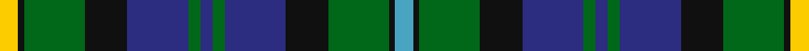

In pattern [YKGKBGBGBKGKY](/stripes/ykgkbgbgbkgky/).

This was sourced from tartans-authority.  It is a [13 stripe tartan](/stripes/stripes13/).

Original link http://www.tartansauthority.com/tartan-ferret/display/10806/

## Thread count
Y/6 K2 G20 K14 DB20 G4 DB4 G4 DB20 K14 G20 K2 B/6

## Palette
Each colour and the base-6 reference it is a variant of.

| Colour | Shade | Base |
|---|---|---|
| B | <code style="background-color:#48A4C0;">#48A4C0</code> `oklch(67.5% 0.096 221.0)` <small>#48A4C0</small> | Y <code style="background-color:#F2BF00;">#F2BF00</code> |
| DB | <code style="background-color:#2C2C80;">#2C2C80</code> `oklch(35.0% 0.138 276.6)` <small>#2C2C80</small> | B <code style="background-color:#2A418A;">#2A418A</code> |
| G | <code style="background-color:#006818;">#006818</code> `oklch(45.0% 0.142 145.0)` <small>#006818</small> | G <code style="background-color:#006100;">#006100</code> |
| K | <code style="background-color:#101010;">#101010</code> `oklch(17.3% 0.000 89.9)` <small>#101010</small> | K <code style="background-color:#000000;">#000000</code> |
| Y | <code style="background-color:#FCCC00;">#FCCC00</code> `oklch(86.2% 0.176 91.5)` <small>#FCCC00</small> | Y <code style="background-color:#F2BF00;">#F2BF00</code> |

## Nearest tartans

The nearest existing variants by ΔTartan distance.

1. [Spar (UK) Ltd](/setts/s12/g9k9b10k1b2k2b10k9g9w1g2r1~x4/) — ΔT 0.46
1. [MacLeod of Skye (Johnston)](/setts/s14/b9k1b1k1b1k7g8k1ly2k1g8k7b8r2~x4/) — ΔT 0.59
1. [Lloyd of Dolobran (Personal)](/setts/s12/k10g4w1g4k1g4r1g4k5db5k1db5~x4/) — ΔT 0.64
1. [Rose](/setts/s11/r2db10k10g10w1k4w1g10k10db10r1~x4/) — ΔT 0.66
1. [Glengoyne Distillery Corporate Tartan Tartan Number: 1144. Earliest known date: 1993 Designed for the Glengoyne Distillery by Lochcarron of Scotland in 1993. See products available Copyright © Blair Urquhart, Comrie, 2015](/setts/s15/db11k3db3k3db3k9g9k1ly3k1g9k9db9k1w3~x2/) — ΔT 0.69
1. [MacRae Hunting (Wilsons)](/setts/s15/g26k4g6m4g6k26db26k3w7k3db26k26g26k3m7~x2/) — ΔT 0.69
1. [Campbell of Loudoun Clan Tartan Tartan Number: 3. Earliest known date: 1886 The rarest of the Campbell tartans, Loudoun is nevertheless, acknowledged by the MacCailein Mor, Chief of the Clan Campbell. It is similar to the Campbell of Argyll except for a different arrangement of black 'tramlines' on the blue stripe. The tartan may have its origin in the formation of 'Loudouns Highlanders' raised at the time of the '45 and disbanded in 1748 though a similar claim is made for another sett. The weavers, Wilson's of Bannockburn, produced many variations of the Black Watch, for the Highland regiments, by adding coloured stripes to the basic pattern. The sett was not published until 1886 when James Grant included it in 'The Tartans of the Clans of Scotland' published by W and A.K. Johnston, Edinburgh. See products available Copyright © Blair Urquhart, Comrie, 2015](/setts/s13/w2k1g12k12db12k1db2k1db12k12g12k1ly2~x2/) — ΔT 0.72
1. [MacLeod](/setts/s13/ly4k1db12k12g12k1r4k1g12k12db12k1ly2~x4/) — ΔT 0.72
1. [Fruin Colquhoun](/setts/s12/k19w3g19r5g19w3k19db19k3db2k3db19~x2/) — ΔT 0.72
1. [Keith (District)](/setts/s13/b18r5b3r5b3k20g18ly4g18k20b20k6b6/) — ΔT 0.74

## Neighbour map

Every grey dot is one of 14299 variants placed by the first two principal components of the ΔTartan feature space (44% of its variance). Red is this tartan; blue dots are its nearest — click one to open its page.

<svg viewBox="0 0 640 380" role="img" style="max-width:100%;height:auto;border:1px solid #e0e0e0;border-radius:4px;display:block" xmlns="http://www.w3.org/2000/svg"><image href="/nn/cloud.v1.png" width="640" height="380"/><a href="/setts/s12/g9k9b10k1b2k2b10k9g9w1g2r1~x4/"><circle cx="150.3" cy="186.6" r="4" fill="#3465a4"><title>Spar (UK) Ltd</title></circle></a><a href="/setts/s14/b9k1b1k1b1k7g8k1ly2k1g8k7b8r2~x4/"><circle cx="135.8" cy="171.1" r="4" fill="#3465a4"><title>MacLeod of Skye (Johnston)</title></circle></a><a href="/setts/s12/k10g4w1g4k1g4r1g4k5db5k1db5~x4/"><circle cx="167.9" cy="196.9" r="4" fill="#3465a4"><title>Lloyd of Dolobran (Personal)</title></circle></a><a href="/setts/s11/r2db10k10g10w1k4w1g10k10db10r1~x4/"><circle cx="150.4" cy="198.0" r="4" fill="#3465a4"><title>Rose</title></circle></a><a href="/setts/s15/db11k3db3k3db3k9g9k1ly3k1g9k9db9k1w3~x2/"><circle cx="142.3" cy="174.5" r="4" fill="#3465a4"><title>Glengoyne Distillery Corporate Tartan Tartan Number: 1144. Earliest known date: 1993 Designed for the Glengoyne Distillery by Lochcarron of Scotland in 1993. See products available Copyright © Blair Urquhart, Comrie, 2015</title></circle></a><a href="/setts/s15/g26k4g6m4g6k26db26k3w7k3db26k26g26k3m7~x2/"><circle cx="134.2" cy="174.5" r="4" fill="#3465a4"><title>MacRae Hunting (Wilsons)</title></circle></a><a href="/setts/s13/w2k1g12k12db12k1db2k1db12k12g12k1ly2~x2/"><circle cx="168.9" cy="169.1" r="4" fill="#3465a4"><title>Campbell of Loudoun Clan Tartan Tartan Number: 3. Earliest known date: 1886 The rarest of the Campbell tartans, Loudoun is nevertheless, acknowledged by the MacCailein Mor, Chief of the Clan Campbell. It is similar to the Campbell of Argyll except for a different arrangement of black 'tramlines' on the blue stripe. The tartan may have its origin in the formation of 'Loudouns Highlanders' raised at the time of the '45 and disbanded in 1748 though a similar claim is made for another sett. The weavers, Wilson's of Bannockburn, produced many variations of the Black Watch, for the Highland regiments, by adding coloured stripes to the basic pattern. The sett was not published until 1886 when James Grant included it in 'The Tartans of the Clans of Scotland' published by W and A.K. Johnston, Edinburgh. See products available Copyright © Blair Urquhart, Comrie, 2015</title></circle></a><a href="/setts/s13/ly4k1db12k12g12k1r4k1g12k12db12k1ly2~x4/"><circle cx="136.6" cy="166.4" r="4" fill="#3465a4"><title>MacLeod</title></circle></a><a href="/setts/s12/k19w3g19r5g19w3k19db19k3db2k3db19~x2/"><circle cx="143.7" cy="190.1" r="4" fill="#3465a4"><title>Fruin Colquhoun</title></circle></a><a href="/setts/s13/b18r5b3r5b3k20g18ly4g18k20b20k6b6/"><circle cx="110.7" cy="198.0" r="4" fill="#3465a4"><title>Keith (District)</title></circle></a><circle cx="142.3" cy="184.5" r="5" fill="#c00000"/></svg>

ID: /setts/s13/ly3k1g10k7db10g2db2g2db10k7g10k1lg3~x2/
