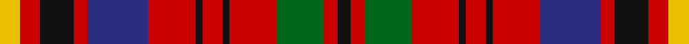

In pattern [KRGRKRKRBRKRY](/stripes/krgrkrkrbrkry/).

This was sourced from register-of-tartans.  It is a [13 stripe tartan](/stripes/stripes13/).

Original link https://www.tartanregister.gov.uk/tartanDetails.aspx?ref=4422

## Also known as

This cloth is also recorded under:

- Prince Charles Edward
- Prince Charles Plaid
- Prince Charles, Albany, Plaid

## Attestations

This cloth appears in 4 source records; the oldest owns this page.

- 01/01/1745 — Prince Charles Edward (Edinburgh) (register-of-tartans, [record](https://www.tartanregister.gov.uk/tartanDetails.aspx?ref=4422))
- 1746 — Albany (Artefact?) (tartans-authority, [record](http://www.tartansauthority.com/tartan-ferret/display/1170/))
- undated — Prince Charles, Albany, Plaid (weddslist, [record](http://www.weddslist.com/cgi-bin/tartans/pg.pl?source=sts))
- undated — Prince Charles Plaid Tartan Tartan Number: 1170. Earliest known date: 1893 'Old and Rare Scottish Tartans' (1893), contains a selection of forty five setts, woven in silk, of special interest or antiquity. Many of the illustrated tartans owe their present day popularity to the publication of this work. The author was D. W. Stewart. See products available Copyright © Blair Urquhart, Comrie, 2015 (house-of-tartan, [record](http://www.house-of-tartan.scotland.net/house/TartanViewjs.asp?colr=Def&tnam=1170))

## Register references

External register numbers recorded for this tartan.

- Scottish Register of Tartans: [4422](https://www.tartanregister.gov.uk/tartanDetails.aspx?ref=4422)
- Scottish Tartans Authority (ITI): 1170
- Scottish Tartans World Register: 1170

## Thread count
Y/6 R6 K10 R4 DB18 R14 K2 R6 K2 R14 G14 R4 K/4

## Palette
Each colour and the base-6 reference it is a variant of.

| Colour | Shade | Base |
|---|---|---|
| DB | <code style="background-color:#2C2C80;">#2C2C80</code> `oklch(35.0% 0.138 276.6)` <small>#2C2C80</small> | B <code style="background-color:#2A418A;">#2A418A</code> |
| G | <code style="background-color:#006818;">#006818</code> `oklch(45.0% 0.142 145.0)` <small>#006818</small> | G <code style="background-color:#006100;">#006100</code> |
| K | <code style="background-color:#101010;">#101010</code> `oklch(17.3% 0.000 89.9)` <small>#101010</small> | K <code style="background-color:#000000;">#000000</code> |
| R | <code style="background-color:#C80000;">#C80000</code> `oklch(52.3% 0.215 29.2)` <small>#C80000</small> | R <code style="background-color:#CC0000;">#CC0000</code> |
| Y | <code style="background-color:#E8C000;">#E8C000</code> `oklch(81.9% 0.168 93.7)` <small>#E8C000</small> | Y <code style="background-color:#F2BF00;">#F2BF00</code> |

## Nearest tartans

The nearest existing variants by ΔTartan distance.

1. [Unidentified Plaid #4](/setts/s13/ly18r18dg30r12db55r42dg6r18dg6r42dg44r12dg12/) — ΔT 0.31
1. [Unidentified Plaid 16](/setts/s13/ly18r18dg30r12db55r42dg6r18dg6r42g44r12dg12/) — ΔT 0.72
1. [Nicolson/MacNicol](/setts/s13/db2r11dg2r11dg21r2k9t2db11r11dg2r11db2~x2/) — ΔT 0.73
1. [Nicolson](/setts/s13/db2r11g2r11g21r2k9t2db11r11g2r11db2~x2/) — ΔT 0.84
1. [Caledonia](/setts/s14/r21t9k2t2k2t9k18ly3g21r13k3r13w2r13~x2/) — ΔT 1.08
1. [MacKinnon #3](/setts/s14/dp3r4dg3db3r7dg17r3db5dg4r21dg7dp3r6w3~x2/) — ΔT 1.12
1. [Highland Spring (1985)](/setts/s12/r16k2r9g12lo2g10b3k2b3k2b3r10~x2/) — ΔT 1.13
1. [Sturrock (Blue/Black)](/setts/s12/r52b16k16g22r16lo3r16~x2/) — ΔT 1.16
1. [MacKinnon #5](/setts/s14/k4r3dg2db2r6dg15r2db4dg2r15dg7k2r4w2~x2/) — ΔT 1.17
1. [MacPherson #8](/setts/s15/r14dg3r14dg13ly2k14db6k2db2k2db6r9w2k2r2~x2/) — ΔT 1.22

## Neighbour map

Every grey dot is one of 14299 variants placed by the first two principal components of the ΔTartan feature space (44% of its variance). Red is this tartan; blue dots are its nearest — click one to open its page.

<svg viewBox="0 0 640 380" role="img" style="max-width:100%;height:auto;border:1px solid #e0e0e0;border-radius:4px;display:block" xmlns="http://www.w3.org/2000/svg"><image href="/nn/cloud.v1.png" width="640" height="380"/><a href="/setts/s13/ly18r18dg30r12db55r42dg6r18dg6r42dg44r12dg12/"><circle cx="172.7" cy="166.7" r="4" fill="#3465a4"><title>Unidentified Plaid #4</title></circle></a><a href="/setts/s13/ly18r18dg30r12db55r42dg6r18dg6r42g44r12dg12/"><circle cx="177.7" cy="172.2" r="4" fill="#3465a4"><title>Unidentified Plaid 16</title></circle></a><a href="/setts/s13/db2r11dg2r11dg21r2k9t2db11r11dg2r11db2~x2/"><circle cx="215.3" cy="156.7" r="4" fill="#3465a4"><title>Nicolson/MacNicol</title></circle></a><a href="/setts/s13/db2r11g2r11g21r2k9t2db11r11g2r11db2~x2/"><circle cx="201.0" cy="153.1" r="4" fill="#3465a4"><title>Nicolson</title></circle></a><a href="/setts/s14/r21t9k2t2k2t9k18ly3g21r13k3r13w2r13~x2/"><circle cx="165.8" cy="133.1" r="4" fill="#3465a4"><title>Caledonia</title></circle></a><a href="/setts/s14/dp3r4dg3db3r7dg17r3db5dg4r21dg7dp3r6w3~x2/"><circle cx="206.9" cy="158.7" r="4" fill="#3465a4"><title>MacKinnon #3</title></circle></a><a href="/setts/s12/r16k2r9g12lo2g10b3k2b3k2b3r10~x2/"><circle cx="194.3" cy="163.3" r="4" fill="#3465a4"><title>Highland Spring (1985)</title></circle></a><a href="/setts/s12/r52b16k16g22r16lo3r16~x2/"><circle cx="213.8" cy="153.1" r="4" fill="#3465a4"><title>Sturrock (Blue/Black)</title></circle></a><a href="/setts/s14/k4r3dg2db2r6dg15r2db4dg2r15dg7k2r4w2~x2/"><circle cx="192.6" cy="155.8" r="4" fill="#3465a4"><title>MacKinnon #5</title></circle></a><a href="/setts/s15/r14dg3r14dg13ly2k14db6k2db2k2db6r9w2k2r2~x2/"><circle cx="133.3" cy="139.4" r="4" fill="#3465a4"><title>MacPherson #8</title></circle></a><circle cx="172.3" cy="168.1" r="5" fill="#c00000"/></svg>

ID: /setts/s13/ly3r3k5r2db9r7k1r3k1r7g7r2k2~x2/
