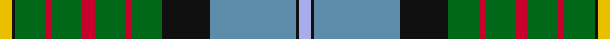

In pattern [WKBKGRGRGRGKY](/stripes/wkbkgrgrgrgky/).

This was sourced from register-of-tartans.  It is a [13 stripe tartan](/stripes/stripes13/).

Original link https://www.tartanregister.gov.uk/tartanDetails.aspx?ref=482

## Attestations

This cloth appears in 2 source records; the oldest owns this page.

- 01/09/1997 — California State (register-of-tartans, [record](https://www.tartanregister.gov.uk/tartanDetails.aspx?ref=482))
- 1998 — California State (District) (tartans-authority, [record](http://www.tartansauthority.com/tartan-ferret/display/2454/))

## Register references

External register numbers recorded for this tartan.

- Scottish Register of Tartans: [482](https://www.tartanregister.gov.uk/tartanDetails.aspx?ref=482)
- Scottish Tartans Authority (ITI): 2454
- Scottish Tartans World Register: 2454

## Thread count
Y/8 K2 G20 R4 G20 R8 G20 R4 G20 K32 B56 K2 LP/8

## Palette
Each colour and the base-6 reference it is a variant of.

| Colour | Shade | Base |
|---|---|---|
| B | <code style="background-color:#5C8CA8;">#5C8CA8</code> `oklch(61.7% 0.067 235.0)` <small>#5C8CA8</small> | B <code style="background-color:#2A418A;">#2A418A</code> |
| G | <code style="background-color:#006818;">#006818</code> `oklch(45.0% 0.142 145.0)` <small>#006818</small> | G <code style="background-color:#006100;">#006100</code> |
| K | <code style="background-color:#101010;">#101010</code> `oklch(17.3% 0.000 89.9)` <small>#101010</small> | K <code style="background-color:#000000;">#000000</code> |
| LP | <code style="background-color:#A8ACE8;">#A8ACE8</code> `oklch(76.3% 0.086 281.2)` <small>#A8ACE8</small> | W <code style="background-color:#F7F7F7;">#F7F7F7</code> |
| R | <code style="background-color:#C8002C;">#C8002C</code> `oklch(52.6% 0.212 22.0)` <small>#C8002C</small> | R <code style="background-color:#CC0000;">#CC0000</code> |
| Y | <code style="background-color:#E8C000;">#E8C000</code> `oklch(81.9% 0.168 93.7)` <small>#E8C000</small> | Y <code style="background-color:#F2BF00;">#F2BF00</code> |

## Nearest tartans

The nearest existing variants by ΔTartan distance.

1. [California State American District Tartan Tartan Number: 2454. Earliest known date: 1998 Designed by J.Howard Standing of Tarzana, California and Thomas Ferguson of Sydney, British Columbia. Adopted as the 'official' California State tartan by the State Legislature. For general use by all those living in the State. Based on Muir, after the famous botanist and environmentalist John Muir who lived in California. Assembly Bill 2362, february 20th 1998. See products available Copyright © Blair Urquhart, Comrie, 2015](/setts/s13/lo4k1g10r2g10r4g10r2g10k16t28k1lb4~x2/) — ΔT 0.24
1. [California](/setts/s13/b4k1db28k16g10r2g10r4g10r2g10k1ly4~x2/) — ΔT 0.96
1. [Currie](/setts/s11/db16w3db1ly4g24r1g3r4g3r1t8~x2/) — ΔT 0.96
1. [Stirling University #2](/setts/s14/g22r3w1g2r3t16k3ly2~x4/) — ΔT 0.96
1. [Tait #2](/setts/s12/w4k1r2k1g9k2b24k2r6k2g12ly2~x2/) — ΔT 0.98
1. [Birch Family Tartan Tartan Number: 2157. Earliest known date: 1993 The Birch family tartan was designed and produced by Mr Robin Birch of Connell Reid kiltmaker, Blairgowrie. The new sett has been recorded by the Scottish Tartans Society. See products available Copyright © Blair Urquhart, Comrie, 2015](/setts/s9/g3dp4g23k10r2k10t18k1w3~x2/) — ΔT 1.04
1. [Fermanagh County Crest (Fashion)](/setts/s10/r4w6k10db5k3lo16k3g33k1w4~x2/) — ΔT 1.11
1. [Baron of Greencastle (Personal)](/setts/s13/g4ly2g24r2k12db3k2db2k2db12w1db1w3~x2/) — ΔT 1.17
1. [Brehat (Personal)](/setts/s11/g30dp4r6w6db6dp3k14w14db50g50w2/) — ΔT 1.18
1. [Groen (Personal)](/setts/s11/n12r2n3r4n15k24dg18ly1k3dg3w3~x2/) — ΔT 1.18

## Neighbour map

Every grey dot is one of 14299 variants placed by the first two principal components of the ΔTartan feature space (44% of its variance). Red is this tartan; blue dots are its nearest — click one to open its page.

<svg viewBox="0 0 640 380" role="img" style="max-width:100%;height:auto;border:1px solid #e0e0e0;border-radius:4px;display:block" xmlns="http://www.w3.org/2000/svg"><image href="/nn/cloud.v1.png" width="640" height="380"/><a href="/setts/s13/lo4k1g10r2g10r4g10r2g10k16t28k1lb4~x2/"><circle cx="187.7" cy="107.4" r="4" fill="#3465a4"><title>California State American District Tartan Tartan Number: 2454. Earliest known date: 1998 Designed by J.Howard Standing of Tarzana, California and Thomas Ferguson of Sydney, British Columbia. Adopted as the 'official' California State tartan by the State Legislature. For general use by all those living in the State. Based on Muir, after the famous botanist and environmentalist John Muir who lived in California. Assembly Bill 2362, february 20th 1998. See products available Copyright © Blair Urquhart, Comrie, 2015</title></circle></a><a href="/setts/s13/b4k1db28k16g10r2g10r4g10r2g10k1ly4~x2/"><circle cx="163.0" cy="96.8" r="4" fill="#3465a4"><title>California</title></circle></a><a href="/setts/s11/db16w3db1ly4g24r1g3r4g3r1t8~x2/"><circle cx="217.5" cy="104.0" r="4" fill="#3465a4"><title>Currie</title></circle></a><a href="/setts/s14/g22r3w1g2r3t16k3ly2~x4/"><circle cx="204.7" cy="93.4" r="4" fill="#3465a4"><title>Stirling University #2</title></circle></a><a href="/setts/s12/w4k1r2k1g9k2b24k2r6k2g12ly2~x2/"><circle cx="167.8" cy="90.6" r="4" fill="#3465a4"><title>Tait #2</title></circle></a><a href="/setts/s9/g3dp4g23k10r2k10t18k1w3~x2/"><circle cx="160.9" cy="128.5" r="4" fill="#3465a4"><title>Birch Family Tartan Tartan Number: 2157. Earliest known date: 1993 The Birch family tartan was designed and produced by Mr Robin Birch of Connell Reid kiltmaker, Blairgowrie. The new sett has been recorded by the Scottish Tartans Society. See products available Copyright © Blair Urquhart, Comrie, 2015</title></circle></a><a href="/setts/s10/r4w6k10db5k3lo16k3g33k1w4~x2/"><circle cx="176.0" cy="86.9" r="4" fill="#3465a4"><title>Fermanagh County Crest (Fashion)</title></circle></a><a href="/setts/s13/g4ly2g24r2k12db3k2db2k2db12w1db1w3~x2/"><circle cx="193.7" cy="92.2" r="4" fill="#3465a4"><title>Baron of Greencastle (Personal)</title></circle></a><a href="/setts/s11/g30dp4r6w6db6dp3k14w14db50g50w2/"><circle cx="193.3" cy="99.4" r="4" fill="#3465a4"><title>Brehat (Personal)</title></circle></a><a href="/setts/s11/n12r2n3r4n15k24dg18ly1k3dg3w3~x2/"><circle cx="176.1" cy="120.9" r="4" fill="#3465a4"><title>Groen (Personal)</title></circle></a><circle cx="181.4" cy="103.3" r="5" fill="#c00000"/></svg>

ID: /setts/s13/ly4k1g10r2g10r4g10r2g10k16t28k1lb4~x2/
