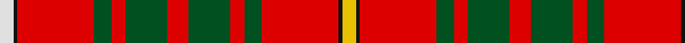

**Bands:** [WKRGRGRGRGRKY](/stripes/wkrgrgrgrgrky/) · **Stripes:** [W K R DG R DG R DG R DG R K LY](/stripes/stripes13/) W K R DG R DG R DG R DG R K LY

This was sourced from register-of-tartans.  It is a [13 band tartan](/bands/bands13/).

Original link https://www.tartanregister.gov.uk/tartanDetails.aspx?ref=398

## Register references

External register numbers recorded for this tartan.

- Scottish Register of Tartans: [398](https://www.tartanregister.gov.uk/tartanDetails.aspx?ref=398)
- Scottish Tartans World Register: 1821

## Thread count
LN/8 K2 R44 G10 R8 G24 R12 G24 R8 G10 R44 K2 Y/8

## Palette
Each colour and its ΔE from the base-6 reference it is a variant of.

| Colour | Shade | Base | ΔE (OKLab) |
|---|---|---|---|
| G | <code style="background-color:#005020;">#005020</code> `#005020` | G <code style="background-color:#006100;">#006100</code> | 0.07 |
| K | <code style="background-color:#101010;">#101010</code> `#101010` | K <code style="background-color:#000000;">#000000</code> | 0.17 |
| LN | <code style="background-color:#E0E0E0;">#E0E0E0</code> `#E0E0E0` | W <code style="background-color:#F7F7F7;">#F7F7F7</code> | 0.07 |
| R | <code style="background-color:#DC0000;">#DC0000</code> `#DC0000` | R <code style="background-color:#CC0000;">#CC0000</code> | 0.03 |
| Y | <code style="background-color:#E8C000;">#E8C000</code> `#E8C000` | Y <code style="background-color:#F2BF00;">#F2BF00</code> | 0.02 |

## Nearest tartans

The nearest existing variants by ΔTartan distance.

1. [Bruce](/setts/s13/ly4k1r22g5r4g12r6g12r4g5r22k1w4~x2/) — ΔT 0.66
1. [Confrerie de Vouvray](/setts/s17/dt8r4ly18r4r19ly4r19dt6r4g1r4g1r4g1r4g1r4~x2/) — ΔT 1.01
1. [Hoben (Personal)](/setts/s11/k3w1r20db4r4g10r4db4r20k1w3~x2/) — ΔT 1.10
1. [MacLeod and MacNicol](/setts/s12/r8dg1r8dg16r4k2t1k4r8dg1r8k1~x2/) — ΔT 1.11
1. [Justerini & Brooks](/setts/s9/r48ly14r9g14k6r11g6r10g3~x2/) — ΔT 1.17
1. [Loch Creran (District)](/setts/s11/r6dg8ly2dg8r6dt8r29dg3lb2r5dt3~x2/) — ΔT 1.20
1. [Unidentified Plaid #7](/setts/s10/w8r100k42dg42r5k3r5t42r100w8/) — ΔT 1.23
1. [Cumming/Comyn](/setts/s10/r4dg8w1dg8r4dg4r2dg4r24k2~x2/) — ΔT 1.23
1. [MacLeod, and MacNicol](/setts/s12/r8g1r8g16r4k2t1k4r8g1r8k1~x2/) — ΔT 1.25
1. [MacDougal 3](/setts/s11/r4g8k6r8r6g2r2g2r24g1r3~x2/) — ΔT 1.28

## Neighbour map

Every grey dot is one of 14313 variants placed by the first two principal components of the ΔTartan feature space (44% of its variance). Red is this tartan; blue dots are its nearest — click one to open its page.

<svg viewBox="0 0 640 380" role="img" style="max-width:100%;height:auto;border:1px solid #e0e0e0;border-radius:4px;display:block" xmlns="http://www.w3.org/2000/svg"><image href="/nn/cloud.v1.png" width="640" height="380"/><a href="/setts/s13/ly4k1r22g5r4g12r6g12r4g5r22k1w4~x2/"><circle cx="319.0" cy="119.7" r="4" fill="#3465a4"><title>Bruce</title></circle></a><a href="/setts/s17/dt8r4ly18r4r19ly4r19dt6r4g1r4g1r4g1r4g1r4~x2/"><circle cx="278.9" cy="101.3" r="4" fill="#3465a4"><title>Confrerie de Vouvray</title></circle></a><a href="/setts/s11/k3w1r20db4r4g10r4db4r20k1w3~x2/"><circle cx="361.9" cy="116.0" r="4" fill="#3465a4"><title>Hoben (Personal)</title></circle></a><a href="/setts/s12/r8dg1r8dg16r4k2t1k4r8dg1r8k1~x2/"><circle cx="333.8" cy="152.0" r="4" fill="#3465a4"><title>MacLeod and MacNicol</title></circle></a><a href="/setts/s9/r48ly14r9g14k6r11g6r10g3~x2/"><circle cx="356.3" cy="138.2" r="4" fill="#3465a4"><title>Justerini &amp; Brooks</title></circle></a><a href="/setts/s11/r6dg8ly2dg8r6dt8r29dg3lb2r5dt3~x2/"><circle cx="317.6" cy="136.1" r="4" fill="#3465a4"><title>Loch Creran (District)</title></circle></a><a href="/setts/s10/w8r100k42dg42r5k3r5t42r100w8/"><circle cx="338.0" cy="96.6" r="4" fill="#3465a4"><title>Unidentified Plaid #7</title></circle></a><a href="/setts/s10/r4dg8w1dg8r4dg4r2dg4r24k2~x2/"><circle cx="372.0" cy="134.0" r="4" fill="#3465a4"><title>Cumming/Comyn</title></circle></a><a href="/setts/s12/r8g1r8g16r4k2t1k4r8g1r8k1~x2/"><circle cx="317.0" cy="148.5" r="4" fill="#3465a4"><title>MacLeod, and MacNicol</title></circle></a><a href="/setts/s11/r4g8k6r8r6g2r2g2r24g1r3~x2/"><circle cx="360.0" cy="127.5" r="4" fill="#3465a4"><title>MacDougal 3</title></circle></a><circle cx="319.9" cy="116.0" r="5" fill="#c00000"/></svg>

ID: /setts/s13/ly4k1r22dg5r4dg12r6dg12r4dg5r22k1w4~x2/
