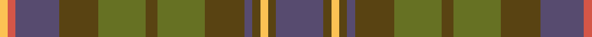

**Bands:** [BGYGBGGGGGBRY](/stripes/bgygbgggggbry/) · **Stripes:** [N DY LY DY N DY Y DY Y DY N R LY](/stripes/stripes13/) N DY LY DY N DY Y DY Y DY N R LY

This was sourced from register-of-tartans.  It is a [13 band tartan](/bands/bands13/).

Original link https://www.tartanregister.gov.uk/tartanDetails.aspx?ref=10032

## Register references

External register numbers recorded for this tartan.

- Scottish Register of Tartans: [10032](https://www.tartanregister.gov.uk/tartanDetails.aspx?ref=10032)

## Thread count
LG/4 DO4 N22 T20 G24 T6 G24 T20 N4 T4 LG4 T4 N/24

## Palette
Each colour and its ΔE from the base-6 reference it is a variant of.

| Colour | Shade | Base | ΔE (OKLab) |
|---|---|---|---|
| DO | <code style="background-color:#D45647;">#D45647</code> `#D45647` | R <code style="background-color:#CC0000;">#CC0000</code> | 0.10 |
| G | <code style="background-color:#667123;">#667123</code> `#667123` | G <code style="background-color:#006100;">#006100</code> | 0.12 |
| LG | <code style="background-color:#FCC254;">#FCC254</code> `#FCC254` | Y <code style="background-color:#F2BF00;">#F2BF00</code> | 0.04 |
| N | <code style="background-color:#574B6F;">#574B6F</code> `#574B6F` | B <code style="background-color:#2A418A;">#2A418A</code> | 0.09 |
| T | <code style="background-color:#594312;">#594312</code> `#594312` | G <code style="background-color:#006100;">#006100</code> | 0.13 |

## Nearest tartans

The nearest existing variants by ΔTartan distance.

1. [Limerick, County](/setts/s11/do6lo4do3dt2do5dt2do3dt2y14r3dt2~x2/) — ΔT 0.79
1. [Maple Leaf (District)](/setts/s12/r15g3r3g19dy6y6o6g19r3g3r15y13~x2/) — ΔT 0.86
1. [Roscommon Irish County Tartan Tartan Number: 2246. Earliest known date: 1996 One of a series of Irish District tartans designed by Polly Wittering of the House of Edgar, with colours reminiscent of the Country with soft warm colours dominating. See products available Copyright © Blair Urquhart, Comrie, 2015](/setts/s10/o5lo3o19do6lo5do6dg12n5dg12n3~x2/) — ΔT 1.17
1. [Hash House Harriers Hunting (Corp)](/setts/s13/g7dy1lb1dy1lo1dy7n7dy1n7dy7g7dy1r1~x4/) — ΔT 1.18
1. [Lander (2013)](/setts/s15/lo18do3lo3do3lo3do16y16r2ly2r2y16do16lo17do3lo3~x2/) — ΔT 1.23
1. [McCulloch, Grant (Personal)](/setts/s13/n6db1n1db1n3lr2r1lr2y3db1y1db1y6~x4/) — ΔT 1.23
1. [Kerry, County](/setts/s15/lo2dt3dy3dt4y16dt3dy3dt4y3dt3dy16dt4y3dt3lo2~x2/) — ΔT 1.39
1. [Meath Irish County Tartan Tartan Number: 2269. Earliest known date: 1996 One of a series of Irish District tartans designed by Polly Wittering of the House of Edgar, with colours reminiscent of the Country with soft warm colours dominating. See products available Copyright © Blair Urquhart, Comrie, 2015](/setts/s12/lo5n2o14dy9dg8n3o3n3o3n3dg19ly3~x2/) — ΔT 1.42
1. [Lakin (Personal)](/setts/s12/r5lr1r1lr1r1n5o6r1o6n5lr5r1~x4/) — ΔT 1.47
1. [Lawrence's Seven Pillars of Khaki](/setts/s9/g3t12g10t6g8g6g8o23r3~x2/) — ΔT 1.49

## Neighbour map

Every grey dot is one of 14313 variants placed by the first two principal components of the ΔTartan feature space (44% of its variance). Red is this tartan; blue dots are its nearest — click one to open its page.

<svg viewBox="0 0 640 380" role="img" style="max-width:100%;height:auto;border:1px solid #e0e0e0;border-radius:4px;display:block" xmlns="http://www.w3.org/2000/svg"><image href="/nn/cloud.v1.png" width="640" height="380"/><a href="/setts/s11/do6lo4do3dt2do5dt2do3dt2y14r3dt2~x2/"><circle cx="224.6" cy="228.0" r="4" fill="#3465a4"><title>Limerick, County</title></circle></a><a href="/setts/s12/r15g3r3g19dy6y6o6g19r3g3r15y13~x2/"><circle cx="228.5" cy="238.1" r="4" fill="#3465a4"><title>Maple Leaf (District)</title></circle></a><a href="/setts/s10/o5lo3o19do6lo5do6dg12n5dg12n3~x2/"><circle cx="166.9" cy="233.6" r="4" fill="#3465a4"><title>Roscommon Irish County Tartan Tartan Number: 2246. Earliest known date: 1996 One of a series of Irish District tartans designed by Polly Wittering of the House of Edgar, with colours reminiscent of the Country with soft warm colours dominating. See products available Copyright © Blair Urquhart, Comrie, 2015</title></circle></a><a href="/setts/s13/g7dy1lb1dy1lo1dy7n7dy1n7dy7g7dy1r1~x4/"><circle cx="217.9" cy="213.7" r="4" fill="#3465a4"><title>Hash House Harriers Hunting (Corp)</title></circle></a><a href="/setts/s15/lo18do3lo3do3lo3do16y16r2ly2r2y16do16lo17do3lo3~x2/"><circle cx="222.4" cy="189.6" r="4" fill="#3465a4"><title>Lander (2013)</title></circle></a><a href="/setts/s13/n6db1n1db1n3lr2r1lr2y3db1y1db1y6~x4/"><circle cx="192.2" cy="218.7" r="4" fill="#3465a4"><title>McCulloch, Grant (Personal)</title></circle></a><a href="/setts/s15/lo2dt3dy3dt4y16dt3dy3dt4y3dt3dy16dt4y3dt3lo2~x2/"><circle cx="249.6" cy="221.0" r="4" fill="#3465a4"><title>Kerry, County</title></circle></a><a href="/setts/s12/lo5n2o14dy9dg8n3o3n3o3n3dg19ly3~x2/"><circle cx="211.3" cy="193.9" r="4" fill="#3465a4"><title>Meath Irish County Tartan Tartan Number: 2269. Earliest known date: 1996 One of a series of Irish District tartans designed by Polly Wittering of the House of Edgar, with colours reminiscent of the Country with soft warm colours dominating. See products available Copyright © Blair Urquhart, Comrie, 2015</title></circle></a><a href="/setts/s12/r5lr1r1lr1r1n5o6r1o6n5lr5r1~x4/"><circle cx="156.5" cy="215.2" r="4" fill="#3465a4"><title>Lakin (Personal)</title></circle></a><a href="/setts/s9/g3t12g10t6g8g6g8o23r3~x2/"><circle cx="198.5" cy="236.4" r="4" fill="#3465a4"><title>Lawrence's Seven Pillars of Khaki</title></circle></a><circle cx="200.8" cy="231.6" r="5" fill="#c00000"/></svg>

ID: /setts/s13/n12dy2ly2dy2n2dy10y12dy3y12dy10n11r2ly2~x2/
