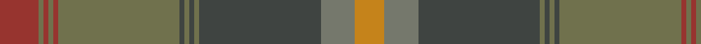

This page is one **sett** — a single exact thread-count. It belongs to the [tartan](/tartans/dr8g1dr1g1dr1g25n1g1n1g1n25na7do6/)
(the same proportion at any scale), whose colour order is pattern [RGRGRGBGBGBGY](/stripes/rgrgrgbgbgbgy/).

Sourced from register-of-tartans.  It is a [13 stripe tartan](/stripes/stripes13/).

Original link https://www.tartanregister.gov.uk/tartanDetails.aspx?ref=10457

## Register references

External register numbers recorded for this tartan.

- Scottish Register of Tartans: [10457](https://www.tartanregister.gov.uk/tartanDetails.aspx?ref=10457)

## Thread count
DR/16 G2 DR2 G2 DR2 G50 N2 G2 N2 G2 N50 Na14 DO/12

## Palette
Each colour and the base-6 reference it is a variant of.

| Colour | Shade | Base |
|---|---|---|
| DO | <code style="background-color:#C5831B;">#C5831B</code> `oklch(66.2% 0.134 71.7)` <small>#C5831B</small> | Y <code style="background-color:#F2BF00;">#F2BF00</code> |
| DR | <code style="background-color:#97342F;">#97342F</code> `oklch(46.8% 0.134 26.5)` <small>#97342F</small> | R <code style="background-color:#CC0000;">#CC0000</code> |
| G | <code style="background-color:#70714D;">#70714D</code> `oklch(53.8% 0.053 109.4)` <small>#70714D</small> | G <code style="background-color:#006100;">#006100</code> |
| N | <code style="background-color:#3F4441;">#3F4441</code> `oklch(38.1% 0.008 159.7)` <small>#3F4441</small> | B <code style="background-color:#2A418A;">#2A418A</code> |
| Na | <code style="background-color:#75786C;">#75786C</code> `oklch(56.6% 0.018 118.4)` <small>#75786C</small> | G <code style="background-color:#006100;">#006100</code> |

## Nearest tartans

The nearest existing variants by ΔTartan distance, with this tartan at the top so the swatches line up against it.

ΔTartan

Tartan

Sett

—

<a href="/ttd/edit/#slug=o8y1o1y1o1y25dt1y1dt1y1dt25y7lo6~x2">Johansson (Aneby, Sweden), Christian (Personal)</a> <a class="nn-out" href="/setts/s13/o8y1o1y1o1y25dt1y1dt1y1dt25y7lo6~x2/" title="open its dictionary page">↗</a>

0.47

<a href="/ttd/edit/#slug=r8y1r1y1r1y25n1y1n1y1n25o7lo6~x2">Johansson (Personal)</a> <a class="nn-out" href="/setts/s13/r8y1r1y1r1y25n1y1n1y1n25o7lo6~x2/" title="open its dictionary page">↗</a>

1.82

<a href="/setts/s12/y23o4dy6g6y4lb1y4~x4/">Tricor</a>

1.95

<a href="/ttd/edit/#slug=r3k1y8ly1dy7ly1y19y25k1~x2">Broons, The (DC Thomson)</a> <a class="nn-out" href="/setts/s9/r3k1y8ly1dy7ly1y19y25k1~x2/" title="open its dictionary page">↗</a>

1.99

<a href="/ttd/edit/#slug=r3k1y8lo1dy7lo1y19dy25k1~x2">The Broons (Corporate)</a> <a class="nn-out" href="/setts/s9/r3k1y8lo1dy7lo1y19dy25k1~x2/" title="open its dictionary page">↗</a>

1.99

<a href="/ttd/edit/#slug=dt5t2dt11y2dt2y6o17o9dt1o1~x2">Clarks No.1</a> <a class="nn-out" href="/setts/s10/dt5t2dt11y2dt2y6o17o9dt1o1~x2/" title="open its dictionary page">↗</a>

2.01

<a href="/ttd/edit/#slug=lb2dg2n1dg30n10n20dg1n2lo1~x2">Scottish Borderland (Fashion)</a> <a class="nn-out" href="/setts/s9/lb2dg2n1dg30n10n20dg1n2lo1~x2/" title="open its dictionary page">↗</a>

2.02

<a href="/ttd/edit/#slug=dg3r15dg2r2dg2r2dg18do2dg2do2dg2do27k2do2k6lo2~x2">Strathmore</a> <a class="nn-out" href="/setts/s16/dg3r15dg2r2dg2r2dg18do2dg2do2dg2do27k2do2k6lo2~x2/" title="open its dictionary page">↗</a>

2.02

<a href="/ttd/edit/#slug=dy36k3o6k3do10o5do3lo4k1dy2~x2">Mead (Tennessee) Hunting (Personal)</a> <a class="nn-out" href="/setts/s10/dy36k3o6k3do10o5do3lo4k1dy2~x2/" title="open its dictionary page">↗</a>

2.02

<a href="/ttd/edit/#slug=dg27r2dg3r3n3lo2n14r2n3lo3n3r2n14~x2">Crowne Plaza (Corporate)</a> <a class="nn-out" href="/setts/s13/dg27r2dg3r3n3lo2n14r2n3lo3n3r2n14~x2/" title="open its dictionary page">↗</a>

2.07

<a href="/ttd/edit/#slug=dg3r15dg2r2dg2r2dg18do2dg2do2dg2do27k2do2k6k2~x2">Strathmore District Tartan Tartan Number: 10118. Earliest known date: 20/11/2009 The name 'Strathmore' means the big valley and its fertile lands have made this area lying between the Grampians to the North and the Sidlaws to the South one the wealthiest farming areas in Scotland. The tartan is thus influenced by the brown and black of the rich soil, the green of the pastures, the red for the abundance of soft fruit grown and the gold to represent its prosperity. See products available Copyright © Blair Urquhart, Comrie, 2015</a> <a class="nn-out" href="/setts/s16/dg3r15dg2r2dg2r2dg18do2dg2do2dg2do27k2do2k6k2~x2/" title="open its dictionary page">↗</a>

## Neighbour map

Every grey dot is one of 14299 variants placed by the first two principal components of the ΔTartan feature space (44% of its variance). Red is this tartan; blue dots are its nearest — click one to open its page.

<svg viewBox="0 0 640 380" role="img" style="max-width:100%;height:auto;border:1px solid #e0e0e0;border-radius:4px;display:block" xmlns="http://www.w3.org/2000/svg"><image href="/nn/cloud.v1.png" width="640" height="380"/><a href="/setts/s13/r8y1r1y1r1y25n1y1n1y1n25o7lo6~x2/"><circle cx="348.6" cy="157.8" r="4" fill="#3465a4"><title>Johansson (Personal)</title></circle></a><a href="/setts/s12/y23o4dy6g6y4lb1y4~x4/"><circle cx="385.0" cy="190.5" r="4" fill="#3465a4"><title>Tricor</title></circle></a><a href="/setts/s9/r3k1y8ly1dy7ly1y19y25k1~x2/"><circle cx="321.4" cy="153.7" r="4" fill="#3465a4"><title>Broons, The (DC Thomson)</title></circle></a><a href="/setts/s9/r3k1y8lo1dy7lo1y19dy25k1~x2/"><circle cx="375.5" cy="185.5" r="4" fill="#3465a4"><title>The Broons (Corporate)</title></circle></a><a href="/setts/s10/dt5t2dt11y2dt2y6o17o9dt1o1~x2/"><circle cx="259.7" cy="186.8" r="4" fill="#3465a4"><title>Clarks No.1</title></circle></a><a href="/setts/s9/lb2dg2n1dg30n10n20dg1n2lo1~x2/"><circle cx="414.8" cy="184.8" r="4" fill="#3465a4"><title>Scottish Borderland (Fashion)</title></circle></a><a href="/setts/s16/dg3r15dg2r2dg2r2dg18do2dg2do2dg2do27k2do2k6lo2~x2/"><circle cx="277.5" cy="153.9" r="4" fill="#3465a4"><title>Strathmore</title></circle></a><a href="/setts/s10/dy36k3o6k3do10o5do3lo4k1dy2~x2/"><circle cx="413.0" cy="146.8" r="4" fill="#3465a4"><title>Mead (Tennessee) Hunting (Personal)</title></circle></a><a href="/setts/s13/dg27r2dg3r3n3lo2n14r2n3lo3n3r2n14~x2/"><circle cx="358.4" cy="197.5" r="4" fill="#3465a4"><title>Crowne Plaza (Corporate)</title></circle></a><a href="/setts/s16/dg3r15dg2r2dg2r2dg18do2dg2do2dg2do27k2do2k6k2~x2/"><circle cx="300.3" cy="166.9" r="4" fill="#3465a4"><title>Strathmore District Tartan Tartan Number: 10118. Earliest known date: 20/11/2009 The name 'Strathmore' means the big valley and its fertile lands have made this area lying between the Grampians to the North and the Sidlaws to the South one the wealthiest farming areas in Scotland. The tartan is thus influenced by the brown and black of the rich soil, the green of the pastures, the red for the abundance of soft fruit grown and the gold to represent its prosperity. See products available Copyright © Blair Urquhart, Comrie, 2015</title></circle></a><circle cx="340.4" cy="152.9" r="5" fill="#c00000"/></svg>

ID: /setts/s13/o8y1o1y1o1y25dt1y1dt1y1dt25y7lo6~x2/
