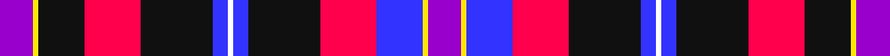

This page is one **sett** — a single exact thread-count. It belongs to the [tartan](/tartans/p13ly2k18r22k28b6w2b6k28r22b18ly2p13/)
(the same proportion at any scale), whose colour order is pattern [BYBRKBWBKRKYB](/stripes/bybrkbwbkrkyb/).

Sourced from register-of-tartans.  It is a [13 stripe tartan](/stripes/stripes13/).

Original link https://www.tartanregister.gov.uk/tartanDetails.aspx?ref=10683

## Also known as

This cloth is also recorded under:

- European Congress of Immunology

2 attestations — the source records this cloth was collapsed from (oldest owns this page)

<ul>
<li>08/08/2012 — European Congress of Immunology 2012 (register-of-tartans, <a href="https://www.tartanregister.gov.uk/tartanDetails.aspx?ref=10683">record</a>)</li>
<li>undated — European Congress of Immunology Corporate Tartan Tartan Number: 10683. Earliest known date: Created to commemorate the 3rd European Congress of Immunology, held in Glasgow in September 2012. The inspiration for this tartan comes from the City of Glasgow tartan, first woven in 1790 by Wilsons of Bannockburn. This modern interpretation incorporates the Congress colours of purple and lime green, and also features the white on blue of the Scottish Saltire. The width of the blue band is 12 threads to mark the year 2012. The colours of the tartan also embrace those of the EFIS (European Federation of Immunological Societies) and the BSI (British Society for Immunology). See products available Copyright © Blair Urquhart, Comrie, 2015 (house-of-tartan, <a href="http://www.house-of-tartan.scotland.net/house/TartanViewjs.asp?colr=Def&tnam=10683">record</a>)</li>
</ul>

## Register references

External register numbers recorded for this tartan.

- Scottish Register of Tartans: [10683](https://www.tartanregister.gov.uk/tartanDetails.aspx?ref=10683)

## Thread count
P/13 Y2 K18 R22 K28 B6 W2 B6 K28 R22 B18 Y2 P/13

## Palette

Palette: <strong>Tartan Register</strong> <small style="color:#888">(3 of 6 colours)</small>
<table><thead><tr><th>Colour</th><th>Threads</th><th>Shade</th><th>Base</th><th>OKLCh</th></tr></thead><tbody><tr><td>P/</td><td style="text-align:right;font-variant-numeric:tabular-nums">13</td><td><code style="background-color:#9900CC;">#9900CC</code> <small style="color:#888">#9900CC</small></td><td>B <code style="background-color:#2A418A;">#2A418A</code></td><td><small style="color:#888">oklch(51.6% 0.257 313.2)</small></td></tr><tr><td>Y</td><td style="text-align:right;font-variant-numeric:tabular-nums">2</td><td><code style="background-color:#FFE600;">#FFE600</code> <small style="color:#888">#FFE600</small></td><td>Y <code style="background-color:#F2BF00;">#F2BF00</code></td><td><small style="color:#888">oklch(91.7% 0.192 101.4)</small></td></tr><tr><td>K</td><td style="text-align:right;font-variant-numeric:tabular-nums">18</td><td><code style="background-color:#101010;">#101010</code> <small style="color:#888">#101010</small></td><td>K <code style="background-color:#000000;">#000000</code></td><td><small style="color:#888">oklch(17.3% 0.000 89.9)</small></td></tr><tr><td>R</td><td style="text-align:right;font-variant-numeric:tabular-nums">22</td><td><code style="background-color:#FF004D;">#FF004D</code> <small style="color:#888">#FF004D</small></td><td>R <code style="background-color:#CC0000;">#CC0000</code></td><td><small style="color:#888">oklch(63.4% 0.254 17.6)</small></td></tr><tr><td>K</td><td style="text-align:right;font-variant-numeric:tabular-nums">28</td><td><code style="background-color:#101010;">#101010</code> <small style="color:#888">#101010</small></td><td>K <code style="background-color:#000000;">#000000</code></td><td><small style="color:#888">oklch(17.3% 0.000 89.9)</small></td></tr><tr><td>B</td><td style="text-align:right;font-variant-numeric:tabular-nums">6</td><td><code style="background-color:#3333FF;">#3333FF</code> <small style="color:#888">#3333FF</small></td><td>B <code style="background-color:#2A418A;">#2A418A</code></td><td><small style="color:#888">oklch(49.7% 0.283 269.8)</small></td></tr><tr><td>W</td><td style="text-align:right;font-variant-numeric:tabular-nums">2</td><td><code style="background-color:#FFFFFF;">#FFFFFF</code> <small style="color:#888">#FFFFFF</small></td><td>W <code style="background-color:#F7F7F7;">#F7F7F7</code></td><td><small style="color:#888">oklch(100.0% 0.000 89.9)</small></td></tr><tr><td>B</td><td style="text-align:right;font-variant-numeric:tabular-nums">6</td><td><code style="background-color:#3333FF;">#3333FF</code> <small style="color:#888">#3333FF</small></td><td>B <code style="background-color:#2A418A;">#2A418A</code></td><td><small style="color:#888">oklch(49.7% 0.283 269.8)</small></td></tr><tr><td>K</td><td style="text-align:right;font-variant-numeric:tabular-nums">28</td><td><code style="background-color:#101010;">#101010</code> <small style="color:#888">#101010</small></td><td>K <code style="background-color:#000000;">#000000</code></td><td><small style="color:#888">oklch(17.3% 0.000 89.9)</small></td></tr><tr><td>R</td><td style="text-align:right;font-variant-numeric:tabular-nums">22</td><td><code style="background-color:#FF004D;">#FF004D</code> <small style="color:#888">#FF004D</small></td><td>R <code style="background-color:#CC0000;">#CC0000</code></td><td><small style="color:#888">oklch(63.4% 0.254 17.6)</small></td></tr><tr><td>B</td><td style="text-align:right;font-variant-numeric:tabular-nums">18</td><td><code style="background-color:#3333FF;">#3333FF</code> <small style="color:#888">#3333FF</small></td><td>B <code style="background-color:#2A418A;">#2A418A</code></td><td><small style="color:#888">oklch(49.7% 0.283 269.8)</small></td></tr><tr><td>Y</td><td style="text-align:right;font-variant-numeric:tabular-nums">2</td><td><code style="background-color:#FFE600;">#FFE600</code> <small style="color:#888">#FFE600</small></td><td>Y <code style="background-color:#F2BF00;">#F2BF00</code></td><td><small style="color:#888">oklch(91.7% 0.192 101.4)</small></td></tr><tr><td>P/</td><td style="text-align:right;font-variant-numeric:tabular-nums">13</td><td><code style="background-color:#9900CC;">#9900CC</code> <small style="color:#888">#9900CC</small></td><td>B <code style="background-color:#2A418A;">#2A418A</code></td><td><small style="color:#888">oklch(51.6% 0.257 313.2)</small></td></tr></tbody></table>

## Nearest tartans

The nearest existing variants by ΔTartan distance, with this tartan at the top so the swatches line up against it.

ΔTartan

Tartan

Sett

—

<a href="/ttd/edit/#slug=p13ly2k18r22k28b6w2b6k28r22b18ly2p13">European Congress of Immunology 2012</a> <a class="nn-out" href="/setts/s13/p13ly2k18r22k28b6w2b6k28r22b18ly2p13/" title="open its dictionary page">↗</a>

1.54

<a href="/ttd/edit/#slug=r9k4w6k4db21lo3db13k2w4k2r6~x2">Dauphinee (Personal)</a> <a class="nn-out" href="/setts/s11/r9k4w6k4db21lo3db13k2w4k2r6~x2/" title="open its dictionary page">↗</a>

1.58

<a href="/ttd/edit/#slug=db20b6k8ly2k4w4k4db13r7k4r4w2~x2">Stuart/Stewart Black</a> <a class="nn-out" href="/setts/s12/db20b6k8ly2k4w4k4db13r7k4r4w2~x2/" title="open its dictionary page">↗</a>

1.60

<a href="/ttd/edit/#slug=db9k16db9r7db4r9w2r2b2r9db4r7~x2">Tullis Russell</a> <a class="nn-out" href="/setts/s12/db9k16db9r7db4r9w2r2b2r9db4r7~x2/" title="open its dictionary page">↗</a>

1.66

<a href="/ttd/edit/#slug=r6db3p24w2k23y23k2y6~x2">Culloden, Grey</a> <a class="nn-out" href="/setts/s8/r6db3p24w2k23y23k2y6~x2/" title="open its dictionary page">↗</a>

1.70

<a href="/ttd/edit/#slug=db4ly3db22o6w2k6w2r6r20k3r4~x2">Asman Dress Family Tartan Tartan Number: 2552. Earliest known date: 1989 Designed for David I Asman by Dr. Philip D. Smith, 1989. David Asman was an English armiger and lived at one time in New jersey, USA. The tartan was first woven by Peter MacDonald in the weaving shed at the Scottish Tartan Society's Comrie museum in the 1989. See products available Copyright © Blair Urquhart, Comrie, 2015</a> <a class="nn-out" href="/setts/s11/db4ly3db22o6w2k6w2r6r20k3r4~x2/" title="open its dictionary page">↗</a>

1.73

<a href="/ttd/edit/#slug=db14t2w2t2db20k20r17w4r3w3r3w3r5~x2">American Bi-Centennial</a> <a class="nn-out" href="/setts/s13/db14t2w2t2db20k20r17w4r3w3r3w3r5~x2/" title="open its dictionary page">↗</a>

1.76

<a href="/ttd/edit/#slug=o6do1o2do2o1do4dp14k4db1k3ly1~x4">Wcwm 1873-4</a> <a class="nn-out" href="/setts/s11/o6do1o2do2o1do4dp14k4db1k3ly1~x4/" title="open its dictionary page">↗</a>

1.78

<a href="/ttd/edit/#slug=r4lb6k1r2k1lb14k3w3k2r2k2r2db4r2db6r2db6r2~x2">Royal Canadian Air Force (Military)</a> <a class="nn-out" href="/setts/s18/r4lb6k1r2k1lb14k3w3k2r2k2r2db4r2db6r2db6r2~x2/" title="open its dictionary page">↗</a>

1.79

<a href="/ttd/edit/#slug=k4db12lb3db4g8lo2r24db4r4~x2">MacCreary (Personal)</a> <a class="nn-out" href="/setts/s9/k4db12lb3db4g8lo2r24db4r4~x2/" title="open its dictionary page">↗</a>

1.81

<a href="/ttd/edit/#slug=w5db6r18k8b5k4db27w3~x2">Clinton (Personal)</a> <a class="nn-out" href="/setts/s8/w5db6r18k8b5k4db27w3~x2/" title="open its dictionary page">↗</a>

## Neighbour map

Every grey dot is one of 14359 variants placed by the first two principal components of the ΔTartan feature space (44% of its variance). Red is this tartan; blue dots are its nearest — click one to open its page.

<svg viewBox="0 0 640 380" role="img" style="max-width:100%;height:auto;border:1px solid #e0e0e0;border-radius:4px;display:block" xmlns="http://www.w3.org/2000/svg"><image href="/nn/cloud.v1.png" width="640" height="380"/><a href="/setts/s11/r9k4w6k4db21lo3db13k2w4k2r6~x2/"><circle cx="170.2" cy="149.7" r="4" fill="#3465a4"><title>Dauphinee (Personal)</title></circle></a><a href="/setts/s12/db20b6k8ly2k4w4k4db13r7k4r4w2~x2/"><circle cx="129.4" cy="146.8" r="4" fill="#3465a4"><title>Stuart/Stewart Black</title></circle></a><a href="/setts/s12/db9k16db9r7db4r9w2r2b2r9db4r7~x2/"><circle cx="157.6" cy="185.2" r="4" fill="#3465a4"><title>Tullis Russell</title></circle></a><a href="/setts/s8/r6db3p24w2k23y23k2y6~x2/"><circle cx="119.4" cy="142.1" r="4" fill="#3465a4"><title>Culloden, Grey</title></circle></a><a href="/setts/s11/db4ly3db22o6w2k6w2r6r20k3r4~x2/"><circle cx="152.7" cy="121.8" r="4" fill="#3465a4"><title>Asman Dress Family Tartan Tartan Number: 2552. Earliest known date: 1989 Designed for David I Asman by Dr. Philip D. Smith, 1989. David Asman was an English armiger and lived at one time in New jersey, USA. The tartan was first woven by Peter MacDonald in the weaving shed at the Scottish Tartan Society's Comrie museum in the 1989. See products available Copyright © Blair Urquhart, Comrie, 2015</title></circle></a><a href="/setts/s13/db14t2w2t2db20k20r17w4r3w3r3w3r5~x2/"><circle cx="133.4" cy="136.3" r="4" fill="#3465a4"><title>American Bi-Centennial</title></circle></a><a href="/setts/s11/o6do1o2do2o1do4dp14k4db1k3ly1~x4/"><circle cx="149.8" cy="118.8" r="4" fill="#3465a4"><title>Wcwm 1873-4</title></circle></a><a href="/setts/s18/r4lb6k1r2k1lb14k3w3k2r2k2r2db4r2db6r2db6r2~x2/"><circle cx="105.9" cy="111.1" r="4" fill="#3465a4"><title>Royal Canadian Air Force (Military)</title></circle></a><a href="/setts/s9/k4db12lb3db4g8lo2r24db4r4~x2/"><circle cx="182.0" cy="135.7" r="4" fill="#3465a4"><title>MacCreary (Personal)</title></circle></a><a href="/setts/s8/w5db6r18k8b5k4db27w3~x2/"><circle cx="172.2" cy="171.2" r="4" fill="#3465a4"><title>Clinton (Personal)</title></circle></a><circle cx="128.9" cy="128.0" r="5" fill="#c00000"/></svg>

ID: /setts/s13/p13ly2k18r22k28b6w2b6k28r22b18ly2p13/
