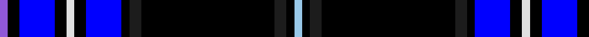

This page is one **sett** — a single exact thread-count. It belongs to the [tartan](/tartans/p2k3b9k3w2k3b9k2dt3k34dt3k2lb2/)
(the same proportion at any scale), whose colour order is pattern [BKBKWKBKBKBKW](/stripes/bkbkwkbkbkbkw/).

Sourced from register-of-tartans.  It is a [13 stripe tartan](/stripes/stripes13/).

Original link https://www.tartanregister.gov.uk/tartanDetails.aspx?ref=11438

## Register references

External register numbers recorded for this tartan.

- Scottish Register of Tartans: [11438](https://www.tartanregister.gov.uk/tartanDetails.aspx?ref=11438)

## Thread count
P/4 K6 B18 K6 LN4 K6 B18 K4 Ka6 K68 Ka6 K4 LB/4

## Palette

Palette: <strong>Tartan Register</strong>
<table><thead><tr><th>Colour</th><th>Threads</th><th>Shade</th><th>Base</th><th>OKLCh</th></tr></thead><tbody><tr><td>P/</td><td style="text-align:right;font-variant-numeric:tabular-nums">4</td><td><code style="background-color:#9058D8;">#9058D8</code> <small style="color:#888">#9058D8</small></td><td>B <code style="background-color:#2A418A;">#2A418A</code></td><td><small style="color:#888">oklch(58.4% 0.190 300.8)</small></td></tr><tr><td>K</td><td style="text-align:right;font-variant-numeric:tabular-nums">6</td><td><code style="background-color:#000000;">#000000</code> <small style="color:#888">#000000</small></td><td>K <code style="background-color:#000000;">#000000</code></td><td><small style="color:#888">oklch(0.0% 0.000 0.0)</small></td></tr><tr><td>B</td><td style="text-align:right;font-variant-numeric:tabular-nums">18</td><td><code style="background-color:#0000FF;">#0000FF</code> <small style="color:#888">#0000FF</small></td><td>B <code style="background-color:#2A418A;">#2A418A</code></td><td><small style="color:#888">oklch(45.2% 0.313 264.1)</small></td></tr><tr><td>K</td><td style="text-align:right;font-variant-numeric:tabular-nums">6</td><td><code style="background-color:#000000;">#000000</code> <small style="color:#888">#000000</small></td><td>K <code style="background-color:#000000;">#000000</code></td><td><small style="color:#888">oklch(0.0% 0.000 0.0)</small></td></tr><tr><td>LN</td><td style="text-align:right;font-variant-numeric:tabular-nums">4</td><td><code style="background-color:#E0E0E0;">#E0E0E0</code> <small style="color:#888">#E0E0E0</small></td><td>W <code style="background-color:#F7F7F7;">#F7F7F7</code></td><td><small style="color:#888">oklch(90.7% 0.000 89.9)</small></td></tr><tr><td>K</td><td style="text-align:right;font-variant-numeric:tabular-nums">6</td><td><code style="background-color:#000000;">#000000</code> <small style="color:#888">#000000</small></td><td>K <code style="background-color:#000000;">#000000</code></td><td><small style="color:#888">oklch(0.0% 0.000 0.0)</small></td></tr><tr><td>B</td><td style="text-align:right;font-variant-numeric:tabular-nums">18</td><td><code style="background-color:#0000FF;">#0000FF</code> <small style="color:#888">#0000FF</small></td><td>B <code style="background-color:#2A418A;">#2A418A</code></td><td><small style="color:#888">oklch(45.2% 0.313 264.1)</small></td></tr><tr><td>K</td><td style="text-align:right;font-variant-numeric:tabular-nums">4</td><td><code style="background-color:#000000;">#000000</code> <small style="color:#888">#000000</small></td><td>K <code style="background-color:#000000;">#000000</code></td><td><small style="color:#888">oklch(0.0% 0.000 0.0)</small></td></tr><tr><td>Ka</td><td style="text-align:right;font-variant-numeric:tabular-nums">6</td><td><code style="background-color:#1C1C1C;">#1C1C1C</code> <small style="color:#888">#1C1C1C</small></td><td>B <code style="background-color:#2A418A;">#2A418A</code></td><td><small style="color:#888">oklch(22.6% 0.000 89.9)</small></td></tr><tr><td>K</td><td style="text-align:right;font-variant-numeric:tabular-nums">68</td><td><code style="background-color:#000000;">#000000</code> <small style="color:#888">#000000</small></td><td>K <code style="background-color:#000000;">#000000</code></td><td><small style="color:#888">oklch(0.0% 0.000 0.0)</small></td></tr><tr><td>Ka</td><td style="text-align:right;font-variant-numeric:tabular-nums">6</td><td><code style="background-color:#1C1C1C;">#1C1C1C</code> <small style="color:#888">#1C1C1C</small></td><td>B <code style="background-color:#2A418A;">#2A418A</code></td><td><small style="color:#888">oklch(22.6% 0.000 89.9)</small></td></tr><tr><td>K</td><td style="text-align:right;font-variant-numeric:tabular-nums">4</td><td><code style="background-color:#000000;">#000000</code> <small style="color:#888">#000000</small></td><td>K <code style="background-color:#000000;">#000000</code></td><td><small style="color:#888">oklch(0.0% 0.000 0.0)</small></td></tr><tr><td>LB/</td><td style="text-align:right;font-variant-numeric:tabular-nums">4</td><td><code style="background-color:#98C8E8;">#98C8E8</code> <small style="color:#888">#98C8E8</small></td><td>W <code style="background-color:#F7F7F7;">#F7F7F7</code></td><td><small style="color:#888">oklch(81.0% 0.068 237.9)</small></td></tr></tbody></table>

## Nearest tartans

The nearest existing variants by ΔTartan distance, with this tartan at the top so the swatches line up against it.

ΔTartan

Tartan

Sett

—

<a href="/ttd/edit/#slug=p2k3b9k3w2k3b9k2dt3k34dt3k2lb2~x2">Hanson (2016)</a> <a class="nn-out" href="/setts/s13/p2k3b9k3w2k3b9k2dt3k34dt3k2lb2~x2/" title="open its dictionary page">↗</a>

1.58

<a href="/ttd/edit/#slug=db84r3k16ly4k4lb4k4dg20db8k4db8lb4">Wcwm 1105</a> <a class="nn-out" href="/setts/s12/db84r3k16ly4k4lb4k4dg20db8k4db8lb4/" title="open its dictionary page">↗</a>

1.64

<a href="/ttd/edit/#slug=w4k2w2k28dt4k2dt2r1k13r1dg13r2~x2">Niagara Region</a> <a class="nn-out" href="/setts/s12/w4k2w2k28dt4k2dt2r1k13r1dg13r2~x2/" title="open its dictionary page">↗</a>

1.67

<a href="/ttd/edit/#slug=db4k1lo2k1db3k1db2k2db2k4db2k2db2k1db3r1db4k19dp1k2dp3k4db4k1w2~x2">Arnold (California)</a> <a class="nn-out" href="/setts/s25/db4k1lo2k1db3k1db2k2db2k4db2k2db2k1db3r1db4k19dp1k2dp3k4db4k1w2~x2/" title="open its dictionary page">↗</a>

1.73

<a href="/setts/s10/k42dp4k16dg10ki2r6ki2dg10ki3w4~x2/">Mount Dora</a>

1.74

<a href="/ttd/edit/#slug=lr2db1t2db2k1t12db2k1k10db28t1db3t2db3w1~x2">Northfield Academy Corporate Tartan Tartan Number: 11490. Earliest known date: 2016, March Northfield is built on Freedom Lands gifted by Robert the Bruce to the Burgh of Aberdeen around 1313 and this Academy design is based on the complex 1782 Aberdeen tartan. The dark blue squares number 56 threads for the year 1956 when the Academy was opened; the maroon is from the original 1956 school badge; the predominantly dark blue and light blue colours represent the colours of the school tie in 2016; the four light blue lines around the white represent the four capacities of Scottish education's Curriculum for Excellence in the 21st century. Finally, the grey remembers the 19th century Cairncry Granite Quarry on part of which, Northfield Academy was built. See products available Copyright © Blair Urquhart, Comrie, 2015</a> <a class="nn-out" href="/setts/s15/lr2db1t2db2k1t12db2k1k10db28t1db3t2db3w1~x2/" title="open its dictionary page">↗</a>

1.75

<a href="/ttd/edit/#slug=r2k4w1k4db18g1db18k6db3ly1db2ly1db2ly2~x2">Wupper Pipes &amp; Drums (Corporate)</a> <a class="nn-out" href="/setts/s14/r2k4w1k4db18g1db18k6db3ly1db2ly1db2ly2~x2/" title="open its dictionary page">↗</a>

1.77

<a href="/setts/s11/ki42n2ki2n4y4ly2y6k9y2k2r2~x2/">Dama Weekend</a>

1.90

<a href="/setts/s10/r2m3ki16db4r2db4k36n3k3w2~x2/">Fitzgerald Hunting</a>

1.92

<a href="/ttd/edit/#slug=lo2dbi2w1db6w1ly2dbi17ly1~x2">East Tennessee State University</a> <a class="nn-out" href="/setts/s8/lo2dbi2w1db6w1ly2dbi17ly1~x2/" title="open its dictionary page">↗</a>

1.95

<a href="/ttd/edit/#slug=k4n8db54ly6db23n4k4r14k4n2db2k4db4">Blue Brough from Orkney</a> <a class="nn-out" href="/setts/s13/k4n8db54ly6db23n4k4r14k4n2db2k4db4/" title="open its dictionary page">↗</a>

## Neighbour map

Every grey dot is one of 14359 variants placed by the first two principal components of the ΔTartan feature space (44% of its variance). Red is this tartan; blue dots are its nearest — click one to open its page.

<svg viewBox="0 0 640 380" role="img" style="max-width:100%;height:auto;border:1px solid #e0e0e0;border-radius:4px;display:block" xmlns="http://www.w3.org/2000/svg"><image href="/nn/cloud.v1.png" width="640" height="380"/><a href="/setts/s12/db84r3k16ly4k4lb4k4dg20db8k4db8lb4/"><circle cx="343.1" cy="82.9" r="4" fill="#3465a4"><title>Wcwm 1105</title></circle></a><a href="/setts/s12/w4k2w2k28dt4k2dt2r1k13r1dg13r2~x2/"><circle cx="339.2" cy="111.2" r="4" fill="#3465a4"><title>Niagara Region</title></circle></a><a href="/setts/s25/db4k1lo2k1db3k1db2k2db2k4db2k2db2k1db3r1db4k19dp1k2dp3k4db4k1w2~x2/"><circle cx="252.8" cy="84.1" r="4" fill="#3465a4"><title>Arnold (California)</title></circle></a><a href="/setts/s10/k42dp4k16dg10ki2r6ki2dg10ki3w4~x2/"><circle cx="312.9" cy="127.4" r="4" fill="#3465a4"><title>Mount Dora</title></circle></a><a href="/setts/s15/lr2db1t2db2k1t12db2k1k10db28t1db3t2db3w1~x2/"><circle cx="308.7" cy="81.1" r="4" fill="#3465a4"><title>Northfield Academy Corporate Tartan Tartan Number: 11490. Earliest known date: 2016, March Northfield is built on Freedom Lands gifted by Robert the Bruce to the Burgh of Aberdeen around 1313 and this Academy design is based on the complex 1782 Aberdeen tartan. The dark blue squares number 56 threads for the year 1956 when the Academy was opened; the maroon is from the original 1956 school badge; the predominantly dark blue and light blue colours represent the colours of the school tie in 2016; the four light blue lines around the white represent the four capacities of Scottish education's Curriculum for Excellence in the 21st century. Finally, the grey remembers the 19th century Cairncry Granite Quarry on part of which, Northfield Academy was built. See products available Copyright © Blair Urquhart, Comrie, 2015</title></circle></a><a href="/setts/s14/r2k4w1k4db18g1db18k6db3ly1db2ly1db2ly2~x2/"><circle cx="360.6" cy="114.0" r="4" fill="#3465a4"><title>Wupper Pipes &amp; Drums (Corporate)</title></circle></a><a href="/setts/s11/ki42n2ki2n4y4ly2y6k9y2k2r2~x2/"><circle cx="319.9" cy="98.6" r="4" fill="#3465a4"><title>Dama Weekend</title></circle></a><a href="/setts/s10/r2m3ki16db4r2db4k36n3k3w2~x2/"><circle cx="248.4" cy="99.5" r="4" fill="#3465a4"><title>Fitzgerald Hunting</title></circle></a><a href="/setts/s8/lo2dbi2w1db6w1ly2dbi17ly1~x2/"><circle cx="301.2" cy="130.6" r="4" fill="#3465a4"><title>East Tennessee State University</title></circle></a><a href="/setts/s13/k4n8db54ly6db23n4k4r14k4n2db2k4db4/"><circle cx="347.9" cy="97.7" r="4" fill="#3465a4"><title>Blue Brough from Orkney</title></circle></a><circle cx="305.0" cy="99.4" r="5" fill="#c00000"/></svg>

ID: /setts/s13/p2k3b9k3w2k3b9k2dt3k34dt3k2lb2~x2/
