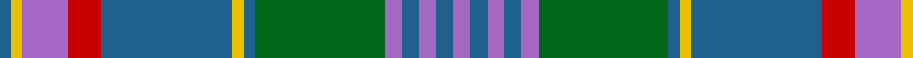

**Bands:** [BYBRBYBGBBBBB](/stripes/bybrbybgbbbbb/) · **Stripes:** [N LY P R N LY N G P N P N P](/stripes/stripes13/) N LY P R N LY N G P N P N P

This was sourced from house-of-tartan.  It is a [13 band tartan](/bands/bands13/).

Original link http://www.house-of-tartan.scotland.net/house/TartanViewjs.asp?colr=Def&tnam=6727

## Thread count
P/6 B6 P6 B6 P6 G46 B4 Y4 B46 R12 P16 Y4 B/4

## Palette
Each colour and its ΔE from the base-6 reference it is a variant of.

| Colour | Shade | Base | ΔE (OKLab) |
|---|---|---|---|
| B | <code style="background-color:#20608C;">#20608C</code> `#20608C` | B <code style="background-color:#2A418A;">#2A418A</code> | 0.09 |
| G | <code style="background-color:#006818;">#006818</code> `#006818` | G <code style="background-color:#006100;">#006100</code> | 0.02 |
| P | <code style="background-color:#A468C4;">#A468C4</code> `#A468C4` | B <code style="background-color:#2A418A;">#2A418A</code> | 0.24 |
| R | <code style="background-color:#C80000;">#C80000</code> `#C80000` | R <code style="background-color:#CC0000;">#CC0000</code> | 0.01 |
| Y | <code style="background-color:#E8C000;">#E8C000</code> `#E8C000` | Y <code style="background-color:#F2BF00;">#F2BF00</code> | 0.02 |

## Nearest tartans

The nearest existing variants by ΔTartan distance.

1. [Pitcairn Heritage Htg (Name)](/setts/s13/p3b3p3b3p3g22b2ly2b22r5p8ly2b2~x2/) — ΔT 0.63
1. [MacLellan of Gartbreck (Personal)](/setts/s12/o3r3o4r4o20k5n4k3o3k2n25w3~x2/) — ΔT 0.89
1. [Ellis (Welsh Name)](/setts/s12/k4t26k2t4k2t26k3dt36k3g30k3w2/) — ΔT 0.93
1. [Callum](/setts/s12/r3n16db2n2db2n3db6o20lr3o2lr2o3~x2/) — ΔT 0.99
1. [Callum, Scotch House](/setts/s12/o4w2o2w3o20db6t3db2t2db2t16r3~x2/) — ΔT 1.04
1. [Pride of Lorient](/setts/s17/r2lr8n1lr4n2lr3n3lr1n15dt1n4dt2n2dt4n1dt9w2~x2/) — ΔT 1.05
1. [Powys Welsh District Tartan Tartan Number: 5747. Earliest known date: 2002 Tartan the Welsh County of Powys in Mid Wales. Differing in warp and weft, the threads and colours create an unusual striped effect, designed and woven at the Cambrian Woollen Mill which has been in existence since c.1830. Woven for Wales Tartan Centres, Swansea. See products available Copyright © Blair Urquhart, Comrie, 2015](/setts/s12/dg24b7dg7b7dg7db22b7db4ly4db4b40r14/) — ΔT 1.05
1. [Hawaiian](/setts/s14/t4r1ly1t12do4y10ly1r3~x4/) — ΔT 1.07
1. [Callum Scotch House Trade Tartan Tartan Number: 1319. Earliest known date: pre 2003 Sett identical to Vestiarium Scoticum No 196 'Menzies' See products available Copyright © Blair Urquhart, Comrie, 2015](/setts/s12/dy4w2dy2w3dy20db6t3db2t2db2t16r3~x2/) — ΔT 1.14
1. [Stewart of Appin Hunting Clan Tartan Tartan Number: 430. Earliest known date: 1930-50 There is extensive correspondence about the use of the terms 'ancient' and 'hunting' in relation to this sett in the Stewart files at the Scottish Tartan Society. The use of brown makes this sett proportionately similar to the count recorded by James Scarlett as early nineteenth century. He says that the brown was probably black originally. (No. 417, The Highland Textile, 1990) See products available Copyright © Blair Urquhart, Comrie, 2015](/setts/s10/g11r4g4r7g41dy11t4db41r4db8/) — ΔT 1.15

## Neighbour map

Every grey dot is one of 14299 variants placed by the first two principal components of the ΔTartan feature space (44% of its variance). Red is this tartan; blue dots are its nearest — click one to open its page.

<svg viewBox="0 0 640 380" role="img" style="max-width:100%;height:auto;border:1px solid #e0e0e0;border-radius:4px;display:block" xmlns="http://www.w3.org/2000/svg"><image href="/nn/cloud.v1.png" width="640" height="380"/><a href="/setts/s13/p3b3p3b3p3g22b2ly2b22r5p8ly2b2~x2/"><circle cx="210.7" cy="149.1" r="4" fill="#3465a4"><title>Pitcairn Heritage Htg (Name)</title></circle></a><a href="/setts/s12/o3r3o4r4o20k5n4k3o3k2n25w3~x2/"><circle cx="222.7" cy="147.2" r="4" fill="#3465a4"><title>MacLellan of Gartbreck (Personal)</title></circle></a><a href="/setts/s12/k4t26k2t4k2t26k3dt36k3g30k3w2/"><circle cx="227.6" cy="143.2" r="4" fill="#3465a4"><title>Ellis (Welsh Name)</title></circle></a><a href="/setts/s12/r3n16db2n2db2n3db6o20lr3o2lr2o3~x2/"><circle cx="199.4" cy="147.9" r="4" fill="#3465a4"><title>Callum</title></circle></a><a href="/setts/s12/o4w2o2w3o20db6t3db2t2db2t16r3~x2/"><circle cx="197.4" cy="147.9" r="4" fill="#3465a4"><title>Callum, Scotch House</title></circle></a><a href="/setts/s17/r2lr8n1lr4n2lr3n3lr1n15dt1n4dt2n2dt4n1dt9w2~x2/"><circle cx="231.7" cy="140.3" r="4" fill="#3465a4"><title>Pride of Lorient</title></circle></a><a href="/setts/s12/dg24b7dg7b7dg7db22b7db4ly4db4b40r14/"><circle cx="201.5" cy="179.9" r="4" fill="#3465a4"><title>Powys Welsh District Tartan Tartan Number: 5747. Earliest known date: 2002 Tartan the Welsh County of Powys in Mid Wales. Differing in warp and weft, the threads and colours create an unusual striped effect, designed and woven at the Cambrian Woollen Mill which has been in existence since c.1830. Woven for Wales Tartan Centres, Swansea. See products available Copyright © Blair Urquhart, Comrie, 2015</title></circle></a><a href="/setts/s14/t4r1ly1t12do4y10ly1r3~x4/"><circle cx="238.8" cy="168.1" r="4" fill="#3465a4"><title>Hawaiian</title></circle></a><a href="/setts/s12/dy4w2dy2w3dy20db6t3db2t2db2t16r3~x2/"><circle cx="197.0" cy="147.4" r="4" fill="#3465a4"><title>Callum Scotch House Trade Tartan Tartan Number: 1319. Earliest known date: pre 2003 Sett identical to Vestiarium Scoticum No 196 'Menzies' See products available Copyright © Blair Urquhart, Comrie, 2015</title></circle></a><a href="/setts/s10/g11r4g4r7g41dy11t4db41r4db8/"><circle cx="238.5" cy="178.4" r="4" fill="#3465a4"><title>Stewart of Appin Hunting Clan Tartan Tartan Number: 430. Earliest known date: 1930-50 There is extensive correspondence about the use of the terms 'ancient' and 'hunting' in relation to this sett in the Stewart files at the Scottish Tartan Society. The use of brown makes this sett proportionately similar to the count recorded by James Scarlett as early nineteenth century. He says that the brown was probably black originally. (No. 417, The Highland Textile, 1990) See products available Copyright © Blair Urquhart, Comrie, 2015</title></circle></a><circle cx="219.2" cy="149.3" r="5" fill="#c00000"/></svg>

ID: /setts/s13/p3n3p3n3p3g23n2ly2n23r6p8ly2n2~x2/
