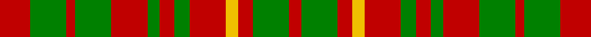

In pattern [RGRGRGRGRYRGR](/stripes/rgrgrgrgryrgr/).

This was sourced from weddslist.  It is a [13 stripe tartan](/stripes/stripes13/).

Original link http://www.weddslist.com/cgi-bin/tartans/pg.pl?source=sts

## Also known as

This cloth is also recorded under:

- MacRurie, MacRory

## Attestations

This cloth appears in 2 source records; the oldest owns this page.

- undated — MacRurie, MacRory (weddslist, [record](http://www.weddslist.com/cgi-bin/tartans/pg.pl?source=sts))
- undated — MacRurie MacRory Tartan Tartan Number: 1498. Earliest known date: pre 2003 This sample comes from the MacGregor-Hastie collection which forms the basis of the cloth archive of the Scottish Tartans Society. Some of the samples, including this one, were unmarked. One can assume that the sample dates between 1930 and 1950. See products available Copyright © Blair Urquhart, Comrie, 2015 (house-of-tartan, [record](http://www.house-of-tartan.scotland.net/house/TartanViewjs.asp?colr=Def&tnam=1498))

## Thread count
R/20 G24 R6 G24 R24 G8 R10 G10 R24 Y8 R10 G24 R/8

## Palette
Each colour and the base-6 reference it is a variant of.

| Colour | Shade | Base |
|---|---|---|
| G | <code style="background-color:#008000;">#008000</code> `oklch(52.0% 0.177 142.5)` <small>#008000</small> | G <code style="background-color:#006100;">#006100</code> |
| R | <code style="background-color:#C00000;">#C00000</code> `oklch(50.7% 0.208 29.2)` <small>#C00000</small> | R <code style="background-color:#CC0000;">#CC0000</code> |
| Y | <code style="background-color:#F0C000;">#F0C000</code> `oklch(82.7% 0.169 90.5)` <small>#F0C000</small> | Y <code style="background-color:#F2BF00;">#F2BF00</code> |

## Nearest tartans

The nearest existing variants by ΔTartan distance.

1. [MacRurie/MacRory](/setts/s13/r8g10r2g10r9g3r4g4r10ly3r3g10r3~x2/) — ΔT 0.57
1. [Grant of Monymusk](/setts/s13/r12g14r4g14r4g14r4db8r5db8r12g3r12~x2/) — ΔT 1.08
1. [Wilson's No.169](/setts/s16/r9g10w2g2ly2g10r9g5r9g10ly2g2w2g10r9g5~x2/) — ΔT 1.36
1. [MacIntosh, Ancient](/setts/s20/r5y1r2g4r3g2r2y5r5g1r1g2r1g1r1g4r1g1r1g2~x2/) — ΔT 1.55
1. [Dunbarton Warp/Weft](/setts/s11/lo8r2lo2k5lo2o2lo3o7lo3k2lo3~x2/) — ΔT 1.61
1. [MacIntosh Old Ancient Artifact Tartan Tartan Number: 966. Earliest known date: pre 2003 The name 'MacKintosh' is usually spelled with a 'K'. In this instance the tartan sample is labelled MacIntosh. See products available Copyright © Blair Urquhart, Comrie, 2015](/setts/s20/r5o1r2g4r3g2r2o5r5g1r1g2r1g1r1g4r1g1r1g2~x2/) — ΔT 1.64
1. [Bruce](/setts/s11/lr1r4dg1r1dg3r1dg3r1dg1r4ly1~x2/) — ΔT 1.66
1. [Grant of Monymusk](/setts/s13/r12dg14r4dg14r4dg14r4db8r5db8r12dg3r12/) — ΔT 1.71
1. [MacIntosh Ancient](/setts/s20/r5o1r2dg4r3dg2r2o5r5dg1r1dg2r1dg1r1dg4r1dg1r1dg2~x2/) — ΔT 1.77
1. [Wilson's, No 169](/setts/s9/g5r9g10w2g2ly2g10r9g5~x2/) — ΔT 1.80

## Neighbour map

Every grey dot is one of 14299 variants placed by the first two principal components of the ΔTartan feature space (44% of its variance). Red is this tartan; blue dots are its nearest — click one to open its page.

<svg viewBox="0 0 640 380" role="img" style="max-width:100%;height:auto;border:1px solid #e0e0e0;border-radius:4px;display:block" xmlns="http://www.w3.org/2000/svg"><image href="/nn/cloud.v1.png" width="640" height="380"/><a href="/setts/s13/r8g10r2g10r9g3r4g4r10ly3r3g10r3~x2/"><circle cx="268.8" cy="249.3" r="4" fill="#3465a4"><title>MacRurie/MacRory</title></circle></a><a href="/setts/s13/r12g14r4g14r4g14r4db8r5db8r12g3r12~x2/"><circle cx="219.4" cy="257.2" r="4" fill="#3465a4"><title>Grant of Monymusk</title></circle></a><a href="/setts/s16/r9g10w2g2ly2g10r9g5r9g10ly2g2w2g10r9g5~x2/"><circle cx="245.6" cy="218.0" r="4" fill="#3465a4"><title>Wilson's No.169</title></circle></a><a href="/setts/s20/r5y1r2g4r3g2r2y5r5g1r1g2r1g1r1g4r1g1r1g2~x2/"><circle cx="258.2" cy="221.3" r="4" fill="#3465a4"><title>MacIntosh, Ancient</title></circle></a><a href="/setts/s11/lo8r2lo2k5lo2o2lo3o7lo3k2lo3~x2/"><circle cx="205.9" cy="225.7" r="4" fill="#3465a4"><title>Dunbarton Warp/Weft</title></circle></a><a href="/setts/s20/r5o1r2g4r3g2r2o5r5g1r1g2r1g1r1g4r1g1r1g2~x2/"><circle cx="260.1" cy="221.0" r="4" fill="#3465a4"><title>MacIntosh Old Ancient Artifact Tartan Tartan Number: 966. Earliest known date: pre 2003 The name 'MacKintosh' is usually spelled with a 'K'. In this instance the tartan sample is labelled MacIntosh. See products available Copyright © Blair Urquhart, Comrie, 2015</title></circle></a><a href="/setts/s11/lr1r4dg1r1dg3r1dg3r1dg1r4ly1~x2/"><circle cx="263.4" cy="239.9" r="4" fill="#3465a4"><title>Bruce</title></circle></a><a href="/setts/s13/r12dg14r4dg14r4dg14r4db8r5db8r12dg3r12/"><circle cx="210.1" cy="253.4" r="4" fill="#3465a4"><title>Grant of Monymusk</title></circle></a><a href="/setts/s20/r5o1r2dg4r3dg2r2o5r5dg1r1dg2r1dg1r1dg4r1dg1r1dg2~x2/"><circle cx="266.0" cy="222.5" r="4" fill="#3465a4"><title>MacIntosh Ancient</title></circle></a><a href="/setts/s9/g5r9g10w2g2ly2g10r9g5~x2/"><circle cx="275.7" cy="247.1" r="4" fill="#3465a4"><title>Wilson's, No 169</title></circle></a><circle cx="255.6" cy="260.4" r="5" fill="#c00000"/></svg>

ID: /setts/s13/r10g12r3g12r12g4r5g5r12ly4r5g12r4~x2/
