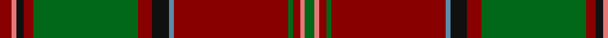

In pattern [GRRGRBKRGRKRR](/patterns/grrgrbkrgrkrr/).

This was sourced from tartans-authority.  It is a [13 stripes tartan](/stripes/stripes13/).

Original link http://www.tartansauthority.com/tartan-ferret/display/3850/

## Attestations

This cloth appears in 2 source records; the oldest owns this page.

- pre 2002 — Glen Coe (District) (tartans-authority, [record](http://www.tartansauthority.com/tartan-ferret/display/3850/))
- undated — Glen Coe (register-of-tartans, [record](https://www.tartanregister.gov.uk/tartanDetails.aspx?ref=4839))

## Thread count
DR/10 LR4 K6 DR8 G86 DR12 K14 B4 DR94 G4 DR6 LR4 G/8

## Palette
Each colour and its ΔE from the base-6 reference it is a variant of.

| Colour | Shade | Base | ΔE (OKLab) |
|---|---|---|---|
| B | <code style="background-color:#5C8CA8;">#5C8CA8</code> `#5C8CA8` | B <code style="background-color:#2C4084;">#2C4084</code> | 0.23 |
| DR | <code style="background-color:#880000;">#880000</code> `#880000` | R <code style="background-color:#C80000;">#C80000</code> | 0.14 |
| G | <code style="background-color:#006818;">#006818</code> `#006818` | G <code style="background-color:#006400;">#006400</code> | 0.02 |
| K | <code style="background-color:#101010;">#101010</code> `#101010` | K <code style="background-color:#000000;">#000000</code> | 0.17 |
| LR | <code style="background-color:#E87878;">#E87878</code> `#E87878` | R <code style="background-color:#C80000;">#C80000</code> | 0.19 |

ID: /setts/s13/r10ra4k6r8g86r12k14b4r94g4r6ra4g8-b5c8ca8-g006818-k101010-r880000-rae87878/
