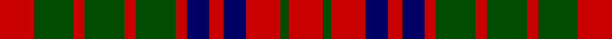

In pattern [RGRBRBRGRGRGR](/stripes/rgrbrbrgrgrgr/).

This was sourced from weddslist.  It is a [13 stripe tartan](/stripes/stripes13/).

Original link http://www.weddslist.com/cgi-bin/tartans/pg.pl?source=rb

## Attestations

This cloth appears in 2 source records; the oldest owns this page.

- undated — Grant of Monymusk (weddslist, [record](http://www.weddslist.com/cgi-bin/tartans/pg.pl?source=rb))
- undated — Grant of Monymusk (weddslist, [record](http://www.weddslist.com/cgi-bin/tartans/pg.pl?source=x))

## Thread count
R/12 G14 R4 G14 R4 G14 R4 DB8 R5 DB8 R12 G3 R/12

## Palette
Each colour and the base-6 reference it is a variant of.

| Colour | Shade | Base |
|---|---|---|
| DB | <code style="background-color:#000064;">#000064</code> `oklch(22.7% 0.158 264.1)` <small>#000064</small> | B <code style="background-color:#2A418A;">#2A418A</code> |
| G | <code style="background-color:#004C00;">#004C00</code> `oklch(36.1% 0.123 142.5)` <small>#004C00</small> | G <code style="background-color:#006100;">#006100</code> |
| R | <code style="background-color:#C80000;">#C80000</code> `oklch(52.3% 0.215 29.2)` <small>#C80000</small> | R <code style="background-color:#CC0000;">#CC0000</code> |

## Nearest tartans

The nearest existing variants by ΔTartan distance.

1. [Grant of Monymusk](/setts/s13/r12dg14r4dg14r4dg14r4db8r5db8r12dg3r12~x2/) — ΔT 0.79
1. [Grant of Monymusk](/setts/s13/r12g14r4g14r4g14r4db8r5db8r12g3r12~x2/) — ΔT 0.99
1. [Fiddes](/setts/s11/g16r12db16r6db4r6db7r20db8g8db12~x2/) — ΔT 1.25
1. [Fiddes #2](/setts/s11/dg16r12db16r6db4r6db7r20db8dg8db12~x2/) — ΔT 1.34
1. [MacDonald #8](/setts/s12/k6r1k1r4k7r1k7dg6r5dg1r1dg5~x2/) — ΔT 1.38
1. [Grant of Monymusk](/setts/s13/r12g16r3g16r3g16r4b16r5k9r12g3r12~x2/) — ΔT 1.38
1. [Grant of Monymusk](/setts/s13/r12g16r3g16r3g16r4db16r5k9r12g3r12~x2/) — ΔT 1.42
1. [Fiddes (Artefact)](/setts/s11/db18g5db6r25db6r5db5r6db18r12g16~x2/) — ΔT 1.43
1. [MacRurie/MacRory](/setts/s13/r8g10r2g10r9g3r4g4r10ly3r3g10r3~x2/) — ΔT 1.45
1. [Lumsden of Kintore (Clan?)](/setts/s9/dt1r5dt4r1g1r1g4r5g1~x12/) — ΔT 1.46

## Neighbour map

Every grey dot is one of 14299 variants placed by the first two principal components of the ΔTartan feature space (44% of its variance). Red is this tartan; blue dots are its nearest — click one to open its page.

<svg viewBox="0 0 640 380" role="img" style="max-width:100%;height:auto;border:1px solid #e0e0e0;border-radius:4px;display:block" xmlns="http://www.w3.org/2000/svg"><image href="/nn/cloud.v1.png" width="640" height="380"/><a href="/setts/s13/r12dg14r4dg14r4dg14r4db8r5db8r12dg3r12~x2/"><circle cx="231.1" cy="266.9" r="4" fill="#3465a4"><title>Grant of Monymusk</title></circle></a><a href="/setts/s13/r12g14r4g14r4g14r4db8r5db8r12g3r12~x2/"><circle cx="219.4" cy="257.2" r="4" fill="#3465a4"><title>Grant of Monymusk</title></circle></a><a href="/setts/s11/g16r12db16r6db4r6db7r20db8g8db12~x2/"><circle cx="195.3" cy="265.8" r="4" fill="#3465a4"><title>Fiddes</title></circle></a><a href="/setts/s11/dg16r12db16r6db4r6db7r20db8dg8db12~x2/"><circle cx="192.8" cy="262.5" r="4" fill="#3465a4"><title>Fiddes #2</title></circle></a><a href="/setts/s12/k6r1k1r4k7r1k7dg6r5dg1r1dg5~x2/"><circle cx="231.9" cy="227.7" r="4" fill="#3465a4"><title>MacDonald #8</title></circle></a><a href="/setts/s13/r12g16r3g16r3g16r4b16r5k9r12g3r12~x2/"><circle cx="171.0" cy="228.7" r="4" fill="#3465a4"><title>Grant of Monymusk</title></circle></a><a href="/setts/s13/r12g16r3g16r3g16r4db16r5k9r12g3r12~x2/"><circle cx="153.1" cy="220.4" r="4" fill="#3465a4"><title>Grant of Monymusk</title></circle></a><a href="/setts/s11/db18g5db6r25db6r5db5r6db18r12g16~x2/"><circle cx="207.5" cy="237.6" r="4" fill="#3465a4"><title>Fiddes (Artefact)</title></circle></a><a href="/setts/s13/r8g10r2g10r9g3r4g4r10ly3r3g10r3~x2/"><circle cx="268.8" cy="249.3" r="4" fill="#3465a4"><title>MacRurie/MacRory</title></circle></a><a href="/setts/s9/dt1r5dt4r1g1r1g4r5g1~x12/"><circle cx="272.8" cy="243.5" r="4" fill="#3465a4"><title>Lumsden of Kintore (Clan?)</title></circle></a><circle cx="210.1" cy="253.4" r="5" fill="#c00000"/></svg>

ID: /setts/s13/r12dg14r4dg14r4dg14r4db8r5db8r12dg3r12/
